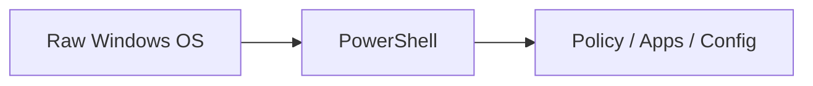

# Tech Inventory & Logs

インフラ構成・設計判断・運用プロセスを、  
**再利用可能な技術資産として整理・蓄積したリポジトリ**です。

個別案件の成果物ではなく、  
「なぜその構成にしたのか」「どう運用・改善してきたか」を  
**第三者が追える形で残すこと**を目的としています。

---

## Implementation Archives

サーバーレス基盤の設計から、  
現場に蓄積した運用負債を解消するための自動化までを扱います。

### 1) Cloud Run / Secure Egress（固定IP・外部接続）

- パス：`02_ARCHITECTURE/serverless-ftps-api-public/`
- 概要：  
  Cloud Run から固定IPで外部システムへ安全に通信する構成例。  
  VPC Connector + Cloud NAT を用いた **制御可能なアウトバウンド設計**。

```mermaid
graph LR
    subgraph VPC
        direction LR
        CR[Cloud Run] --> SVC[VPC Connector]
        SVC --> NAT[Cloud NAT]
    end
    NAT -->|Static IP| Ext[External]
````

* 想定ユースケース：

  * SFTP / FTPS 連携
  * 外部ベンダー接続
  * IP制限が必要な業務連携

---

### 2) Google Workspace / Slack 自動連携

* パス：`03_IMPLEMENTATIONS/daily-sheet-to-slack/`
* 概要：
  Google Sheets 上の業務データを起点に、
  Apps Script / Python を用いて Slack へ通知・連携する実装例。

```mermaid
graph LR
    SS[Google Sheets] --> GAS[Apps Script] --> SL[Slack]
    GWS[GWS API] <--> Py[Python Script]
```

* 想定ユースケース：

  * 日次・週次レポートの自動通知
  * 手作業オペレーションの削減
  * 情報共有の属人化解消

---

### 3) Windows セットアップ自動化

* パス：`03_IMPLEMENTATIONS/windows_setup_automation/`
* 概要：
  初期状態の Windows 環境に対し、
  PowerShell による **ポリシー・アプリ・設定の自動適用**を行う構成。



* 想定ユースケース：

  * キッティング作業の標準化
  * 管理者依存の排除
  * 少人数情シスでの運用効率化

---

## 技術スタック

* **Infrastructure**

  * Google Cloud, AWS
  * Entra ID, Microsoft 365（Intune）
* **Governance / Control**

  * ITGC 対応
  * ID・アクセス管理
* **Automation**

  * Python
  * PowerShell
  * Google Apps Script
  * LLM を用いた補助的オーケストレーション

---

## コンテンツ構成

* **01_TIL**
  日々の検証・試行錯誤・学習ログ。
  技術選定や失敗の記録を含め、意思決定の背景を残しています。

* **02_ARCHITECTURE**
  アーキテクチャ設計書、構成検討メモ、
  セキュリティ・ガバナンス・IaC・運用設計の集約。

* **03_IMPLEMENTATIONS**
  実装例・プロトタイプ・自動化スクリプト。
  実務で再利用可能な最小構成を意識しています。

* **04_PROJECTS**
  テーマ単位でまとめたプロジェクト形式の整理。
  要件 → 設計 → 実装 → 運用を一連で俯瞰できる構成。

---

## Profile

インフラ領域で20年以上の実務経験。
通信キャリアのネットワーク設計から、
大規模組織の ID 基盤運用、スタートアップ環境での自動化・改善まで対応。

一貫したスタンスは、
**「一過性の作業を、再利用可能な構造として残すこと」**。

商談・技術検討時において、
設計思想・運用観点・リスク判断を共有できることを重視しています。
---
