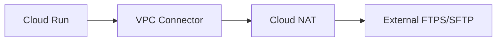

# Tech Inventory

本リポジトリは、  
業務上必要となった構成・設計・実装を  
**記録として整理したもの**です。

特定の技術スタックやプロダクトを誇示する意図はなく、  
再現性・説明可能性・運用性を重視しています。

---

## Scope

主に、以下の領域を扱っています。

---

### Infrastructure as Code

クラウド基盤を  
コードとして管理するための設計と実装。

- Terraform による構成管理
- Cloud Run / Network / Identity を含む構成
- 設計資料とコードの対応関係を保持

▶︎ Architecture  
https://github.com/conti0513/development_public/tree/main/02_ARCHITECTURE

```mermaid
graph LR
    IaC[Terraform] --> Cloud[Cloud Resources]
    Cloud --> Run[Cloud Run]
    Cloud --> Net[Network]
    Cloud --> Id[Identity]
````

---

### Security / Identity / Mail

認証・認可・メール基盤まわりの整理。

* Google Workspace / IdP 連携
* SPF / DKIM / DMARC の運用設計
* 検証結果を前提とした記録

▶︎ Identity / SSO
[https://github.com/conti0513/development_public/tree/main/02_ARCHITECTURE/02_IDENTITY_ACCESS/gws-idp](https://github.com/conti0513/development_public/tree/main/02_ARCHITECTURE/02_IDENTITY_ACCESS/gws-idp)

▶︎ Mail / Security
[https://github.com/conti0513/development_public/tree/main/02_ARCHITECTURE/03_SECURITY_MAIL](https://github.com/conti0513/development_public/tree/main/02_ARCHITECTURE/03_SECURITY_MAIL)

```mermaid
graph LR
    User --> IdP[IdP]
    IdP --> GWS[Google Workspace]
    GWS --> Mail[Mail Flow]
    Mail --> Auth[SPF / DKIM / DMARC]
```

---

### Secure File Transfer

FTP / SFTP を含む
ファイル連携基盤の構成検討。

* Cloud Run + VPC Connector + NAT
* 固定IPを前提とした外部連携
* 実運用を想定した分離構成

▶︎ Serverless FTPS / SFTP
[https://github.com/conti0513/development_public/tree/main/02_ARCHITECTURE/01_PLATFORM_CLOUD/serverless-ftps-api-public](https://github.com/conti0513/development_public/tree/main/02_ARCHITECTURE/01_PLATFORM_CLOUD/serverless-ftps-api-public)



---

## Structure

```text
00_README.md
01_TIL/
02_ARCHITECTURE/
03_IMPLEMENTATIONS/
```

* `02_ARCHITECTURE/`
  設計・構成・検証の記録
* `03_IMPLEMENTATIONS/`
  実装例・自動化スクリプト

※ 個人的なメモや下書きは Git 管理対象外。

---

## Notes

* 単発の実装ではなく、構造として残すこと
* 後から読み返せる粒度で記録すること
* 運用・引き継ぎを前提に考えること

---

## Background

インフラ／ネットワーク／ID 基盤を中心に業務経験。

現場で必要になったものを整理し、
使える形で残しています。

現在は、エンタープライズ規模の環境に向けたGCP、Terraform、セキュリティガバナンスに注力しています。
---