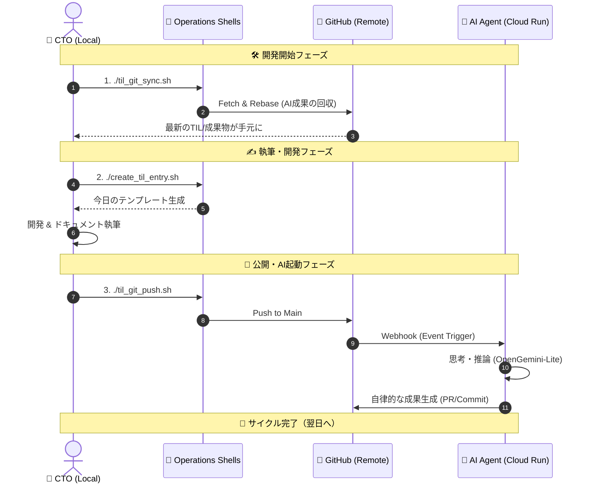

# 🌌 Development Public / 2026 Innovation Layer

## 🛠️ Main Feature: OpenGemini-Lite (AI-Driven Pipeline)

Slack を起点とし、最新の AI モデルと CI/CD パイプラインを直結させた**自律型イベント駆動基盤**。

* **Gemini 2.0/3.0 Ready**: `gemini-flash-latest` エイリアスを採用し、AI モデルの進化に自動追従するメンテフリーな設計。
* **Cloud Run × Go (The Brain)**: ステートレスかつ低レイテンシな実行環境で、Slack API の「3秒ルール」を Goroutine で攻略。
* **GHA as Muscle (Execution)**: GitHub Actions を実行レイヤーとし、`repository_dispatch` を通じてインフラ操作から TIL 生成までを完全自動化。
* **Decoupled Architecture**: 思考（AI）と実行（CI）を分離。将来的なマルチエージェント化や他プラットフォーム連携を容易にする高い拡張性を確保。

---

## 🌌 AI-Native Development Lifecycle

本プロジェクトは、人間と AI エージェント（OpenGemini-Lite）が同一リポジトリで共作する**「AI共存型ワークフロー」**を実践しています。

### 📊 AI共存型 開発ライフサイクル

### 🛠️ Operation Shells (Standard Routine)

リポジトリの `01_TIL/` に配備された以下のシェルを使用し、AI との同期を維持します。

1. **`./til_git_sync.sh` (AI成果の回収)**
* 作業開始時に実行。AI エージェントが GitHub 上で生成した成果物を、ローカルへ安全に引き寄せます（`stash` & `rebase` 駆動）。

2. **`./create_til_entry.sh` (知見の継承)**
* 前日の TIL をベースに今日のテンプレートを自動生成。思考の連続性を担保します。

3. **`./til_git_push.sh` (世界への公開)**
* ローカルの成果を GitHub へ Push。これをトリガーに AI エージェントが再び思考を開始します。

---

### 🏛️ Architecture Philosophy

* **Decoupled Intelligence**: 思考（Go/Gemini）と実行（GitHub Actions）を分離し、高負荷な推論をバックグラウンドで処理。
* **Static Typing Confidence**: Go 言語による厳格な型定義が、AI の出力の揺らぎを「204 Success」という確信に変える。
* **Event-Driven Feedback**: Slack メンションを起点とした、完全非同期の自律型ドキュメンテーション。

---

## 🛠️ Upcoming: BigQuery Analytics (Phase 3)

今後、すべてのデプロイログと AI の思考プロセスを BigQuery へストリーミングし、**「開発者の成長と AI の寄与度」を可視化**するダッシュボードを構築予定。

---
