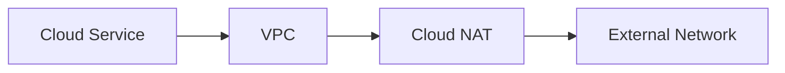

# Platform / Cloud

本ディレクトリは、  
クラウド基盤に関する **構成検討・移行計画・設計判断の記録** をまとめたものです。

特定のクラウドやサービスを前提にせず、  
**制約条件と判断理由を残すこと** を主眼としています。

---

## Scope

主に以下を扱います。

- オンプレミス → クラウド移行
- マルチクラウド構成（AWS / GCP）
- サーバーレス前提の設計検討
- 外部システム連携を含む構成

---

## Contents

### Migration / Modernization

既存環境からクラウドへの移行設計。

- 段階的移行（Big Bang を避ける）
- 業務影響を抑えた切り替え計画
- データ／アプリケーション分離の検討

```mermaid
graph LR
    OnPrem[On-Premise] --> Hybrid[Hybrid Phase]
    Hybrid --> Cloud[Cloud Native]
````

---

### Serverless Architecture

サーバーレスを前提とした構成検討。

* Cloud Run / Managed Services
* ネットワーク制約（固定IP・NAT）
* 運用負荷を下げる設計

```mermaid
graph LR
    Client --> API[Serverless API]
    API --> Managed[Managed Services]
    Managed --> External[External Systems]
```

---

### Network / Connectivity

外部連携を含むネットワーク設計。

* VPC / Subnet / NAT
* 固定IPを前提とした通信
* セキュリティ境界の整理



---

## Design Notes

各ドキュメントでは、以下を意識しています。

* なぜその構成にしたか
* 何を採用しなかったか
* 将来的な変更余地がどこにあるか

実装やツール選定は **結果** として記載し、
前提条件と制約を優先して残しています。

---

## Related

* 📁 `serverless-ftps-api-public/`
  固定IPを前提とした外部連携構成（FTPS / SFTP）

* 📁 `../04_IAC_TERRAFORM/`
  IaC による構成管理

---

## Notes

* 環境差分を吸収できる設計にすること
* 運用フェーズを想定して書くこと
* 後から説明できる状態を保つこと
