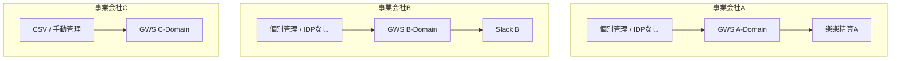
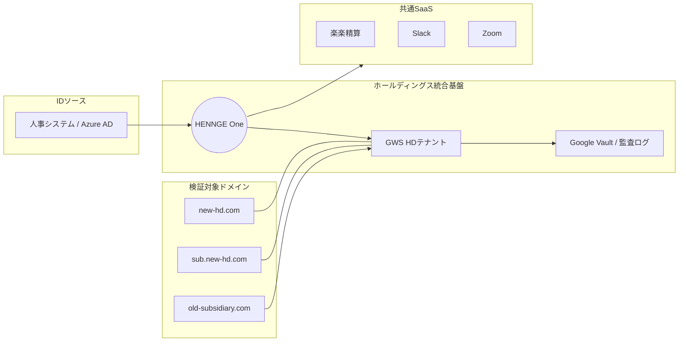

# 🛡️ GWS・IdP（HENNGE等）統合検証＆運用ナレッジ  
## 〜ドメイン統合・SSO・メール・監査を含む実運用検証ナレッジ〜

---

> 本ドキュメント群は以下の3点で構成される。  
> - 01：全体像・設計思想（Why / What）  
> - 02：技術検証・論点整理（How / Risk）  
> - 03：移行計画・運用手順（Do）

## 1. プロジェクトの全体像（仮説・To-Be）

- **認証基盤**  
  IdP（HENNGE One / Azure AD 等）をハブとしたシングルサインオン（SSO）

- **ターゲット**  
  Google Workspace（GWS）を核とし、外部SaaS（会計・チャット等）へSAML連携

- **ミッション**  
  ドメイン統合に伴う「新ドメイン・サブドメイン」の追加と、それに付随する  
  認証・メール・権限・監査の **完全検証**

各事業会社が分散管理している **As-Is** の状態から、  
ホールディングス（HD）として GWS と HENNGE を軸に統合する **To-Be** を  
Mermaid で可視化する。

---

### 1-1. As-Is：分散管理モデル

各社が個別にドメインやSaaSを管理し、ガバナンスが効きにくい状態。

---

### 1-2. To-Be：モダンID統合モデル（検証対象）

HDドメインをハブとし、
SSO・プロビジョニング・監査・メール制御を中央集権化した構成。

---

---

## 2. 管理責任の分離（IdP-Centric Model）
運用負荷を最適化しつつ、ガバナンスを維持する「責任分界点」の検証。

- **情シス管轄（IdPレベル）:**
    - [ ] **アクセスの統合制御:** IdPを「Single Point of Entry」とし、退職時の即時遮断（Kill Switch）を保証する。
    - [ ] **コンテキスト評価:** デバイスや場所による「入り口」の強度管理。
- **現場管轄（SaaSレベル）:**
    - [ ] **RBAC（ロールベースアクセス制御）:** SaaS内部の細かい操作権限。
    - [ ] **ライセンス管理:** アプリごとの特定機能の割り当て。

- **検証の要:**
    - 現場がSaaS側でアカウントを消し忘れた場合でも、IdP側の無効化によって**「ログインが物理的に不可能であること」**を実機でエビデンスとして残す。

    ### 2-1. 認可（アクセス権）の最小化検証
- [ ] **ポリシーベースのアクセス制御:** 特定のSaaSに対し、非対象ユーザーがログインを試みた際、IdPレベルで適切にブロック（403 Forbidden相当）されるか。
- [ ] **ポータルUXの最適化:** ユーザー属性に応じて、不要なSaaSへの導線を整理し、「情シスへの不要な問い合わせ（これ何ですか？）」を未然に防ぐ。
---
