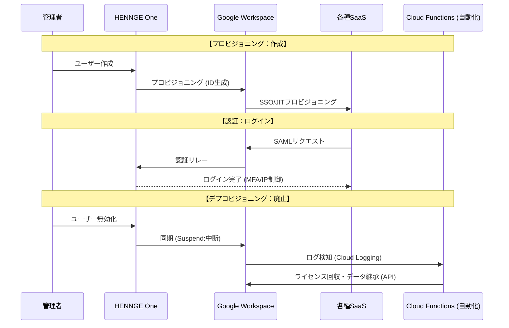

# 🛡️ GWS・IdP（HENNGE等）統合検証＆運用ナレッジ  
## 〜ドメイン統合・SSO・メール・監査を含む実運用検証ナレッジ〜

---

## 1. プロジェクトの全体像（仮説・To-Be）

- **認証基盤**  
  IdP（HENNGE One / Azure AD 等）をハブとしたシングルサインオン（SSO）

- **ターゲット**  
  Google Workspace（GWS）を核とし、外部SaaS（会計・チャット等）へSAML連携

- **ミッション**  
  ドメイン統合に伴う「新ドメイン・サブドメイン」の追加と、それに付随する  
  認証・メール・権限・監査の **完全検証**

各事業会社が分散管理している **As-Is** の状態から、  
ホールディングス（HD）として GWS と HENNGE を軸に統合する **To-Be** を  
Mermaid で可視化する。

---

### 1-1. As-Is：分散管理モデル

各社が個別にドメインやSaaSを管理し、ガバナンスが効きにくい状態。

```mermaid
graph TD
    subgraph Company_A [事業会社A]
        IdA[個別管理 / IDPなし] --> GWSA[GWS A-Domain]
        GWSA --> SaaS1[楽楽精算A]
    end

    subgraph Company_B [事業会社B]
        IdB[個別管理 / IDPなし] --> GWSB[GWS B-Domain]
        GWSB --> SaaS2[Slack B]
    end

    subgraph Company_C [事業会社C]
        IdC[CSV / 手動管理] --> GWSC[GWS C-Domain]
    end
````

---

### 1-2. To-Be：モダンID統合モデル（検証対象）

HDドメインをハブとし、
SSO・プロビジョニング・監査・メール制御を中央集権化した構成。

```mermaid
graph LR
    subgraph HD_Platform [ホールディングス統合基盤]
        direction TB
        IdP((HENNGE One))
        GWS_HD[GWS HDテナント]
        Vault[Google Vault / 監査ログ]
    end

    subgraph Identity_Source [IDソース]
        AD[人事システム / Azure AD]
    end

    subgraph Managed_SaaS [共通SaaS]
        SaaS_A[楽楽精算]
        SaaS_B[Slack]
        SaaS_C[Zoom]
    end

    AD --> IdP
    IdP --> GWS_HD
    IdP --> Managed_SaaS
    GWS_HD --> Vault

    subgraph Domains [検証対象ドメイン]
        D1[new-hd.com]
        D2[sub.new-hd.com]
        D3[old-subsidiary.com]
    end

    D1 --- GWS_HD
    D2 --- GWS_HD
    D3 --> GWS_HD
```

---

## 2. 検証工程と技術的論点

### 2-1. ドメイン基盤となりすまし対策

* **DNS検証**
  MX / SPF / DKIM / DMARC が新ドメインで正しく反映され、
  外部ツールで `PASS` 判定されるか

* **ドメイン種別の選択**
  セカンダリドメインとドメインエイリアスの挙動差が
  既存ユーザーのUX（特に送信アドレス）に影響しないか

---

### 2-2. 認証基盤（SSO / プロビジョニング）

* **多段SSO検証**
  ユーザー → IdP → GWS → 外部SaaS（楽楽精算等）まで
  属性マッピング（NameID 等）が破綻しないか

* **ライフサイクル検証**

  * **JITプロビジョニング**：初回ログイン時に自動生成されるか
  * **Kill Switch**：IdP停止時、全SaaSのセッションが即時破棄されるか

---

### 2-3. メール送受信制御（コンプライアンス）

* **ルーティング制御**

  * 送信メールを SMTP リレーへ強制転送
  * 旧ドメインからの送信を拒否／隔離（Quarantine）

* **例外処理**

  * システム通知用アドレス等が制限に巻き込まれないか
  * Regex を用いた厳密なテスト

---

### 2-4. 権限管理（RBAC / 緊急経路）

* **スコープ検証**

  * 子会社管理者が自社OU以外に干渉できないか

* **緊急経路**

  * SSO障害時でも特権管理者が直接ログインし復旧可能か

---

## 3. 監査（Audit）とセキュリティの担保

### 3-1. 監査対応

* **Google Vault**

  * 新ドメイン追加後も保持ルールが漏れなく適用されるか
  * 新旧ドメイン横断で eDiscovery が可能か

* **操作ログ**

  * 作成／変更／削除／権限昇格の履歴が欠落なく取得できるか

---

### 3-2. ゼロトラスト観点

* **コンプライアンス連携**

  * 管理デバイス／OS状態とSSOを組み合わせた動的制御

* **ゼロタッチキッティング**

  * Autopilot / GCPW 利用時、新ドメイン認証が初回起動で正しく出るか

---

## 4. エンジニアが直面する「詰み」ポイントと打開策

| 項目     | 詰みポイント          | 打開策                     |
| ------ | --------------- | ----------------------- |
| 運用     | スプシ管理によるID形骸化   | Admin SDK / GAM による差分抽出 |
| 技術     | SAML証明書期限・キャッシュ | シークレットブラウザで実機検証         |
| セキュリティ | 管理者権限の放置        | 棚卸しスクリプトを検証工程に組込        |

---

## 5. テスト仕様書の設計方針（エビデンス重視）

1. **正常系**
   新ドメインでのログイン、メール送受信、SaaS連携成功

2. **異常系**
   旧ドメイン送信ブロック、未認可ユーザーSSO拒否、非準拠端末遮断

3. **証跡管理**
   管理ログ／IdPサインインログ／メールヘッダーをセットで保存

---


## 6. 技術補足：GWS・SSO統合における深掘り検証観点

本章は、これまでの検証項目を支える  
**「普通すぎて見落とされがちな、しかしプロとして外せない技術要素」**を  
補足的に整理したものである。

販社（ベンダー）との詳細設計レビューや、  
テスト仕様書作成時の **検証の柱** として利用することを想定する。

---

### 6-1. 認証基盤（SAML / SSO）の技術要件

単なるログイン可否ではなく、  
**「文脈（コンテキスト）を持った認証」** が成立しているかを検証する。

- **SAMLアサーションの整合性**
  - **NameID**  
    新ドメインの `Primary Email` と、IdP 側のユーザー識別子が完全一致しているか
  - **ACS URL / Entity ID**  
    ドメイン固有の値が正しく設定され、新ドメイン経由の認証要求が拒否されていないか

- **認証強度・パスワードレス**
  - **HENNGE連携**  
    ID/Password に加え、デバイス証明書や FIDO2 / WebAuthn を用いた  
    パスワードレス認証が正常に成立するか
  - **属性ベース制御**  
    部署・役職等の属性に応じて、  
    - アクセス可否
    - MFA 要求有無  
    が動的に切り替わるか

---

### 6-2. メールルーティングと送受信制御

メールを単なる通信手段ではなく、  
**「ポリシー制御対象のトラフィック」**として扱う。

- **コンプライアンスルールの多段構成**
  - **送信制限**  
    旧ドメイン（例：`@old.com`）を From とする外部送信を  
    正規表現で検知し、隔離（Quarantine）または拒否（Reject）できるか
  - **ヘッダー検証**  
    `X-Gm-Message-State` 等を参照し、  
    想定したルールが適用されたことをエビデンスとして取得できるか

- **SMTPリレー・外部ゲートウェイ**
  - GWS から外部ゲートウェイ（HENNGE 等）へのホストルーティングが  
    新旧ドメイン混在環境でも破綻していないか
  - **SPF / DKIM / DMARC**  
    新ドメインのなりすまし対策が、外部受信サーバーで  
    `PASS` 判定されるか

---

### 6-3. IDライフサイクルと属性連携（プロビジョニング）

スプレッドシート等の手動管理を排除し、  
**「自動化された権限管理」**が成立しているかを検証する。

- **属性マッピング**
  - 部署・役職・社員番号等の属性が、  
    下流 SaaS（楽楽精算等）の権限（RBAC）に正しく反映されるか

- **改廃の即時性（Kill Switch）**
  - IdP 側でユーザーを停止した瞬間、
    - GWS
    - 連携 SaaS  
    のセッションが即時破棄（Revoke）されるか

- **JITプロビジョニング**
  - 初回 SSO ログイン時に、  
    属性情報に基づいたアカウントが自動生成されるか

---

### 6-4. ゼロトラスト・ガバナンス・可用性

**利便性と堅牢性の両立**を、机上ではなく実機で確認する。

- **特権IDのバイパス（Break Glass）**
  - IdP 障害時を想定し、
    - SSO を介さず
    - Google 認証（ID/Password + 物理 MFA）  
    で特権管理者が直接ログインできる予備経路が確保されているか

- **監査（Audit）対応**
  - **Google Vault**  
    全ドメイン横断での eDiscovery（電子情報開示）が有効か
  - **権限委譲**  
    カスタム管理者ロールが、新ドメインの OU に対して  
    最小権限の原則で機能しているか

---

### 6-5. テスト仕様書へ落とし込む際の観点整理

| 検証カテゴリ | 具体的テスト観点 |
| --- | --- |
| 認証 | デバイス証明書なし端末からのアクセスが IdP レベルで拒否されるか |
| メール | 旧ドメイン送信を隔離した際、管理者が内容を確認できるか |
| 属性 | 部署変更時、次回ログインで SaaS 権限が追従するか |
| 緊急 | SSO 無効化なしで、特権 ID のみ直接ログイン可能か |

---

## 10. 管理責任の分離（IdP-Centric Model）
運用負荷を最適化しつつ、ガバナンスを維持する「責任分界点」の検証。

- **情シス管轄（IdPレベル）:**
    - [ ] **アクセスの統合制御:** IdPを「Single Point of Entry」とし、退職時の即時遮断（Kill Switch）を保証する。
    - [ ] **コンテキスト評価:** デバイスや場所による「入り口」の強度管理。
- **現場管轄（SaaSレベル）:**
    - [ ] **RBAC（ロールベースアクセス制御）:** SaaS内部の細かい操作権限。
    - [ ] **ライセンス管理:** アプリごとの特定機能の割り当て。

- **検証の要:**
    - 現場がSaaS側でアカウントを消し忘れた場合でも、IdP側の無効化によって**「ログインが物理的に不可能であること」**を実機でエビデンスとして残す。

    ### NO.11：認可（アクセス権）の最小化検証
- [ ] **ポリシーベースのアクセス制御:** 特定のSaaSに対し、非対象ユーザーがログインを試みた際、IdPレベルで適切にブロック（403 Forbidden相当）されるか。
- [ ] **ポータルUXの最適化:** ユーザー属性に応じて、不要なSaaSへの導線を整理し、「情シスへの不要な問い合わせ（これ何ですか？）」を未然に防ぐ。
---


# 📋 GWS移行・ID基盤統合設計書（マスター版）

## 1. 構成概要 (ASIS ➡ TOBE)

* **IDマスター:** HENNGE One（起点）
* **認証・基盤:** Google Workspace (Cloud Identity)
* **連携方式:** SAML/OIDCによるSaaS一括SSO
* **自動化:** Cloud Functions (CF) 等によるライフサイクル管理



---

## 2. 移行フェーズと「設計者」の勘所

| フェーズ | 主要タスク | 成功のためのポイント (ACE視点) |
| --- | --- | --- |
| **準備** | 現状棚卸し・ドメイン検証 | TTLを事前に短縮（300s）。ドメイン所有権証明。 |
| **構築** | 二重配信 (Dual Delivery) | レガシーとGWS両方に届く期間を設け、消失を防ぐ。 |
| **移行** | DMSによるデータ移行 | 移行ログをCloud Loggingで監視しエラー率を分析。 |
| **切替** | MXレコード変更 | SPF/DKIMの並行運用設定を完遂させる。 |

---

## 3. テスト手順書 (運用・受入テスト：OT)

「ドメインを本番に差し替えるだけ」で動くことを最小構成で証明します。

### ① 正常系：プロビジョニング＆SSO

1. **HENNGE有効化:** GWS側に「アクティブ」でユーザーが作成されるか。
2. **SSOログイン:** アプリランチャーからSaaSへパスワードレスで入れるか。
3. **属性連携:** 氏名・メアドがSaaS側プロフィールに反映されているか。

### ② 正常系：メール配送（二重配信）

1. **外部受信:** 外部から本番宛に送り、新旧両方のトレイに届くか。
2. **外部送信:** GWSから送り、受信側でSPF/DKIMが「PASS」しているか。

### ③ 異常系：廃止・遮断（キルスイッチ）

1. **IDロック:** HENNGEで停止し、GWS/SaaSへのログインが即座に拒否されるか。
2. **バイパス防止:** GWSの直ログイン画面から入ろうとして拒否されるか。
3. **自動化検知:** Cloud Loggingが中断ログを検知し、CFが正常に動作するか。

---

## 4. 運用・自動化の設計指針 (15年食える武器)

* **役割分担:**
* **HENNGE:** 「入り口と出口」の管理（作成・停止）。
* **GWS:** 「中の椅子並べ」の管理（OU移動、ライセンス、共有ドライブ）。


* **ゾンビアカウント対策:**
* HENNGEでの削除を「Suspend（中断）」でGWSに同期。
* **CF/CRによる自動化:** 中断ログをトリガーに、ライセンス回収とデータ譲渡（オーナー変更）をAPI経由で実行。


* **証跡管理:**
* すべての操作をCloud Loggingに集約し、BigQuery等へ長期エクスポートする設計。


---

## 🛡️ 設計者としてのまとめ

この設計の核心は、**「手作業を減らし、コードとロジックでガバナンスを担保すること」**にあります。ドメインの切り替えは単なる「名前の書き換え」であり、裏側の強固な認証・自動化基盤こそが、将来にわたって汎用的に価値を提供し続ける資産となります。

---
