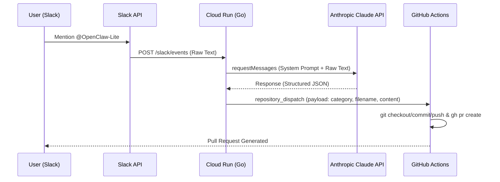

# AI Agent Architecture（OpenClaw-Lite）

本リポジトリは、Slack を起点とした**イベント駆動型 AI エージェント基盤**の設計・実装プロジェクトです。

本プロジェクトの核心はチャットボットの構築ではなく、**「イベント受信 → 自律的思考（AI） → 自動実行（CI/CD）」** という一連のパイプラインを、いかに堅牢かつ疎結合に設計するかという点にあります。

---

## 1. システム構成（Latest Architecture）

現在は Phase 2 に到達し、AI による構造化データ生成と GitHub Actions へのタスク委任が実稼働しています。

### 構成のポイント

* **東京リージョン（asia-northeast1）集約**: 低レイテンシな実行環境の確立。
* **知能の構造化**: Claude 3.5 Sonnet を採用し、曖昧な入力を「自分流テンプレート」に基づく Markdown へ変換。
* **脳と筋肉のインターフェース**: `client_payload` を `category`, `filename`, `content` で定義し、Go と YAML 間の完全な同期を実現。
* **セキュアな認証管理**: `GITHUB_PAT` および `ANTHROPIC_API_KEY` を Cloud Run の環境変数で隔離。

---

## 2. 設計思想

### ① 思考と実行の分離（Decoupling of Thinking & Acting）

Cloud Run（Go）を「思考（脳）」、GitHub Actions を「実行（筋肉）」と明確に分離。Go は GitHub の内部実装を知らず、ただ Dispatch することに専念します。

### ② テンプレート主導型 TIL 生成

入力の揺らぎを AI が吸収し、あらかじめ定義された **【自分流TILテンプレート】** に沿ってドキュメントを錬成。エンジニアリングの言語化コストを最小化します。

### ③ 堅牢なデータパイプライン

Payload の欠損に備えた YAML 側でのガードレール（デフォルト値設定）や、Go 側での非同期実行（Goroutine）により、Slack API のタイムアウト制約（3秒以内）を回避しつつ重い処理を実行可能にしています。

---

## 3. 現在の進捗

### Phase 1：イベント基盤（完了）

* Slack → Cloud Run → GitHub Actions の接続確認。
* repository_dispatch による疎結合な連携の確立。

### Phase 2：知能統合（現在：ロジック最適化中）

* **Anthropic API 統合**: Claude 3.5 Sonnet による TIL テンプレート生成。
* **データ同期**: Go の `AIResponse` 構造体と GHA Payload の整合性確保。
* **実装の洗練**: Go の型システムに基づいた JSON パースおよびポインタ操作の最適化。

### Phase 3：フィードバックループ（構想段階）

* **双方向通信**: GitHub Actions の完了結果を Slack へ逆流させる通知機能。
* **自己修復**: AI によるパース失敗時の再試行ロジックの組み込み。

---

## 4. この設計で示したいこと

本プロジェクトは、単なる自動化を超えた以下の設計コンセプトを実証します。

* **AI をモジュールとして扱う**: 知能レイヤーを単なる「関数」としてプラグインする設計。
* **CI をランタイムとして活用**: 重い処理や Git 操作を CI 側にオフロードする構造。
* **スケーラブルな自動化**: ステートレスな Cloud Run を採用することで、将来的なイベント量増加にも対応可能。

---

## 補足：実装の現状（Go Logic）

現在、Claude API から返却される JSON のパース処理および GitHub Actions への Dispatch ロジックを Go で作り込んでいます。Go の厳格な型安全性を活かし、ポインタデリファレンスによるレスポンス処理を実装済みです。

---

## 5. Next Action: GCP Native への転換（OpenGemini-Lite 計画）

Claude API の残高不足および GCP エコシステムとの親和性を考慮し、AI モデルを **Google Gemini 1.5 Flash** へ移行する。

### 移行のメリット

* **コスト最適化**: 無料枠の活用および Google Cloud 請求への一本化。
* **認証の簡素化**: `ADC (Application Default Credentials)` を利用し、API Key 管理をサービスアカウントへ委任。
* **パフォーマンス**: 同一リージョン内での低レイテンシな推論実行。

### 明日の実装タスク

1. **SDK の変更**: `github.com/liushuangls/go-anthropic/v2` → `google.golang.org/api/genai`
2. **ロジックの置換**: `askClaude` 関数を `askGemini` へリファクタ。
* プロンプト（System Instruction）はそのまま流用。
* JSON Mode（Response MIME Type: `application/json`）を有効化し、パースの堅牢性を向上。

3. **プロジェクト名改訂**: `OpenClaw-Lite` → **`OpenGemini-Lite`** への一括置換。
4. **デプロイ**: `gcloud run deploy` にて Gemini 呼び出し用の権限（Vertex AI ユーザー等）を付与。

---
