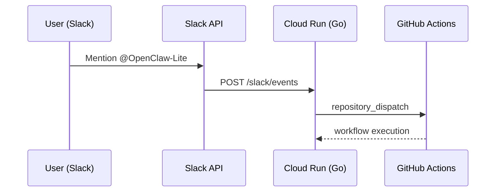

# AI Agent Architecture（OpenClaw-Lite）

本リポジトリには、
Slack を起点としたイベント駆動型 AI エージェント基盤の設計・実装例を含みます。

目的はチャットボットの構築ではなく、
**イベント → 実行基盤 → CI オーケストレーション** という構造を設計することにあります。

---

## 1. システム構成

Phase 1 では、イベント駆動の神経系を構築しています。

構成のポイントは以下です。

* Slack からのイベント受信
* Cloud Run によるステートレス実行
* GitHub Actions を用いたタスクオーケストレーション
* repository_dispatch による疎結合トリガー

AI はあくまで拡張レイヤーであり、
中核はイベント基盤の設計にあります。

---

## 2. 設計思想

本構成は、以下の思想で設計しています。

### ① 疎結合

Slack / 実行基盤 / CI を分離。
どの層も差し替え可能な構造。

### ② インフラ優先設計

AI ロジックよりも先に、
イベントと実行のパイプラインを確立。

### ③ 拡張前提

Anthropic API などの知能レイヤーは
オプションとして追加可能。

依存を最小化し、
構造を先に固定しています。

---

## 3. 現在の進捗

### Phase 1：イベント基盤（完了）

* Slack → Cloud Run → GitHub Actions の接続確認
* repository_dispatch トリガー実装
* エンドツーエンド動作検証済み

### Phase 2：知能統合（実装予定）

* AI API 統合
* JSON タスク生成
* GitHub タスク自動生成

### Phase 3：フィードバックループ（構想段階）

* GitHub 実行結果の取り込み
* Slack への結果通知
* 失敗時の自動再試行設計

---

## 4. この設計で示したいこと

本プロジェクトは、

* イベント駆動アーキテクチャ設計
* Cloud Run によるステートレス実装
* CI を実行基盤として活用する構造
* AI をモジュールとして扱う設計思想

を示すためのものです。

実験ではなく、
**拡張可能な自動化基盤の設計例**です。

---

## 補足

本設計は「チャットボット実装」ではなく、
内部自動化基盤のプロトタイプとして構成しています。

---
