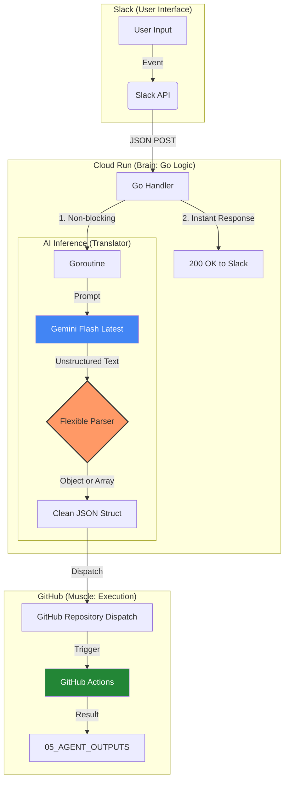

# AI Agent Architecture（OpenGemini-Lite）: 2026 Revised

本リポジトリは、Slack を起点とした**イベント駆動型 AI エージェント基盤**の設計・実装プロジェクトである。
2026年2月15日、実装上の「URLパースエラー」という技術的特異点を乗り越え、最新モデルへの**「動的追従（Alias Strategy）」**と、GitHub Actions への**「タスク委任（Dispatch）」**を両立した、持続可能な自動化パイプラインを確立した。

---

## 1. システム構成（Latest Architecture）

現在、Phase 2.5 に到達。Gemini 世代の機能を活用し、Slack と GitHub Actions を結ぶ疎結合なワークフローが安定稼働している。

### 📊 アーキテクチャ図（Mermaid）



---

## 2. 設計思想と Lessons Learned（学んだ教訓）

### ① 思考と実行の分離（Decoupling）

Cloud Run（Go）を「思考（脳）」、GitHub Actions を「実行（筋肉）」と定義。Go 側は Git 操作の複雑さを知らず、API を通じた Dispatch 処理に専念することで、高い保守性を実現した。

### ② 構造化パースの「型」の柔軟性

AI モデルは指示が厳格になるほど、単一オブジェクトを期待しても「リスト形式（配列 `[]`）」で返してくる挙動が強まる特性がある。

* **解決**: データの入り口で `[` の有無を検知し、配列・単体両対応の柔軟なアンマーシャル・ロジックを実装。静的型付け言語である Go の厳格さを保ちつつ、AI の出力の揺らぎをコード側で吸収・正規化した。

### ③ Slack 3秒ルールの克服

* **課題**: Slack API の「3秒以内レスポンス」制約。AI 推論時間はこれを超えることが常である。
* **解決**: Go の **Goroutine（非同期処理）** を活用。HTTP ハンドラー内で即座に `200 OK` を返し、重い推論と Dispatch 処理をバックグラウンドへ逃がす設計を徹底した。

### ④ AI 駆動開発における「表示」と「実行」の不一致

* **課題**: AI チャット UI が提示するコード内の URL は、Markdown 自動リンク化により `[url](url)` 形式に汚染され、Go の `http.NewRequest` でパースエラーを引き起こす。
* **解決**: AI の出力には「表示上の不純物」が混ざることを前提とした運用（環境変数への追い出し、または物理的な文字列クレンジング）の重要性を定義した。

---

## 3. 2026.02.15 最終戦略サマリ

### 開通したロジックの根幹

本サービスの核心は、Gemini を単なる「チャット相手」ではなく、**「非構造化データを構造化データ（JSON）に変換する純粋な関数」**として再定義した点にある。

### 打開した方法（エンジニアの赤ペン）

AI は 99% のコードを爆速で生成するが、URL の 1 文字や記号ひとつでシステムを停止させる。この「最後の 1%」を人間が「静的型付け（Static Typing）」の厳格さをもって赤ペンを入れる（修正する）ことこそが、AI 時代のエンジニアリングの真髄である。

---

## 🛠️ 実装の記録（Go Logic Highlights）

実行環境の安定性を優先し、モデル指定はエイリアスを継続使用する。

```go
// 2026-02-15: 安定稼働を確認した推論エンジン指定
model := client.GenerativeModel("gemini-flash-latest")

// 2026-02-15: URL汚染問題を解決したクリーンなURL文字列
url := "https://api.github.com/repos/conti0513/development_public/dispatches"
