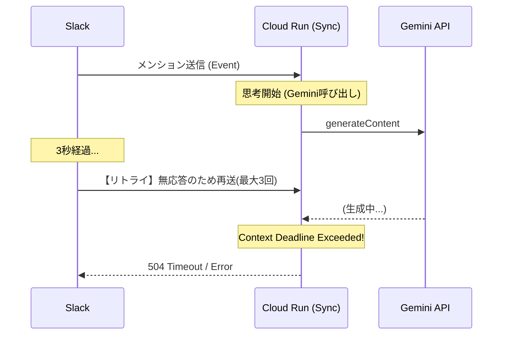
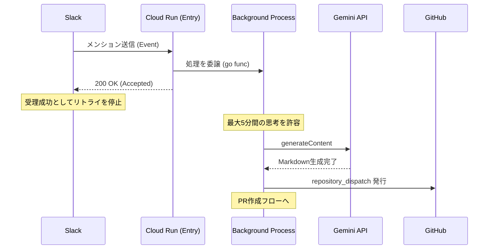

# OpenGemini-Lite 実装仕様メモ（2026.02.20 改訂版）

Slack から入力されたテキスト情報を Gemini API で構造化し、GitHub のプルリクエスト（PR）として自動保存するパイプラインの構成記録。数日間の動作検証を経て、安定稼働を確認した設計要点をまとめる。

本システムの主眼は、フロー情報（Slack）をストック情報（GitHub Markdown）へ変換し、ナレッジの資産化を自動化することにある。

---

## 1. システム全体像

構成は **「Slack → Cloud Run (Go) → GitHub Actions」** の 3 段構成を採用。

### 役割分担

* **Cloud Run (Go): 受付・解析**
* Slack イベントの受信と即時応答（3秒ルール回避）。
* Goroutine による非同期処理での Gemini API 呼び出し。
* GitHub Actions への `repository_dispatch` 発行。


* **GitHub Actions: 実行・永続化**
* 受け取った Payload を基に Markdown ファイルを生成。
* Git 操作（ブランチ作成・コミット・PR 作成）の実行。


この分離により、API 実行と Git 操作の責務を分け、環境依存のエラーを最小化している。

---

## 2. 設計上の主要な対策事項

### 2.1 データ転送の整合性確保 (Base64)

AI が生成する Markdown には、シェルスクリプトで予約語とされる記号（`$`, `"`, `|`, `\` 等）が多用される。これらが GitHub Actions の実行環境（bash/sh）で誤認され、構文エラーを引き起こす課題があった。

* **対策**: Go 側でコンテンツを **Base64** エンコードして送信し、GitHub Actions 側で復号して書き込む方式を採用。転送プロセスにおけるパースエラーを排除した。

### 2.2 実行環境のタイムアウト管理

長文生成時、Gemini の応答待ち時間が Cloud Run のデフォルト設定や Go のコンテキスト制限を超え、処理が中断される事象を確認。

* **対策**: Cloud Run のタイムアウトを **300秒** に設定し、Go の `context.Background()` および `context.WithTimeout` を 5 分に同期。長時間処理に対応可能な設定とした。

### 2.3 モデル指定の安定化 (Alias 運用)

特定のバージョン（例：`gemini-1.5-flash`）指定による将来的な 404 エラーのリスクを抑制。

* **対策**: エイリアス（`gemini-flash-latest`）を指定。SDK のバージョンに左右されず、常に最新の安定版を利用する構成とした。

### 2.4 安全設定の調整 (SafetySettings)

エンジニアリング用途のメモに含まれるコマンド（例：`rm -rf`）が、デフォルトの安全フィルターによって拒否されるケースへの対応。

* **対策**: `SafetySettings` を調整し、コンテンツの構造化を優先させる設定に変更。

---

## 3. 実装のコア・ロジック

安定稼働に不可欠な実装ポイント。

```go
// 1. モデル指定（エイリアスによる抽象化）
model := client.GenerativeModel("gemini-flash-latest")

// 2. データのエンコード（シェル経由のパースエラー防止）
encodedContent := base64.StdEncoding.EncodeToString([]byte(res.Content))

// 3. 非同期実行（Slackへの即時応答と処理継続の並立）
w.WriteHeader(http.StatusOK)
go func() {
    ctx := context.Background()
    // ... process AI request ...
}()

```

---

## 4. 運用監視とデバッグ（monitor-agent.sh）

`monitor-agent.sh` を通じて以下の層を切り分ける。

1. **インフラ層 (Cloud Run)**: `Ready/RoutesReady` のステータスを確認。
2. **認証・設定層 (Gemini API)**: `API_KEY_INVALID` 等のログから設定ミスを特定。
3. **通信・リソース層**: `context deadline exceeded` の有無で、混雑状況やタイムアウト設定の妥当性を判断。

エラーの内容が「404 (NotFound)」から「429 (QuotaExceeded)」や「DeadlineExceeded」へ変化することは、接続プロトコルが確立され、リソース調整のフェーズに移行したことを示す。

---

## 5. 技術スタック

| 区分 | 採用技術 | 選定理由 |
| --- | --- | --- |
| **言語** | **Go 1.22+** | 強力な並行処理（Goroutine）を活用した非同期実装のため。 |
| **実行基盤** | **Cloud Run** | サーバーレス環境によるコスト最適化とスケーラビリティの確保。 |
| **知能 (LLM)** | **Gemini 1.5 Flash** | 低レイテンシかつ、個人運用の範囲内で広範な無料枠を活用可能。 |
| **自動化** | **GitHub Actions** | Git 操作の抽象化と、リポジトリへの直接的な成果物反映のため。 |
| **管理** | **Terraform** | インフラ構成のコード化（IaC）による環境の再現性担保。 |

---

## 6. まとめ

本システムの構築過程において、認証、パース、タイムアウトといった基本的な実装上の課題を一つずつ解消することで、安定した自動 PR ワークフローを実現した。今後は、リクエスト ID の統一やリトライロジックの精密化により、さらなる観測性の向上を図る。

---


## 7. 今後の課題：ASIS から TOBE への進化

現状（ASIS）で発生している「長文生成時のタイムアウト」と「Slackのリトライ連打」を解決するため、非同期構造へのアップデートを計画している。

### 7.1 現状のデータフローと課題 (ASIS)

Slackの応答制限（3秒）を維持したままメイン処理を行っているため、Geminiの思考時間が長引くと接続が切断され、Slack側の自動リトライを引き起こしている。



### 7.2 理想のデータフロー (TOBE)

受付と実行を分離。Slackには即座に受理応答を返し、実処理はバックグラウンド（Goroutine）でじっくり時間をかけて完結させる。



### 7.3 具体的な改修項目

1. **非同期化の徹底**: HTTPハンドラ内で `go func()` を使用し、メインコンテキストから独立した処理フローを構築する。
2. **リクエストID（reqID）の伝播**: Slack受信からGitHub PR作成までの全ログに共通のIDを付与し、追跡性を向上させる。
3. **完了通知の実装**: PR作成完了後、Slackの `chat.postMessage` 等を利用してユーザーへ非同期に結果をフィードバックする。

---

### 8. 環境構築とデプロイ自動化

本プロジェクトでは、開発効率の最大化とセキュリティの担保を目的として、以下の環境構築および自動化を実施した。

#### 8.1 セキュリティと機密情報管理 (Secret Manager)

Gemini API Key や GitHub PAT 等の機密情報は、ソースコードや環境変数に直接記述せず、Google Cloud Secret Manager に集約した。

* **格納場所**: Google Cloud Secret Manager
* **シークレット名**: `GEMINI_API_KEY`, `GITHUB_PAT`
* **アクセス制御**: Cloud Run のランタイムサービスアカウントに対して `roles/secretmanager.secretAccessor` 権限を最小権限の原則に基づき付与。
* **メリット**: ローカル環境での `export` 作業が不要となり、ターミナル履歴への漏洩リスクを完全に排除した。

#### 8.2 デプロイ・運用自動化 (Automation Scripts)

「毎回手動でコマンドを叩くのがしんどい」という現場の課題を解決するため、以下のシェルスクリプト群を整備した。

| ファイル名 | 役割 | 主な処理内容 |
| --- | --- | --- |
| `deploy-and-check.sh` | **一撃デプロイ** | Artifact Registryの準備、Cloud Runへのソースデプロイ、Secret参照の設定を統合。 |
| `clean-deploy.sh` | **クリーンアップ** | 過去の不要なコンテナイメージを整理しつつデプロイ。 |
| `monitor-agent.sh` | **リアルタイム観測** | Cloud Logging を監視し、エージェントの思考ログをターミナルへ流す。 |

#### 8.3 ヘルスチェックと生存確認

デプロイ直後にエージェントが正常に起動しているかを確認するための自動テストを組み込んでいる。

* **動作**: `deploy-and-check.sh` の最終ステップで Service URL に対して `curl` を実行。
* **異常検知**: HTTP 200 以外が返った場合、即座に最新の `gcloud logging` からエラー内容（Payload）を抽出してターミナルに表示し、原因究明のリードタイムを短縮。
---

## 9. 運用ツールセット：開発効率と「粘り」のインフラ

本プロジェクトでは、AIとの協調デバッグを加速させ、環境起因の挫折を排除するために、4つの専用シェルスクリプトからなる「運用ツールセット」を構築した。これにより、開発者はインフラの定型作業から解放され、ロジックの改善に集中できる環境を実現している。

### 9.1 ツールセットの全体構成

スクリプトには実行順序を示す番号（No）を付与し、作業フェーズに応じた「道具」として整理した。

| No | スクリプト名 | 役割 | 導入の効果 |
| --- | --- | --- | --- |
| **01** | `01_deploy-and-check.sh` | **高速デプロイ & 疎通確認** | 1コマンドでビルドから起動確認までを完結。失敗時は即座にログを抽出し、修正へのリードタイムを最小化。 |
| **02** | `02_clean-deploy.sh` | **環境浄化デプロイ** | Artifact Registry の肥大化を防ぎつつ、クリーンなビルドを保証し、キャッシュ起因の不整合を排除。 |
| **03** | `03_monitor-agent.sh` | **非同期処理の観測（脳内観測）** | 非同期（Goroutine）化したことで見えにくくなった Gemini の思考プロセスをリアルタイムでストリーム表示。 |
| **04** | `04_check-auth.sh` | **認証・権限の自動診断** | Secret Manager と IAM 権限の整合性を一瞬で診断。「コードのバグ」か「インフラのミス」かを5秒で切り分け。 |

### 9.2 効率的な開発サイクルの実現

これらのツールにより、以下の「粘り強い」開発サイクルが確立された。

1. **診断の自動化**: 「動かない」と感じた際、`04_check-auth.sh` を叩くことで、複雑な権限設定の不安から即座に解放される。
2. **観測性の確保**: `03_monitor-agent.sh` により、Gemini が長考（タイムアウト）しているのか、レスポンスが壊れているのかを、Slack の結果を待たずに把握可能。
3. **セキュリティの隠蔽化**: `Secret Manager` と `01_deploy` を連結させることで、ターミナルでの `export` 作業を撤廃。キー漏洩リスクの低減と手間の削減を両立した。

### 9.3 設計思想

「AI時代といえど、最後はURLの一文字や記号のパースといった泥臭い修正がシステムを動かす」という教訓に基づき、**「エラーに直面した際、AIに渡すべき情報を最速で手に入れるためのインターフェース」**としてこれらのツールを定義している。

---
