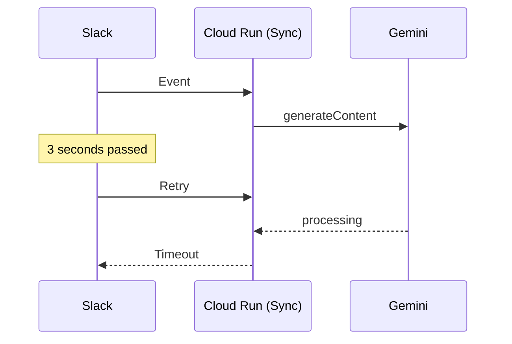
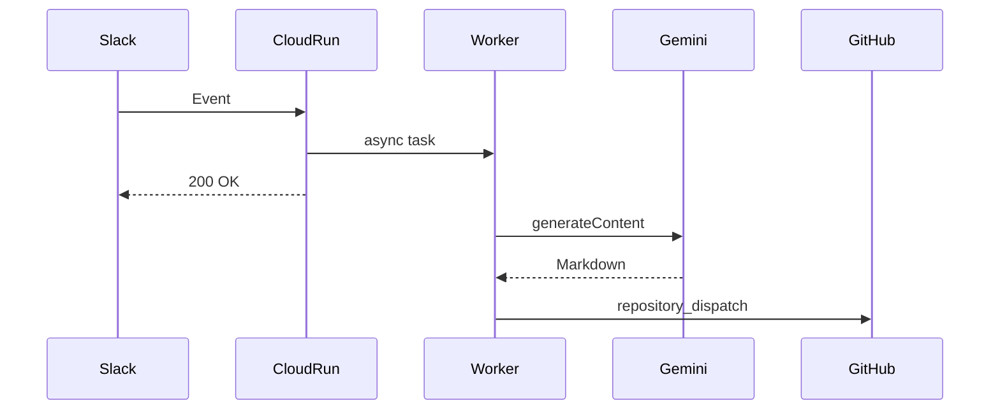

# OpenGemini-Lite Implementation Notes (Revised 2026-03-06)

This document describes the architecture and implementation details of **OpenGemini-Lite**, a pipeline that converts Slack messages into structured Markdown using the Gemini API and automatically stores them as GitHub pull requests.

After several days of operational testing, the design has proven stable. This document summarizes the key architectural decisions.

The primary objective of this system is:

> Converting **flow information (Slack conversations)** into **structured knowledge assets (GitHub Markdown)** automatically.

---

# 1. System Architecture

The system uses a **three-layer architecture**:

```
Slack → Cloud Run (Go) → GitHub Actions
```

## Responsibilities

### Cloud Run (Go) — Ingestion & Processing

Responsibilities:

* Receive Slack Events API requests
* Immediately respond to Slack (to avoid the 3-second timeout)
* Execute Gemini API calls asynchronously via Goroutines
* Trigger GitHub workflows using `repository_dispatch`

### GitHub Actions — Execution & Persistence

Responsibilities:

* Generate Markdown files from received payloads
* Perform Git operations:

  * create branch
  * commit files
  * open pull request

This separation isolates API processing from Git operations, reducing environment-specific failures.

---

# 2. Key Design Considerations

## 2.1 Data Integrity During Transfer (Base64)

AI-generated Markdown often contains shell-sensitive characters:

```
$
"
|
\
```

These characters caused parsing errors inside GitHub Actions (bash environment).

### Solution

Content is **Base64 encoded in Go** before transmission.

GitHub Actions then decodes the payload before writing the file.

Benefits:

* prevents shell parsing errors
* avoids YAML injection issues
* ensures reliable transport

---

## 2.2 Timeout Handling

During long content generation, Gemini responses sometimes exceeded the default Cloud Run or Go timeout limits.

### Solution

Timeout settings were aligned:

Cloud Run timeout:

```
300 seconds
```

Go context:

```
context.WithTimeout(..., 5 minutes)
```

This ensures long responses complete successfully.

---

## 2.3 Model Version Stability (Alias Strategy)

Hard-coding model versions such as:

```
gemini-1.5-flash
```

can introduce future breaking changes (404 errors).

### Solution

Use the alias:

```
gemini-flash-latest
```

This allows automatic tracking of the latest stable model without SDK upgrades.

---

## 2.4 Safety Settings Adjustment

Engineering notes may include commands such as:

```
rm -rf
```

Default safety filters sometimes blocked these messages.

### Solution

Gemini `SafetySettings` were adjusted to prioritize **content structuring over filtering**.

---

# 3. Core Implementation Logic

Critical implementation details for stable operation.

```go
// 1. Model alias abstraction
model := client.GenerativeModel("gemini-flash-latest")

// 2. Base64 encoding to avoid shell parsing issues
encodedContent := base64.StdEncoding.EncodeToString([]byte(res.Content))

// 3. Asynchronous execution for Slack compatibility
w.WriteHeader(http.StatusOK)
go func() {
    ctx := context.Background()
    // AI processing logic
}()
```

---

# 4. Monitoring and Debugging

Operational diagnostics are performed using the script:

```
monitor-agent.sh
```

The script helps isolate failures across three layers.

### Infrastructure Layer

Cloud Run service status

```
Ready
RoutesReady
```

### Authentication Layer

API configuration errors such as:

```
API_KEY_INVALID
```

### Runtime Layer

Network and execution failures such as:

```
context deadline exceeded
```

Changes in error type often indicate system progress.

Example:

```
404 → 429 → DeadlineExceeded
```

This means:

* connectivity established
* quota or resource tuning required

---

# 5. Technology Stack

| Category   | Technology     | Reason                                 |
| ---------- | -------------- | -------------------------------------- |
| Language   | Go 1.22+       | Efficient concurrency using Goroutines |
| Runtime    | Cloud Run      | Serverless scaling and cost efficiency |
| LLM        | Gemini Flash   | Low latency and generous free tier     |
| Automation | GitHub Actions | Native Git workflow automation         |
| IaC        | Terraform      | Infrastructure reproducibility         |

---

# 6. Summary

Through iterative debugging of authentication, parsing, and timeout issues, the system now supports a stable automated pull request workflow.

Future improvements include:

* unified request IDs
* improved retry logic
* enhanced observability

---

# 7. Future Improvements (AS-IS → TO-BE)

## Current Architecture (AS-IS)

The current synchronous flow causes Slack retries during long Gemini processing.


```mermaid
sequenceDiagram
    participant Slack
    participant CloudRun as Cloud Run (Sync)
    participant Gemini

    Slack->>CloudRun: Event
    CloudRun->>Gemini: generateContent
    
    Note over Slack: 3 seconds passed
    
    Slack->>CloudRun: Retry
    Gemini-->>CloudRun: processing
    
    CloudRun-->>Slack: Timeout
```

Problem:

Slack retries because processing exceeds 3 seconds.

---

## Target Architecture (TO-BE)

Separate **request acceptance** and **execution**.


```mermaid
sequenceDiagram
    participant Slack
    participant CloudRun
    participant Worker
    participant Gemini
    participant GitHub

    Slack->>CloudRun: Event
    CloudRun->>Worker: async task
    CloudRun-->>Slack: 200 OK
    
    Worker->>Gemini: generateContent
    Gemini-->>Worker: Markdown
    
    Worker->>GitHub: repository_dispatch
```

Benefits:

* Slack retry prevention
* long AI processing allowed
* better reliability

---

## Planned Improvements

1. Full asynchronous execution via Goroutines
2. Request ID propagation across the entire pipeline
3. Slack completion notification when PR is created

---

# 8. Environment Setup and Deployment Automation

## 8.1 Secret Management

Sensitive credentials are stored in:

```
Google Cloud Secret Manager
```

Secrets:

```
GEMINI_API_KEY
GITHUB_PAT
```

Access control:

```
roles/secretmanager.secretAccessor
```

Advantages:

* eliminates terminal `export` usage
* prevents credential leakage in shell history

---

## 8.2 Deployment Automation

To simplify repetitive operational tasks, several automation scripts were created.

| Script              | Purpose                                  |
| ------------------- | ---------------------------------------- |
| deploy-and-check.sh | Deploy service and verify connectivity   |
| clean-deploy.sh     | Clean old container images before deploy |
| monitor-agent.sh    | Stream Cloud Logging in real time        |

---

## 8.3 Health Check Automation

Deployment scripts include automatic health verification.

Process:

1. Deploy Cloud Run
2. Execute `curl` against service URL
3. If HTTP status ≠ 200:

   * fetch latest Cloud Logging errors
   * display failure details immediately

This significantly reduces debugging time.

---

# 9. Operational Toolset

A set of four scripts improves development efficiency.

| No | Script              | Purpose                      |
| -- | ------------------- | ---------------------------- |
| 01 | deploy-and-check.sh | Deploy and verify service    |
| 02 | clean-deploy.sh     | Clean environment deployment |
| 03 | monitor-agent.sh    | Real-time agent monitoring   |
| 04 | check-auth.sh       | IAM and secret validation    |

---

## Development Workflow

1. Run `check-auth.sh` when errors occur
2. Use `monitor-agent.sh` to observe Gemini processing
3. Deploy via `deploy-and-check.sh`

---

## Design Philosophy

Even in the AI era, many real-world failures originate from small issues:

* malformed URLs
* shell parsing errors
* configuration mismatches

These tools act as an **interface for rapidly collecting debugging information**, allowing engineers to focus on improving system logic rather than infrastructure friction.

---
