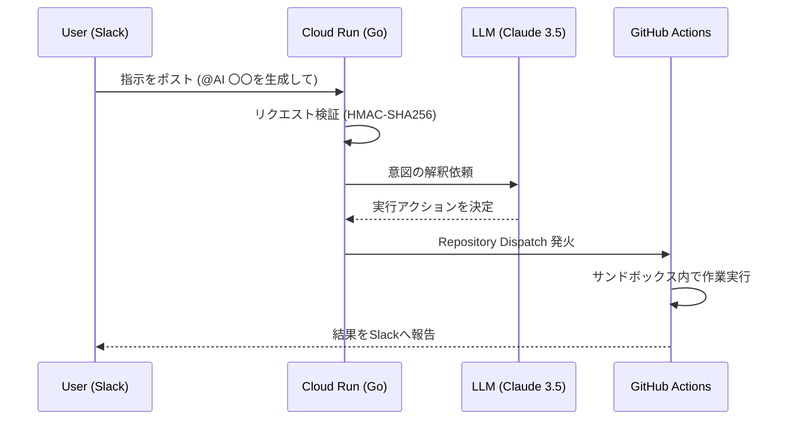

# OpenClaw-Lite: Serverless AI Agent Architecture

## 1. コンセプト

「運用ストレスの最小化と、セキュアな自律自動化」
インフラエンジニアの知見をAIエージェントとして定義し、Slack経由でGitHub上のリソースを操作・生成する基盤。

* **Mobile First**: 外出先や移動中でも、モバイル端末のチャットUIから指示・進捗確認が可能。
* **Serverless**: 固定費を抑え、OS管理やパッチ当て等の保守工数を完全に排除。
* **Safety**: GitHub Actionsをサンドボックスとして利用し、実行環境を都度使い捨てにする。

## 2. ワークフロー詳細 (Visual Flow)

### Mermaid Sequence Diagram



### ASCII Architecture Map

```text
       [  User / Slack  ]
              |
              | (1) "@AI NW Config Update"
              v
   +-----------------------+
   |   Google Cloud Run    | <--- (2) Verify Request (HMAC)
   |      ( Golang )       |
   +----------+------------+
              |
      (3) Thinking... / (4) Decision
              |        v
   +----------+------------+      +-----------------------+
   |  LLM (Claude 3.5)     |      |    GitHub Actions     |
   |      ( The Brain )    |      |     ( The Muscle )    |
   +-----------------------+      +-----------+-----------+
                                              |
                                     (5) Dispatch & Work
                                              |
                                              v
                                  [ GitHub / Repo Asset ]
                                              |
                                     (6) "DONE!" -> Slack

```

## 3. 技術スタック (Tech Stack)

| Layer | Technology | Reason |
| --- | --- | --- |
| **Runtime** | Go 1.22+ | 高速、低メモリ、Cloud Runとの親和性。 |
| **Compute** | Google Cloud Run | 完全サーバーレス、リクエストベース課金。 |
| **VCS/Worker** | GitHub / GitHub Actions | IaC(Infrastructure as Code)の中枢。 |
| **AI Engine** | Claude 3.5 Sonnet | 構造化データの出力精度と推論能力。 |
| **I/F** | Slack API | 汎用的なチャットインターフェース。 |

## 4. セキュリティ実装 (Security)

* **Request Validation**: Slackの `Signing Secret` を用いたHMAC認証によるリクエストの正当性確認。
* **Token Management**: GitHub PATおよびAI API Keyは Google Cloud Secret Manager で一括管理。
* **Ephemeral Environment**: 作業用コンテナはタスク完了ごとに破棄（Stateless）。

## 5. 実装マイルストーン (Roadmap)

* [ ] **Phase 1 (Connectivity)**: Slackメンションに対し、Goハンドラが応答しGHAが発火することを確認。
* [ ] **Phase 2 (Reasoning)**: AIがプロンプトに基づき、適切なワークフローを動的に選択・実行する実装。
* [ ] **Phase 3 (Operational)**: 既存のIACやPLAYBOOKSディレクトリと連携し、実務運用の自動化を開始。

---
