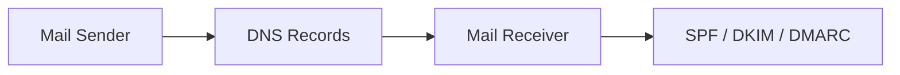
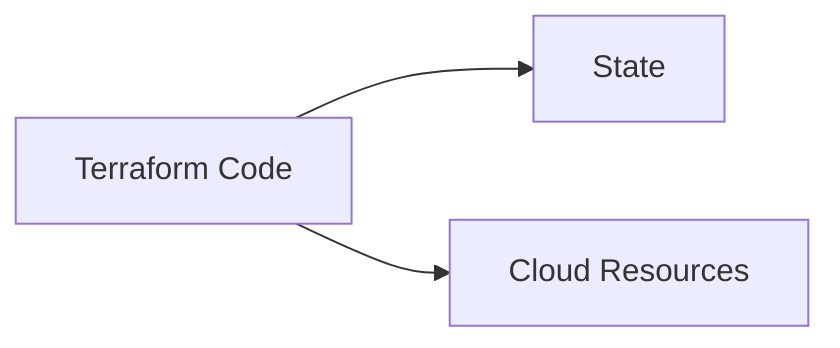
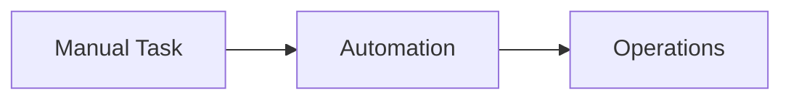

# Architecture Index

本ディレクトリは、  
業務上必要となった **構成・設計・検証の記録** をまとめたものです。

実装ありきではなく、  
**なぜその構成を選んだか／どこに制約があるか** を  
後から説明できる状態で残すことを目的としています。

---

## Scope

主に以下の領域を扱っています。

---

## 01. Platform / Cloud

オンプレミスからクラウドへの移行、  
およびクラウドネイティブ構成の設計検討。

- AWS / GCP を含むマルチクラウド前提
- 移行計画・段階的切り替え
- サーバーレスを前提とした構成整理

📁 `01_PLATFORM_CLOUD/`

```mermaid
graph LR
    OnPrem[On-Premise] --> Cloud[Cloud Platform]
    Cloud --> Serverless[Serverless / Managed Services]
    Serverless --> External[External Systems]
````

---

## 02. Identity / Access

ID 基盤・認証方式の整理と移行検討。

* Google Workspace / IdP 連携
* SSO / アカウント統合
* 移行期の不整合検証と記録

📁 `02_IDENTITY_ACCESS/`

```mermaid
graph LR
    User[User] --> IdP[Identity Provider]
    IdP --> GWS[Google Workspace]
    IdP --> SaaS[SaaS / External Services]
```

---

## 03. Security / Mail

メール認証およびセキュリティ運用の整理。

* SPF / DKIM / DMARC
* Lookup 制限・RFC 制約の検証
* 運用を前提とした設計判断の記録

📁 `03_SECURITY_MAIL/`



---

## 04. Infrastructure as Code (Terraform)

IaC を前提とした構成管理。

* Terraform による環境構築
* 設計ドキュメントとコードの対応
* 検証用 Sandbox 構成

📁 `04_IAC_TERRAFORM/`



---

## 05. Automation / Playbooks

運用を前提とした自動化・手順整理。

* 情シス・運用業務の自動化
* 手作業の削減と再現性確保
* 引き継ぎを意識した記録

📁 `05_AUTOMATION_PLAYBOOKS/`



---

## Archive

検討途中のメモや、
現在はアクティブでない資料。

※ 公開対象外・参照用。

📁 `90_ARCHIVE/`

---

## Notes

* 実装より先に設計を残す
* 判断理由を省略しない
* 後から他者が読める粒度を保つ

---

## Relation

実装例については、以下を参照。

* 📁 `03_IMPLEMENTATIONS/`
  設計に基づく実装・自動化スクリプト

