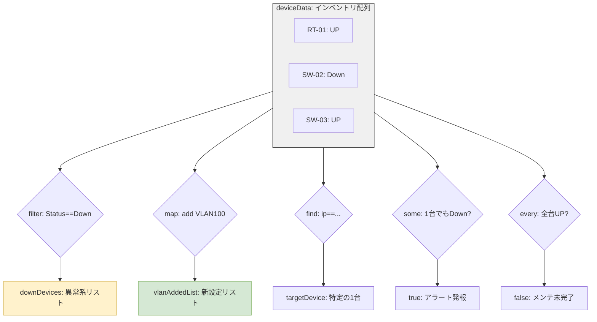

# 📘 JavaScript 実戦演習：Q46 運用・保守ロジック解説

本資料は、ネットワーク機器のインベントリデータをJSで操作し、監視・設定変更・異常検知を行うための「高階関数」と「モダン構文」の解説書です。

## 1. 処理フロー可視化

JSの各メソッドがデータに対してどのような「アクション」を起こすのか、NWの操作に例えて可視化します。

---

## 2. 各Topicの核心：NWエンジニアの眼力

### 🔍 Topic 6: `.find()` 【ピンポイント検索】

* **NWの直感**: `show run | section [IPアドレス]`
* **ハック**: 全体から「これだ」という1つだけを掴む。見つからない場合は `undefined` を返すため、ガード句（`if (targetDevice)`）でのエラー回避がセット。

### 🛠️ Topic 7: `.map()` & `...` 【一括トランスレート】

* **NWの直感**: **Configの一括生成（ディアゴスティーニ方式）**
* **ハック**: 元のリストを汚さず、全員に「新設定（vlan:100）」を適用した新リストを生成。スプレッド構文（`...`）は「既存Configの継承」であり、Terraformの `for_each` に通ずる量産ロジックの基本。

### 🚥 Topic 8: `.some()` & `.every()` 【論理ヘルスチェック】

* **NWの直感**: **SNMP Trap / 一括Ping確認**
* **ハック**: `.some()` は「1台でもDownしているか？」、`.every()` は「全台UPか？」を判定。`true/false` で結果が出るため、監視ダッシュボードのフラグ立てに最適。

### 🏷️ Topic 9: 三項演算子 `( ? : )` 【インラインACL】

* **NWの直感**: **1行ステータスラベル**
* **ハック**: `if-else` を1行で完結。`Status === 'UP' ? '✅' : '❌'` のように、表示上のラベリングをスマートに記述するプロの作法。

### 🔗 Topic 10: 論理演算子 `&&` 【拡張ACL】

* **NWの直感**: **複合条件フィルタ（Extended ACL）**
* **ハック**: `Type === 'Switch' && Status === 'Down'` のように、複数の属性を組み合わせて「真の調査対象」を絞り込む。

---

## 3. レガシー(ES5) vs モダン(ES6) 比較

現場の環境に合わせて書き換えられるよう、2つの流儀を整理します。

| 機能 | レガシー (ES5) | モダン (ES6) | 理由 |
| --- | --- | --- | --- |
| **変数宣言** | `var` | `const` / `let` | スコープの安全確保 |
| **関数** | `function(d) { ... }` | `(d) => { ... }` | 記述の簡略化 |
| **文字列** | `'ID: ' + id` | ``ID: ${id}`` | 可読性（テンプレート） |
| **前方一致** | `indexOf('10.') === 0` | `startsWith('10.')` | 直感的な命名 |
| **継承** | `Object.assign({}, d)` | `{ ...d }` | 直感的なスプレッド構文 |

---
