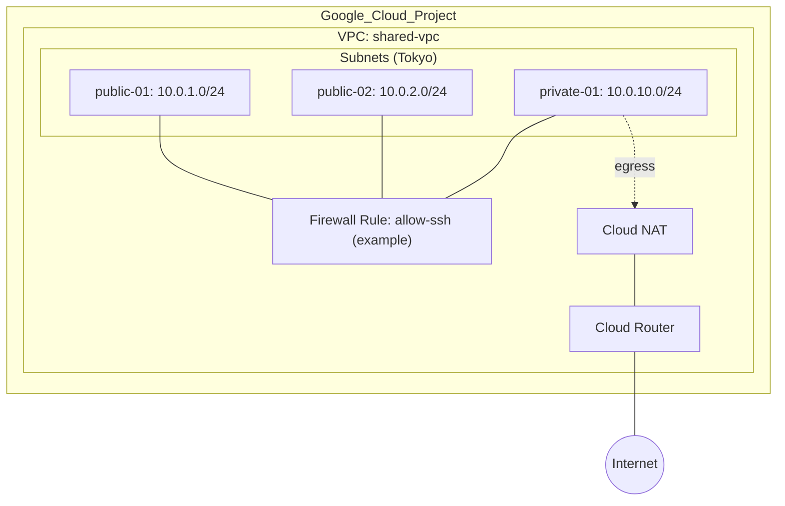

# Google Cloud Infrastructure as Code (Terraform) 構成定義書

本プロジェクトは、Google Cloud 上のネットワーク基盤（VPC / Subnet / Firewall / NAT）を Terraform で構築・管理するための設計モデルである。GUI 運用中心の現場を IaC 化し、運用の安全性と再現性を向上させることを目的とする。

## 1. ファイル構成と役割

Terraform の各ファイルは、役割ごとに疎結合に分離し、保守性を高める。

| ファイル名          | 役割（NWエンジニア視点）                                                      | 開発（JS）のメタファー        |
| -------------- | ------------------------------------------------------------------ | ------------------- |
| `provider.tf`  | 接続先・認証定義：GCP のプロジェクト / リージョン等、操作対象を宣言                              | 外部 API の `config`   |
| `variables.tf` | パラメータ定義：CIDR、命名、リージョンなどを外出しし環境差分を吸収                                | `const` / 設定値       |
| `main.tf`      | 基盤構築：VPC と Subnet（必要に応じて secondary range 等）を定義。`for_each` による量産を実装 | `Array.map()` による生成 |
| `fw.tf`        | 通信制御：Firewall ルール（許可 / 拒否）を定義。対象は network tag 等で制御                 | 条件分岐 / フィルタ         |
| `nat.tf`       | 外部接続出口：Cloud Router と Cloud NAT の依存関係を構築                           | Promise チェーン（依存）    |
| `outputs.tf`   | 構築結果の可視化：VPC ID、Subnet 一覧、NAT 名等を出力し運用確認を補助                        | `console.log()`     |

## 1.1 構成イメージ（Mermaid）

---

## 2. 運用時の最重要注意点（ガードレール）

IaC による運用事故を防ぐため、以下の防衛策を実装・遵守する。

### 2.1 誤削除防止（lifecycle）

基幹リソース（VPC 等）には `prevent_destroy = true` を設定し、誤操作による環境破壊を防止する。

* 例：VPC、重要な Subnet、NAT など「消えると復旧コストが高い」ものが対象
* 例外：一時検証環境など、破棄前提のリソースは対象外（ディレクトリ分離で管理）

### 2.2 変更の事前検知（plan）

反映前に必ず `terraform plan` を実行し、破壊的変更（ForceNew / 再作成）が含まれていないか差分を精査する。

* 特に注意する差分：Subnet の CIDR 変更、Router/NAT の再作成、Firewall の意図しない開放
* “apply してから気づく” を防ぐ運用を最優先とする

### 2.3 State 管理の共有（backend）

実務では `backend.tf` を導入し、tfstate を GCS に保存することでチーム運用の衝突を回避する。

* tfstate をローカルに置かない（属人化、消失、同時編集リスク）
* 可能であれば state バケットへの IAM を最小化する（編集者・閲覧者の分離）

---

## 3. GUI から IaC への移行に関する論点

GUI から Terraform 管理へ移行する際、特に注視すべきポイントを整理する。

### 3.1 既存環境のインポート（terraform import）

稼働中リソースを壊さず Terraform 管理下へ移行するため、現行設定をコード化し、インポート作業を慎重に実施する。

* 先に HCL を整備 → import → plan で差分確認
* import 直後は差分が出やすいため、段階的に “差分ゼロ” を目指す

### 3.2 ドリフト検知と解消

GUI での直接変更（ドリフト）を `plan` で早期に検知し、常に「コードが正」の状態を維持する。

* 原則：GUI 変更は禁止（緊急時のみ例外）
* 例外運用を作るなら「変更申請 → 後追いでコード反映」までセット

### 3.3 ディレクトリ分割による環境分離

1 フォルダに全てを詰め込まず、環境（dev / prod）やレイヤー（Network / Security）で分割し、影響範囲（爆発半径）を最小化する。

* 例：`envs/dev/network/` と `envs/prod/network/`
* 例：共通 module を `modules/` に切り出し、利用側は最小定義に寄せる

---

## 4. 実践中のスキルセット（検証済み）

AI をペアプログラミング・パートナーとして活用し、「手動運用の現場を安全・高速に IaC 化する」観点で、以下のプロトタイプ検証を完了している。

* `for_each` による複数 Subnet の動的一括生成
* 三項演算子による環境別パラメータ切替
* `outputs` による運用確認の自動化補助

---

## 5. 補足（実務での推奨）

* 命名規約：`{system}-{env}-{region}-{role}` のように一貫性を持たせる
* Firewall：最小許可（必要な宛先・ポート・送信元に限定）
* NAT：必要な Subnet のみを対象にする（全開放を避ける）

---
