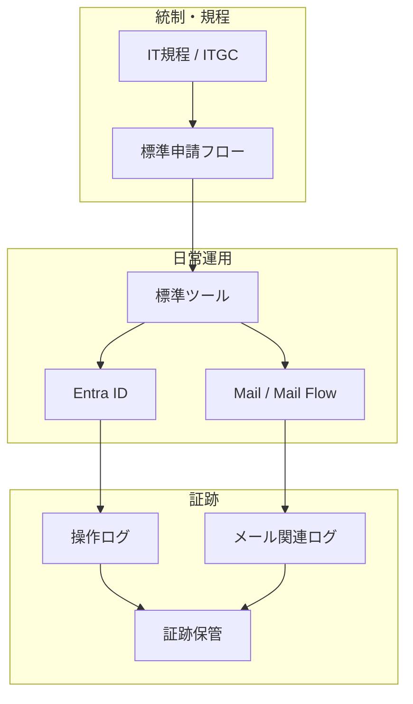

# Case Study 02：大規模企業における ID・メール基盤の運用対応

## プロジェクト概要

* **対象:** 国内大手製造業（数万人規模）
* **環境:** 厳格なガバナンス・監査前提
* **担当:** 運用担当（既存設計基盤の安定運用）
* **対象領域:**

  * Microsoft Entra ID（ID / 認証 / 権限管理）
  * メール基盤（Exchange 系 / Mail Flow）

本案件では、
**既に設計・承認された統制環境のもとで、ID およびメール基盤の運用を担当**しました。

ツール選定や独自自動化の裁量は限定的でしたが、
結果として **運用事故・監査指摘が発生しない状態を継続**しています。

---

## 実務として担当した運用領域

### ID 管理（Entra ID）

* ユーザーライフサイクル管理

  * 作成 / 変更 / 無効化 / 削除
* 権限付与・剥奪の手順運用
* 申請内容と実設定の突合確認
* 操作ログ・監査ログの整合性維持

運用上は、
「**誰が・いつ・なぜ付与されたか説明できない権限を作らない**」
ことを最優先としていました。

---

### メール基盤・Mail Flow 運用

* メールアドレスの付与・変更・削除対応
* 配信ルール（Mail Flow）の管理
* 誤配信・なりすまし・情報漏洩を想定した確認手順
* 障害・問い合わせ時のログトレース対応

メールは ID と直結しており、
**一度のミスが業務・信用に直結する領域**であるため、
常に説明可能性と再現性を重視した運用を行っていました。

---

## 運用構造の整理（事後整理）

以下は、
**当時の実運用を後から構造として整理したもの**です。

新規に設計したものではなく、
「なぜこの運用が破綻しなかったか」を説明するための整理図です。

### この構造が意味していること

* 判断は人が行うが、恣意的な操作が入り込まない
* 日常運用の結果がそのまま監査証跡になる
* 特定の担当者に依存しない（誰が対応しても説明できる）

---

## 運用で意識していた点

### 説明できる操作を優先する

* なぜその設定が存在するのか
* なぜその権限が必要なのか
  → 後から必ず説明できる状態を維持

### 監査対応を特別扱いしない

* 監査前に慌てて資料を作らない
* 日常運用の積み重ねをそのまま提出できる状態を維持

### 例外対応を増やさない

* 一時対応・特例対応を極力作らない
* 例外が出た場合は、必ず正規フローへ戻す

---

## 現在の業務への活用

* クラウドや自動化を扱う際も
  **壊れない前提・説明できる前提**から構成を考える
* 監査・セキュリティ案件においても
  ドキュメント整理やレビュー対応に抵抗がない
* 自動化を行う場合も
  「なぜこの方法で問題ないか」を言語化できる

大規模かつ統制の厳しい環境での運用経験は、
現在の **監査・セキュリティを前提としたクラウド運用・設計の基盤** になっています。

---
