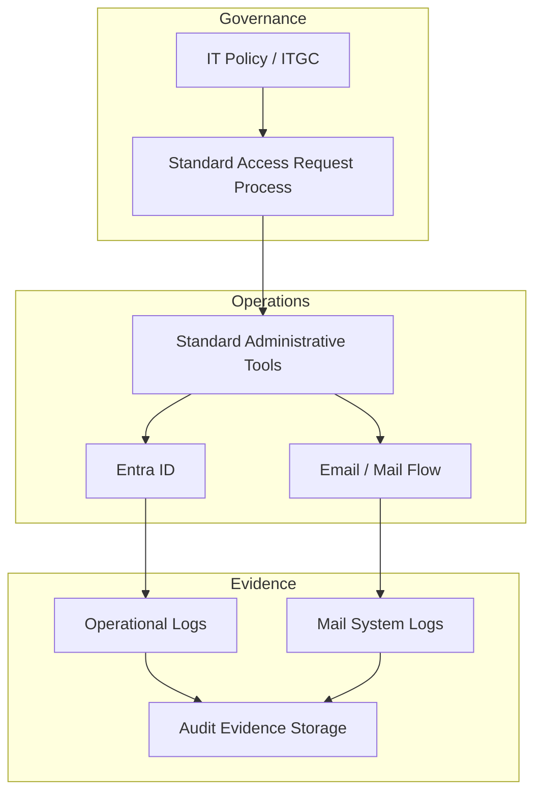

# Case Study 02

## Enterprise Identity and Email Infrastructure Operations

(Entra ID / Exchange / Governance-Based Operations)

## Overview

This project involved operational management of enterprise identity and email infrastructure within a large manufacturing organization.

The environment operated under strict governance and audit requirements, with an identity platform serving tens of thousands of users.

Responsibilities focused on maintaining the stability and reliability of existing identity and email systems that had already been formally designed and approved.

Although architectural decisions and tool selection were outside the operational scope, the role required maintaining **consistent operations without security incidents or audit findings**.

---

## Environment

Industry: Large manufacturing enterprise

Operational scope included:

* Microsoft Entra ID (identity and authentication platform)
* enterprise email infrastructure (Exchange / Mail Flow)
* identity governance and audit-compliant operational processes

The system supported a large user population and required strict operational discipline.

---

## Operational Responsibilities

### Identity Management (Entra ID)

Operational tasks included:

* user lifecycle management

  * account creation
  * modification
  * deactivation
  * deletion
* role and permission assignment / revocation
* validation between access requests and actual configuration
* operational log verification and audit trace consistency

Operational policy emphasized:

**No permissions should exist without a clear explanation of who granted them, when, and why.**

---

### Email Infrastructure and Mail Flow Operations

Responsibilities included:

* email account provisioning and modification
* mail routing and mail flow rule management
* verification procedures to prevent misdelivery, spoofing, or information leakage
* log tracing and troubleshooting during incidents or user inquiries

Because email infrastructure is directly linked to identity systems, operational mistakes could have significant organizational impact.

For this reason, operations emphasized **traceability and reproducibility**.

---

## Operational Structure (Retrospective Analysis)

The following diagram summarizes the operational structure based on actual day-to-day processes.

This was not a newly designed architecture, but rather a structured explanation of why the operational model remained stable.

---

## Operational Principles

### Prioritize Explainable Operations

All configuration changes required clear explanations:

* why the configuration exists
* why specific permissions are necessary

Every operational decision needed to remain explainable in future audits.

---

### Treat Audits as Normal Operations

Rather than preparing special documentation during audit periods, the operational process itself generated the required evidence.

This approach ensured that:

* operational logs served as audit records
* documentation remained consistent with daily operations

---

### Avoid Exceptional Processes

Temporary or special-case operational procedures were avoided whenever possible.

If exceptions occurred, they were returned to the standard operational workflow.

This maintained long-term system consistency.

---

## Impact on Current Work

Experience operating identity and email infrastructure in a highly governed environment provided several long-term benefits:

* designing systems based on **operational reliability and auditability**
* comfort working within security and compliance frameworks
* ability to document and explain operational decisions
* designing automation while preserving governance requirements

This experience now supports work involving **cloud operations, security-conscious system design, and governance-aware infrastructure architecture**.

---

## Summary

Operating enterprise identity and email infrastructure within a governance-heavy environment, ensuring stable operations while maintaining audit-ready processes and traceable system management.

---
