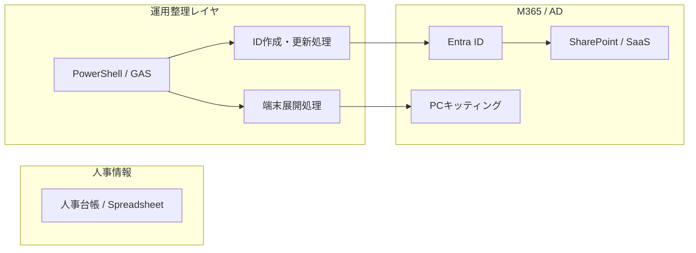

# Case Study 03: ヘルスケア企業でのコーポレートIT運用

## 📌 プロジェクト概要

* **業界**：ヘルスケア（メディカルテック系事業）
* **事業フェーズ**：組織拡大期
* **担当領域**：

  * ITインフラ運用の整理・構造化
  * ID / 端末 / SaaS 運用の標準化支援

本プロジェクトでは、
**属人化していたIT運用を、再現性のある運用フローへ移行すること**を目的とした。

---

## 🎯 背景・課題

急激な人員増加と事業拡大により、以下の課題が発生していた。

* アカウント発行・権限付与が人依存
* 端末キッティングが手作業前提
* パスワード・クレデンシャル管理が煩雑
* 監査・DLP観点での整理不足

IT部門として、
**業務を止めずに、運用負荷とリスクを下げる仕組み作り**が求められていた。

---

## 🏗 基本方針

* 手作業を前提にしない
* 属人化を前提にしない
* 運用・引き継ぎを想定した構成とする

「高度な仕組み」ではなく、
**当時の組織スキルで無理なく回る設計**を重視。

---

## 🧩 採用スタック・構成

### プラットフォーム

* Microsoft 365（M365）

  * Entra ID
  * SharePoint
  * Power Automate
* オンプレミス Active Directory

  * Entra ID とのハイブリッド構成

### 自動化・運用補助

* PowerShell
* Google Apps Script（人事台帳連携）
* MDT（Microsoft Deployment Toolkit）

---

## 🧱 構造化アーキテクチャ概要

人事情報を起点に、
**ID作成・端末展開を一定のルールで処理する流れ**を整理した。

---

## 🔐 セキュリティ・統制面での配慮

* パスワードベース運用を前提
* SharePoint の DLP 設定を考慮
* 権限は必要最小限で付与
* クレデンシャル情報は

  * 保存場所
  * 参照権限
    を明確化

「理想論」ではなく、
**当時の業務実態に合わせた統制レベル**を選択。

---

## 🧠 運用設計のポイント

* 自動化処理は必ずドキュメント化
* 手動作業が残る部分も手順を明文化
* IT担当者が変わっても引き継げる前提

**完全自動化ではなく、破綻しない運用**を重視。

---

## 📈 得られた効果（定性的）

* 定例的なアカウント関連作業の負荷を大きく削減
* 端末キッティングにおける手作業工程を削減
* 運用ルールが整理され、問い合わせ・手戻りが減少

※ 効果は当時の運用感覚で
**3〜5割程度の負荷軽減**と認識。

---

## 🏢 複数企業対応の観点

* 同一グループ内の **複数ヘルスケア企業** をIT側から支援
* 企業ごとの差異を吸収しつつ、

  * ID管理
  * 端末運用
  * M365運用方針
    を整理

**「一社専用に作り込みすぎない」設計**を意識。

---

## 💡 本プロジェクトの位置づけ

* 運用をコードと仕組みで整理する経験
* 後続のクラウド・自動化検討の基礎
* IT運用を「人」ではなく「構造」で捉える視点の確立

運用出身者としての強みが、
そのまま設計に反映されたケース。

---

## 🧷 ポートフォリオとしての価値

* 派手な最新技術は使っていない
* だが、**企業ITで最も壊れやすい領域を扱っている**
* 組織拡大フェーズでの現実的な対応例

---

### 一文まとめ（固定）

> **属人化した IT 運用を、
> 無理のない範囲で構造化した実務プロジェクト。**

---
