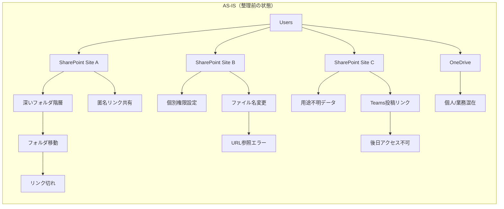
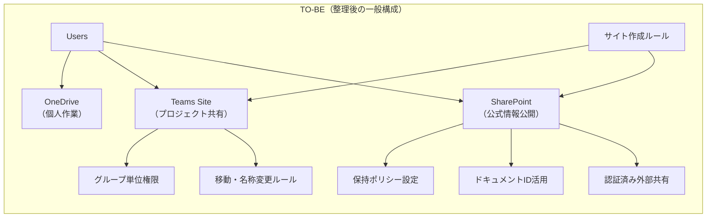

# ✅ TIL（2026-02-16）：SharePoint運用方針の壁打ち整理

**MODE：STD**

---

## 今日の状態

* 体調はSTD（やや眠いが作業は可能）
* 思考は落ち着き気味
* 実装ではなく構造整理向き

---

## 今日の前提

* SharePointを単なる「ファイル置き場」にしないための設計を考える
* 組織利用を想定した場合のガバナンスのあり方を整理
* 実運用ユーザーはいない前提での構造壁打ち

---

# 🗂 SharePoint運用

## AS-IS / TO-BE（一般的な整理モデル）

---

# 🔹 AS-IS（よくある状態）

### 状況

* サイトが利用者主導で増える
* フォルダ階層が深くなる
* 個別権限が増殖する
* OneDrive / Teams / SharePointの役割が曖昧
* 外部共有が場当たり的
* **リンク切れが頻発する**

---

## AS-IS構造図

---

## AS-ISで起きやすい問題

* Teamsに貼ったURLが数ヶ月後に無効
* フォルダ整理＝リンク崩壊
* サイト責任者が不明
* 権限の棚卸しが困難
* ストレージ増加

---

# 🔹 TO-BE（一般的な整理後の状態）

目的は「統制」ではなく、

> **迷わない構造をつくること**

---

## TO-BE構造図

---

## TO-BE整理ポイント

### 1. 用途の明確化

* OneDrive＝個人作業
* Teams＝プロジェクト
* SharePoint（Communication）＝公式共有

### 2. 権限はグループ単位

* フォルダ単位の固有権限は極力避ける

### 3. リンク切れ対策

* 深いフォルダ構造を作らない
* 移動・名称変更ルールの明確化
* ドキュメントIDの活用
* URLは「保存」より「共有リンク」基準

### 4. 外部共有は制限付き

* 匿名リンク原則禁止
* 認証済みユーザー限定

---

# 🧩 差分まとめ

| 項目     | AS-IS  | TO-BE      |
| ------ | ------ | ---------- |
| サイト作成  | 自由     | 申請・ルールあり   |
| 権限     | 個別設定多発 | グループ単位     |
| フォルダ構造 | 深い     | 浅い         |
| リンク    | 切れやすい  | ID/共有リンク活用 |
| 外部共有   | 匿名リンク  | 認証限定       |
| データ責任  | 不明瞭    | 明確         |

---

## メモ

* SharePointは単なるストレージではなく「設計が必要な基盤」
* ガバナンスは制限ではなく「迷わないための案内板」
* 実装しなくても、構造を言語化するだけで理解は深まる

---

## 3行日記

**体調**
・STD 少し眠いが問題なし

**よかったこと**
・SharePointの構造を冷静に整理できた
・実装とは違う思考の使い方ができた

**わるかったこと**
・午後に眠気あり

---

## 今日のまとめ

実運用前提ではないが、
SharePointをどう扱うべきかの骨子を整理できた。

二月中盤。
設計も生活も、シンプルな方が回る。

---
