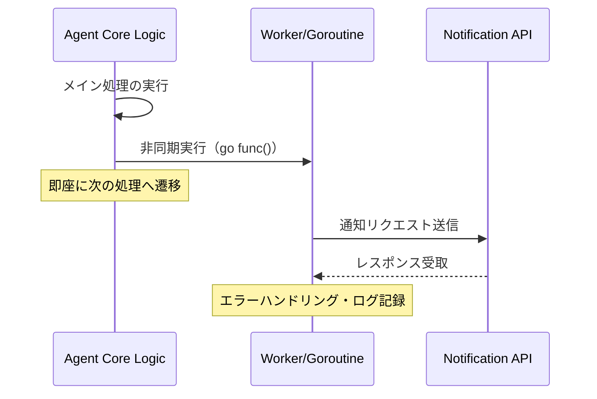

# :white_check_mark: TIL（2024-05-22）：Go言語によるエージェント運用強化と環境整備

**MODE：STD**

---

## 今日の状態

* 体調はSTD（少し眠いが、業務遂行に支障なし）
* Go言語の並行処理実装とアセット管理の設計に注力
* 思考の解像度は高く、アーキテクチャの細部に意識が向いている

---

## 今日の前提

* 自律型エージェントの運用基盤をGoで構築・強化
* 通知処理のレイテンシを排除し、システムのリアルタイム性を向上させる
* 処理対象ファイルのメタデータ（特に拡張子）を欠損させない堅牢なパイプラインの設計

---

# :card_index_dividers: 技術的知見

## 1. Goroutineによる非同期通知の実装

メインロジックの実行を妨げないよう、通知処理を分離。Goの軽量スレッド（Goroutine）を活用し、外部APIのレスポンス待ちによるボトルネックを解消。

### 処理フロー図

---

## 2. 拡張子を維持する資産管理の重要性

クラウドネイティブな資産管理において、ファイル名の整合性は単なる「見た目」の問題ではない。拡張子の欠落はMIME-typeの誤判定を招き、S3/CloudFront等の配信レイヤーで予期せぬ動作（バイナリとしてダウンロードされる等）を引き起こす。

* **設計指針**: 資産移動や加工の際、`filepath.Ext()` を用いた厳格なバリデーションと、元拡張子の強制付与を標準化する。

--- 

# :jigsaw: 整理まとめ

| 項目 | 内容 | 導入メリット |
| :--- | :--- | :--- |
| **非同期通知** | GoroutineによるFire-and-forget | エージェントの応答速度向上、UX改善 |
| **資産管理** | 拡張子保持ロジックの強化 | MIME-type不整合の防止、CDN互換性確保 |

---

## 3行日記

**体調**
・STD 少し眠いがなんとかなるだろう。適度なカフェインで調整。

**よかったこと**
・Goの並行処理の恩恵を直接的に実装に落とし込めた。
・資産管理におけるエッジケース（拡張子欠落）の予防策を定義できた。

**わるかったこと**
・細部へのこだわりにより、やや作業時間が延びた。

---

## 今日のまとめ

エージェント運用の安定化に向けた技術的負債の解消と、将来的なスケーラビリティを考慮した実装を進めることができた。インフラとコード、両方の視点を持つことで、より堅牢なシステムが構築できると再確認した一日であった。