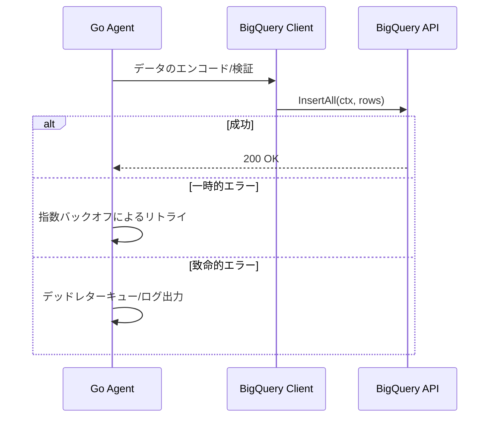

# :white_check_mark: TIL（2026-02-19）：Go言語によるエージェント運用強化とBigQuery連携の安定化

**MODE：STD**

---

## 今日の状態

* 体調はSISU（花粉症で少し頭痛だが、なんとかなるだろう）
* Go言語を用いたエージェントの運用基盤強化と環境整備に従事
* BigQueryとの連携を「単なる接続」から「プロダクトとしての安定稼働」へと昇華させるための設計を模索

---

## 今日の前提

* 自律型エージェントの実行ログや処理結果をBigQueryへ集約し、分析・最適化のサイクルを回す
* 単一のAPIコールに依存せず、リトライ戦略や型安全性を担保したデータパイプラインの構築
* 開発環境と本番環境の差異を埋めるためのGoによる環境整備

---

# :card_index_dividers: 技術的知見

## 1. BigQuery SDKを利用した信頼性の高いデータインジェスト

Goの`google-cloud-go/bigquery`パッケージを用い、ストリーミングインサートの際のエラーハンドリングを強化。プロダクトレベルでは、一時的なネットワークエラーやクォータ制限への対応が不可欠。

### 処理フロー図

---

## 2. プロダクトとしての安定性を重視した環境整備

環境変数管理や依存関係の整理を行い、エージェントがどの環境でも同一の挙動を示すようカプセル化を推進。特にBigQueryのデータセットIDやテーブル構造のバージョン管理をコードベースで厳格化する。

* **設計指針**: インフラ設定をハードコードせず、Goの構造体とタグ（`bigquery:"column_name"`）を利用してスキーマとマッピングし、型安全なデータ転送を実現する。

--- 

# :jigsaw: 整理まとめ

| 項目 | 内容 | 導入メリット |
| :--- | :--- | :--- |
| **BQ連携強化** | エラーハンドリングとリトライ戦略の再定義 | データ欠損の防止、システムの堅牢性向上 |
| **環境整備** | Goによる環境変数とスキーマの連動設計 | デプロイミスの削減、保守性の向上 |

---

## 3行日記

**体調**
・SISU 花粉症で頭痛　無理しない

**よかったこと**
・BigQueryとの連携ロジックをより抽象化し、再利用可能なコンポーネントに落とし込めた。
・「動く」だけでなく「運用に耐えうる」レベルでの設計を完遂できた。

**わるかったこと**
・細部のリファクタリングに熱中し、予定より少し時間が押してしまった。

---

## 今日のまとめ

エージェント運用の要となるデータ連携基盤において、Goの特性を活かした堅牢な設計を検討した。BigQueryへのデータ集約は将来的な分析の鍵となるため、プロダクト品質での安定稼働を目指し、引き続き環境整備を進める。