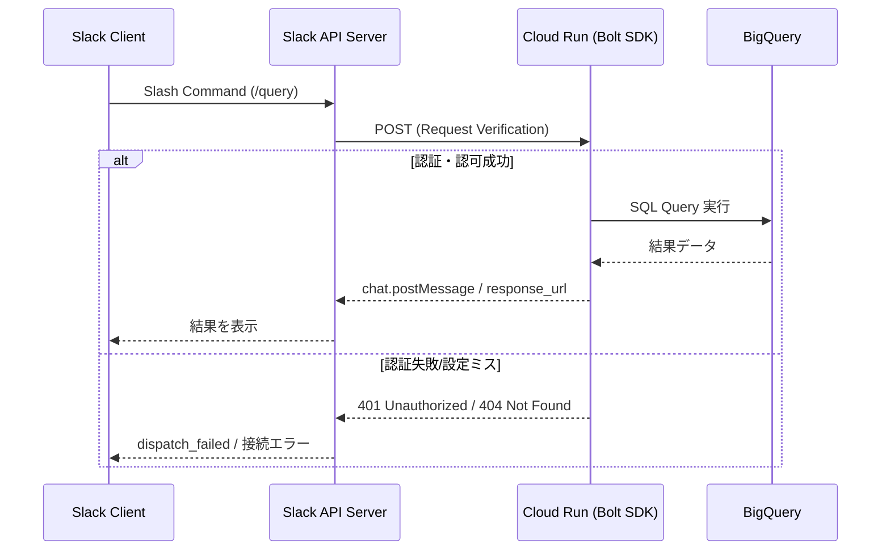

# :white_check_mark: TIL（2026-02-21）：Slack × Cloud Run による ChatOps 基盤の構築と接続トラブル対応

**MODE：STD**

---

## 今日の状態

* 体調はSTD（良好、安定したパフォーマンスを維持）
* Slack Bolt SDK を用いた ChatOps 基盤のデプロイおよび疎通確認に従事
* Slash Command を起点とした BigQuery 連携パイプラインのデバッグを完了

---

## 今日の前提

* Cloud Run 上で Slack Bolt SDK (Node.js/Python) を稼働させ、サーバーレスな運用基盤を構築
* Slash Command → Cloud Run → BigQuery → Slack 返信 という一連のデータフローの実装
* インフラ構成管理および認証情報のセキュアなハンドリング（Secret Manager 等の活用）

---

# :card_index_dividers: 技術的知見

## 1. Slack 接続におけるトラブルシューティングの要点

ChatOps 基盤の構築において、接続エラーの多くは実装ロジックではなく、認証・権限・インフラ設定の不整合に起因する。特に Cloud Run のようなフルマネージド環境では、エンドポイントの露出設定と Slack 側の構成を一致させることが肝要である。

### 処理フロー図

---

## 2. エラー要因の分類と対策

本日のトラブル整理の結果、Slack App 接続におけるエラーの 9 割は以下の軽微な設定ミスに集約されることが判明した。

*   **認証情報 (Auth)**: `SLACK_SIGNING_SECRET` や `SLACK_BOT_TOKEN` の環境変数への設定漏れ、または古いトークンの残存。
*   **スコープ (Scope)**: `chat:write`, `commands` などの必要な OAuth Scope が Slack App 管理画面で許可されていない、あるいは変更後に再インストール（Reinstall to Workspace）が行われていない。
*   **権限 (IAM)**: Cloud Run のサービスアカウントに BigQuery 閲覧者権限が付与されていない。
*   **URL 構成**: Request URL の末尾 `/slack/events` の有無や、GCP 側の「未認証の呼び出しを許可」設定の不備。

---

# :jigsaw: 整理まとめ

| 項目 | 内容 | 導入メリット |
| :--- | :--- | :--- |
| **Bolt SDK 連携** | Cloud Run 上でのサーバーレス運用 | 低コストかつスケーラブルな運用基盤の実現 |
| **トラブル分類** | エラー要因を「認証・権限・設定」に整理 | 障害発生時の切り分けスピード向上 |
| **BQ 連携** | Slash Command をトリガーとした非同期処理 | 業務フローの Slack 完結による効率化 |

---

## 3行日記

**体調**
・STD。安定したコンディションで作業に集中できた。

**よかったこと**
・一見複雑に見える接続エラーを、認証・権限・URLの 3 点に整理して言語化できた。
・Cloud Run と BigQuery の連携における IAM 設計を最適化できた。

**わるかったこと**
・Slack App の再インストールを忘れ、古いスコープでデバッグを続けてしまい、時間を浪費した。

---

## 今日のまとめ

Cloud Run を利用した ChatOps 構築において、ボトルネックとなるのはコードそのものよりも、Slack サービスとクラウドインフラ間の「信頼関係の構築（認証・認可設定）」にあることを再認識した。今回のトラブル整理により、今後の ChatOps 基盤構築におけるデバッグ工数の大幅な削減が期待できる。

明日の課題
・BigQuery 連携クエリの最適化
・Cloud Run のタイムアウト設定（現状 300 秒）に伴うユーザーエクスペリエンスの確認
・リトライトークン処理の実装検討