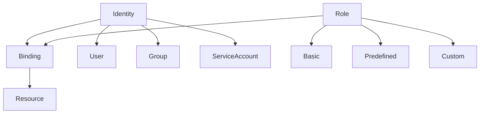
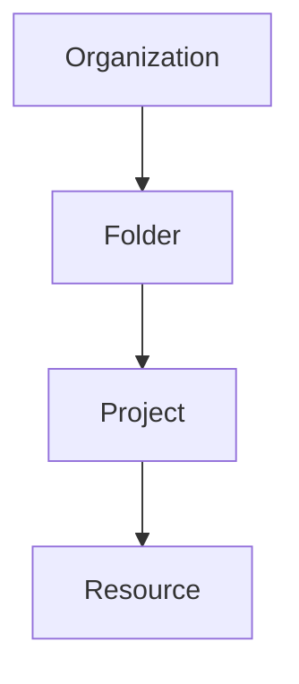
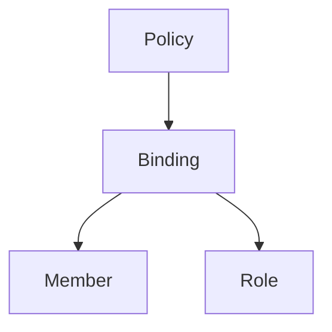
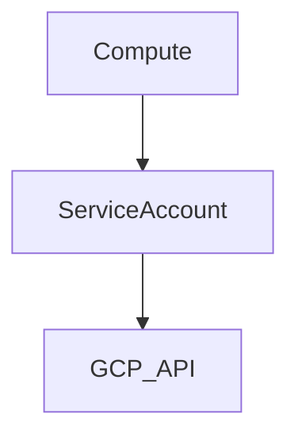
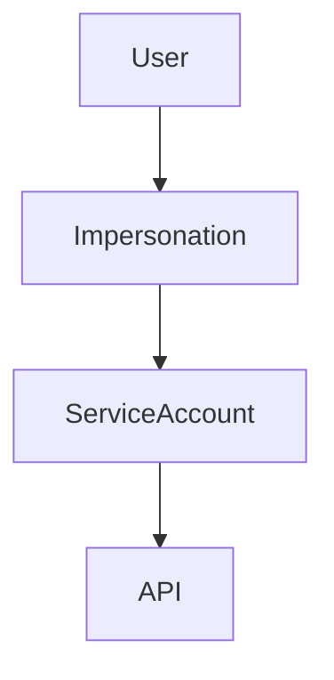
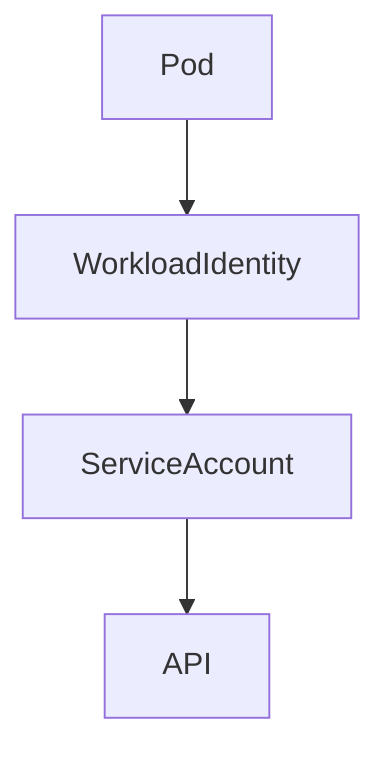
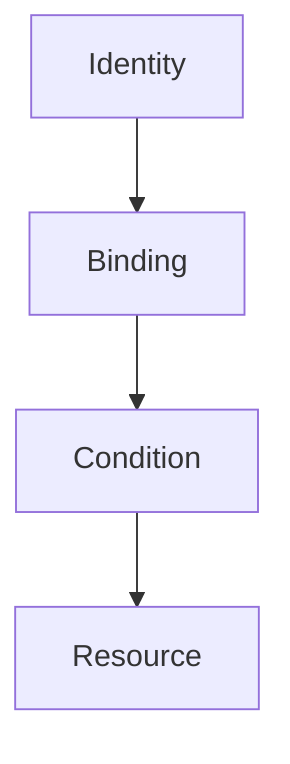
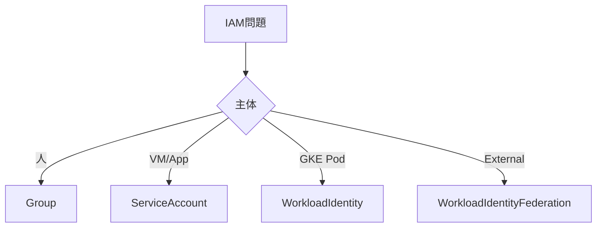
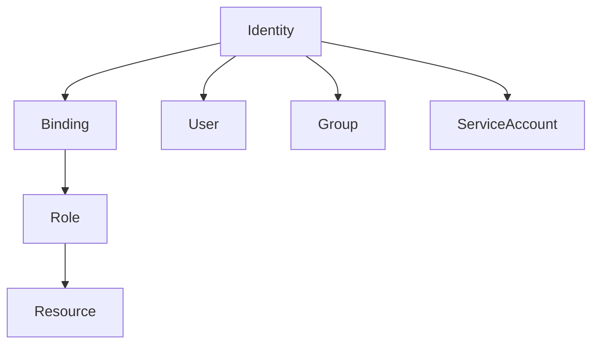

# GCP IAM（ACE / 2026）

GCPのIAMは次の基本構造で理解する。

```
Identity + Role → Resource
```

この関係を **Binding** が結び付ける。

IAMの理解はこの式から始まる。

---

# 1. IAMの基本構造

## 1.1 IAMの構成要素



| 要素       | 内容    |
| -------- | ----- |
| Identity | 誰     |
| Role     | 何ができる |
| Resource | どこ    |
| Binding  | 紐付け   |

IAMは

```
Identity + Role → Resource
```

この構造で権限を管理する。

---

# 2. Identity（主体）

## 2.1 Identityの種類

| Identity        | 用途  |
| --------------- | --- |
| User            | 人   |
| Group           | チーム |
| Service Account | アプリ |

---

## 2.2 ACE判断

```
人管理 → Group
```

理由

```
Userに直接Roleを付与すると管理不能になる
```

運用では

```
User → Group → Role
```

で管理する。

---

# 3. IAM階層

IAMは **上位階層から継承**される。

## 3.1 IAM階層構造



| レベル          | 用途 |
| ------------ | -- |
| Organization | 全社 |
| Folder       | 部門 |
| Project      | 環境 |
| Resource     | 個別 |

---

## 3.2 ACE判断

```
全Project制御
→ Organization IAM
```

---

# 4. IAM Policy

IAMは **Policy → Binding** で構成される。

## 4.1 Policy例

```
member: user:alice@example.com
role: roles/viewer
```

---

## 4.2 Policy構造



---

# 5. Role

## 5.1 Roleの種類

| 種類         | 説明                      |
| ---------- | ----------------------- |
| Basic      | viewer / editor / owner |
| Predefined | Google提供                |
| Custom     | カスタム                    |

---

## 5.2 ACE判断

```
最小権限 → Predefined Role
```

理由

```
Basic Roleは権限が広すぎる
```

---

# 6. Service Account

Service Accountは **アプリ用Identity**。

---

## 6.1 Service Account利用例



| シナリオ                  | 解決              |
| --------------------- | --------------- |
| VM → API              | Service Account |
| Cloud Run → API       | Service Account |
| Cloud Functions → API | Service Account |

---

## 6.2 ACE判断

```
Compute → Service Account
```

---

# 7. Service Account認証

GCP内部アクセスは **Metadata Server** を利用する。

```
Compute
   |
Service Account
   |
Metadata Server
   |
Access Token
   |
GCP API
```

---

## 7.1 ACE判断

```
GCP内部アクセス
→ Service Account attach
```

---

# 8. 外部アクセス

2026の推奨方式

```
Workload Identity Federation
```

---

## 8.1 構造

```
External Identity
       |
Workload Identity Federation
       |
Service Account
       |
GCP API
```

---

## 8.2 JSON Key

JSON Keyは

```
例外用途
```

のみ使用する。

---

# 9. Service Account Impersonation

鍵なしService Account利用。



---

## 9.1 利用ケース

| 問題         | 解決            |
| ---------- | ------------- |
| JSON key回避 | Impersonation |
| 一時権限       | Impersonation |

---

## 9.2 ACE判断

```
key回避 → SA Impersonation
```

---

# 10. Workload Identity

GKE PodからGCP APIアクセス。



---

## 10.1 ACE判断

```
Pod → API
→ Workload Identity
```

理由

```
JSON key不要
```

---

# 11. IAM Conditions

条件付きIAM。



---

## 11.1 条件例

| 条件       | 例      |
| -------- | ------ |
| 時間       | 勤務時間   |
| IP       | 社内IP   |
| Resource | bucket |

---

## 11.2 ACE判断

```
条件付きアクセス → IAM Conditions
```

---

# 12. Organization Policy

組織全体の制御。

---

## 12.1 代表例

| 制限         | 例                                    |
| ---------- | ------------------------------------ |
| 外部IP禁止     | compute.vmExternalIpAccess           |
| SA key禁止   | iam.disableServiceAccountKeyCreation |
| location制限 | resourceLocations                    |

---

## 12.2 ACE判断

```
組織制御 → Org Policy
```

---

# 13. Cross Project Access

別Projectのリソースにアクセスする場合。

---

## 13.1 構造

```
Project A (SA)
       |
       v
Project B (Resource)
```

---

## 13.2 重要ポイント

```
Resource側IAMで許可
```

---

## 13.3 ACE判断

```
別Projectアクセス
→ Resource側IAM
```

---

# 14. Default Service Account

GCPが自動作成するService Account。

例

```
PROJECT_NUMBER-compute@developer.gserviceaccount.com
```

---

## 14.1 問題

```
Editor Role付与
```

---

## 14.2 推奨

```
権限最小化
または
専用Service Account
```

---

# 15. 専用Service Account

VMごとにSAを分離。

```
VM A → SA_A → Bucket
VM B → SA_B → BigQuery
```

---

## 15.1 理由

| 問題     | 解決   |
| ------ | ---- |
| 権限拡散   | 専用SA |
| セキュリティ | 最小権限 |

---

## 15.2 ACE判断

```
VM限定アクセス → 専用SA
```

---

# 16. Project Isolation

GCPで最も強い境界。

---

## 16.1 用途

| 要件        | 解決      |
| --------- | ------- |
| IAM分離     | Folder  |
| チーム分離     | Project |
| Billing分離 | Project |

---

## 16.2 ACE判断

```
完全分離 → 新Project
```

---

# 17. Project Lien

Project削除防止。

| 機能   | 内容                |
| ---- | ----------------- |
| 削除防止 | accidental delete |

注意

```
IAM制御ではない
```

---

# 18. IAM設計ルール

| 原則        | 内容              |
| --------- | --------------- |
| 最小権限      | least privilege |
| Group管理   | 人直接付与しない        |
| SA分離      | アプリ単位           |
| Project分離 | 強い境界            |

---

# 19. IAM判断ツリー



---

# 20. ACE頻出パターン

| 問題         | 答え                           |
| ---------- | ---------------------------- |
| 人管理        | Group                        |
| VM → API   | Service Account              |
| Pod → API  | Workload Identity            |
| 外部Identity | Workload Identity Federation |
| Key回避      | SA Impersonation             |
| 組織制御       | Org Policy                   |
| 条件付き       | IAM Conditions               |
| VM限定アクセス   | 専用SA                         |
| Project分離  | 新Project                     |

---

# 21. IAM超短縮

```
人 → Group
VM → Service Account
Pod → Workload Identity

外部 → Workload Identity Federation

鍵回避 → Impersonation
組織制御 → Org Policy
条件付き → IAM Conditions

完全分離 → Project
```

---

# 22. 2026 IAMトレンド

| 技術                           | 状況   |
| ---------------------------- | ---- |
| Workload Identity            | 標準   |
| Workload Identity Federation | 急増   |
| SA Impersonation             | 推奨   |
| JSON Key                     | 最小化  |
| Org Policy                   | 企業必須 |
| IAM Conditions               | 普及   |

---

# 23. IAM最終構造


