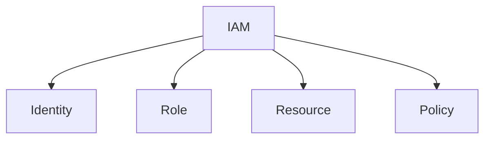
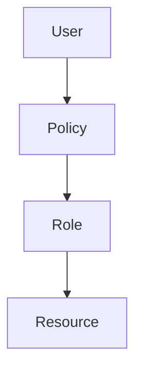
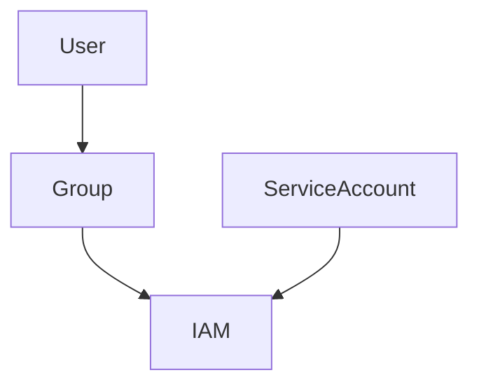
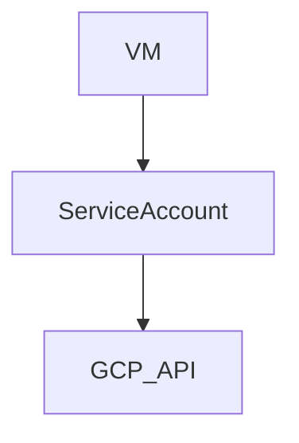
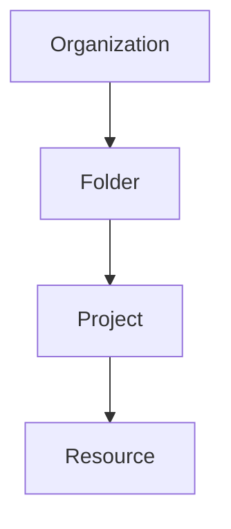
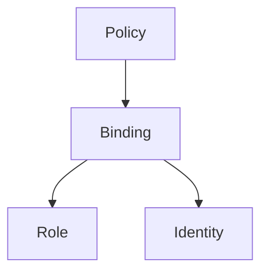
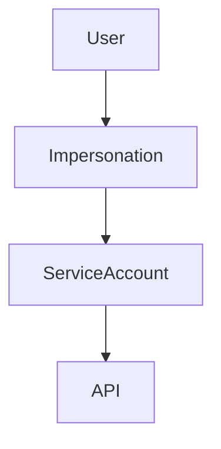
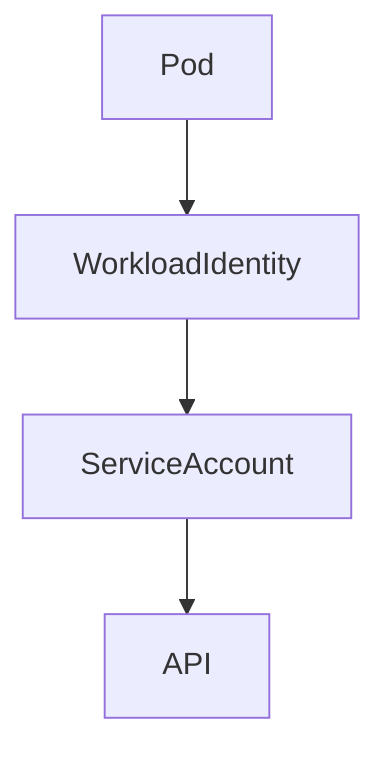
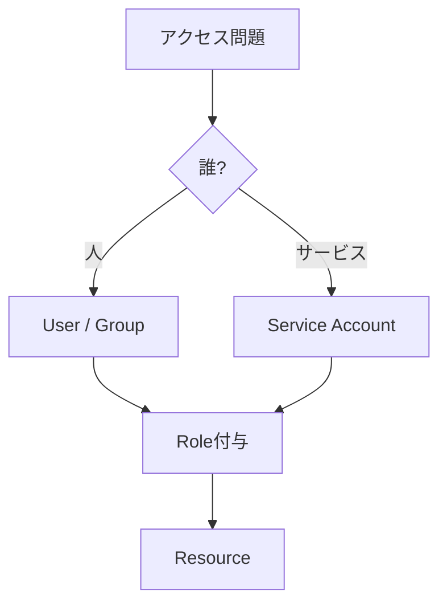
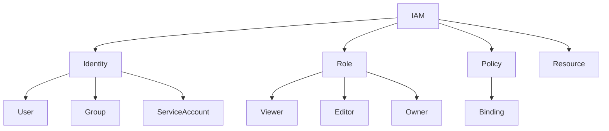

# GCP IAM（ACE）

IAM問題は **4要素**で考えます。



| 要素       | 意味  |
| -------- | --- |
| Identity | 誰が  |
| Role     | 何を  |
| Resource | どこで |
| Policy   | ルール |

短覚え

```text
IAM = Who + What + Where
```

---

# IAM基本構造



例

```
User
↓
role/storage.objectViewer
↓
Cloud Storage
```

---

# Identity（主体）

| 種類              | 説明     |
| --------------- | ------ |
| User            | 人      |
| Group           | ユーザー集合 |
| Service Account | サービス   |

図



ACE重要

```text
人に直接権限付与しない
→ Groupに付与
```

理由
管理が簡単。

---

# Service Account

VMやアプリ用のIdentity。



用途

| 状況            | 答え              |
| ------------- | --------------- |
| VM→GCP API    | Service Account |
| Cloud Run→API | Service Account |

ACE暗記

```text
Compute → Service Account
```

---

# Role（権限）

| 種類         | 説明                      |
| ---------- | ----------------------- |
| Basic      | viewer / editor / owner |
| Predefined | Google管理                |
| Custom     | 自作                      |

例

```
roles/storage.objectViewer
```

ACE

```text
最小権限
→ predefined role
```

---

# IAM階層

GCPは **階層構造**



権限は **上から継承**

| 階層           | 例  |
| ------------ | -- |
| Organization | 会社 |
| Folder       | 部門 |
| Project      | 環境 |

ACE

```text
組織全体
→ Organization policy
```

---

# Policy

IAMは **Policyで管理**



例

```
member: user:alice@example.com
role: roles/viewer
```

---

# Service Account Impersonation

鍵を作らずにSA使用。



ACE

```text
JSON key回避
→ SA impersonation
```

---

# Workload Identity

Pod → GCP API。



ACE

```text
GKE Pod → API
→ Workload Identity
```

---

# Organization Policy

組織レベル制御。

| 用途 | 例        |
| -- | -------- |
| 制限 | 外部IP禁止   |
| 制限 | SA key禁止 |

ACE

```text
組織制限
→ Org Policy
```

---

# IAM判断フロー（ACE）



---

# IAM試験ひっかけ

| 問題      | 答え                |
| ------- | ----------------- |
| VM→API  | Service Account   |
| Pod→API | Workload Identity |
| 鍵回避     | Impersonation     |
| 人管理     | Group             |
| 組織制限    | Org Policy        |

---

# IAM思考マップ



---

# ACE最重要IAM暗記

```text
人 → Group
VM → Service Account
Pod → Workload Identity
鍵回避 → Impersonation
組織制御 → Org Policy
```


---

# Notes

