# GCP IAM（ACE）

IAMは **Binding** を理解すればほぼ解けます。

```text
IAM = Identity + Role → Resource
```

これを **Binding** が結びます。

---

# IAM思考マップ

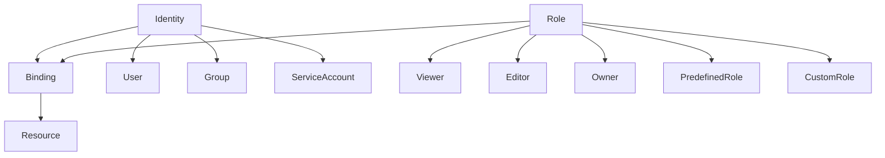

意味

| 要素       | 内容     |
| -------- | ------ |
| Identity | 誰      |
| Role     | 何ができる  |
| Resource | どこに対して |
| Binding  | 紐付け    |

---

# IAM基本構造

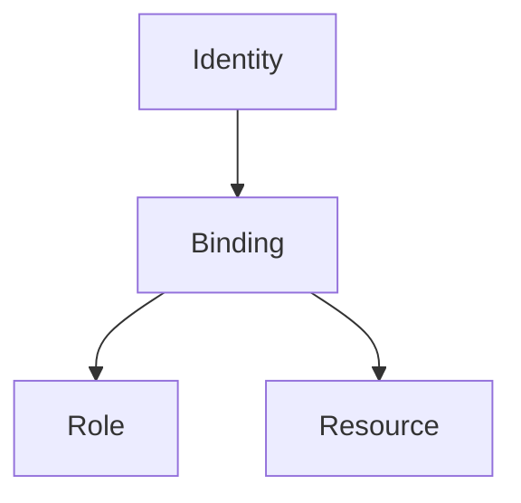

例

```
user:alice@example.com
roles/storage.objectViewer
project
```

---

# Identity（主体）

| 種類              | 説明     |
| --------------- | ------ |
| User            | 人      |
| Group           | ユーザー集合 |
| Service Account | サービス   |

図

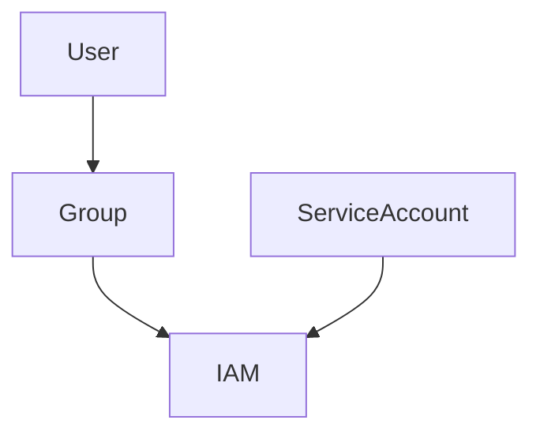

ACE重要

```text
人に直接権限付与しない
→ Groupに付与
```

理由
管理しやすい。

---

# Service Account

VMやアプリのIdentity。

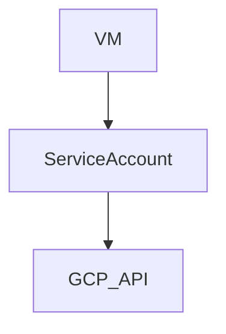

用途

| 状況              | 答え              |
| --------------- | --------------- |
| VM → GCP API    | Service Account |
| Cloud Run → API | Service Account |

ACE暗記

```
Compute → Service Account
```

---

# Role（権限）

| 種類         | 説明                      |
| ---------- | ----------------------- |
| Basic      | viewer / editor / owner |
| Predefined | Google管理                |
| Custom     | 自作                      |

例

```
roles/storage.objectViewer
```

ACE

```
最小権限
→ predefined role
```

---

# IAM階層

GCPは **階層構造**

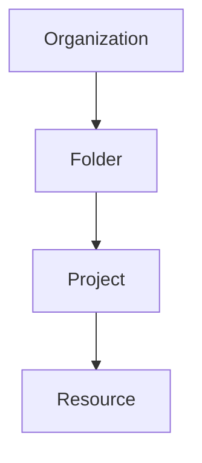

権限は **上から継承**

| 階層           | 例  |
| ------------ | -- |
| Organization | 会社 |
| Folder       | 部門 |
| Project      | 環境 |

ACE

```
組織全体
→ Organization Policy
```

---

# IAM Policy

IAMは **Policyで管理**される。

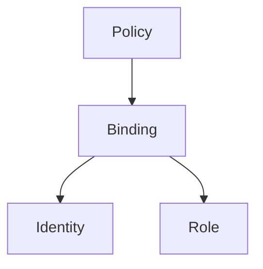

例

```
member: user:alice@example.com
role: roles/viewer
```

---

# Service Account Impersonation

鍵を作らずにSA使用。

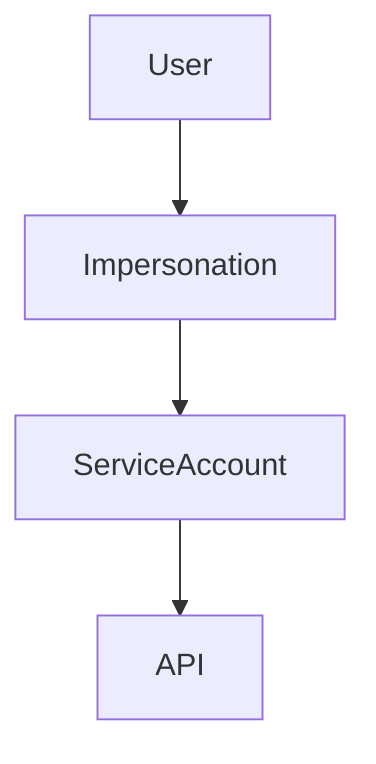

ACE

```
JSON key回避
→ Service Account Impersonation
```

---

# Workload Identity

Pod → GCP API。

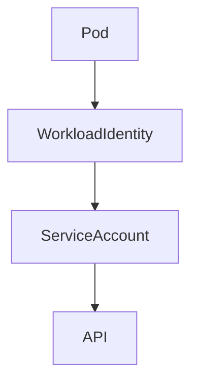

ACE

```
GKE Pod → API
→ Workload Identity
```

---

# Organization Policy

組織レベル制御。

| 用途 | 例        |
| -- | -------- |
| 制限 | 外部IP禁止   |
| 制限 | SA key禁止 |

ACE

```
組織制限
→ Org Policy
```

---

# IAM判断フロー（ACE）

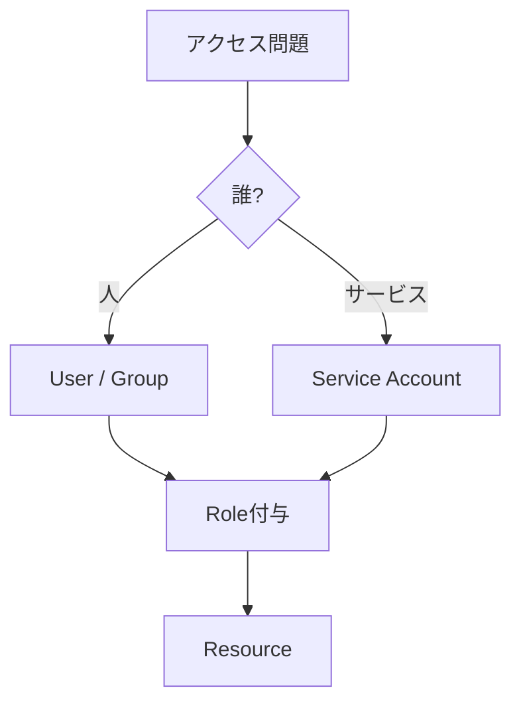

---

# IAM試験ひっかけ

| 問題        | 答え                |
| --------- | ----------------- |
| VM → API  | Service Account   |
| Pod → API | Workload Identity |
| 鍵回避       | Impersonation     |
| 人管理       | Group             |
| 組織制限      | Org Policy        |

---

# ACE最重要IAM暗記

```
人 → Group
VM → Service Account
Pod → Workload Identity
鍵回避 → Impersonation
組織制御 → Org Policy
```

---


# IAM判断ツリー（ACE）

まず **問題文の主体を見る。**

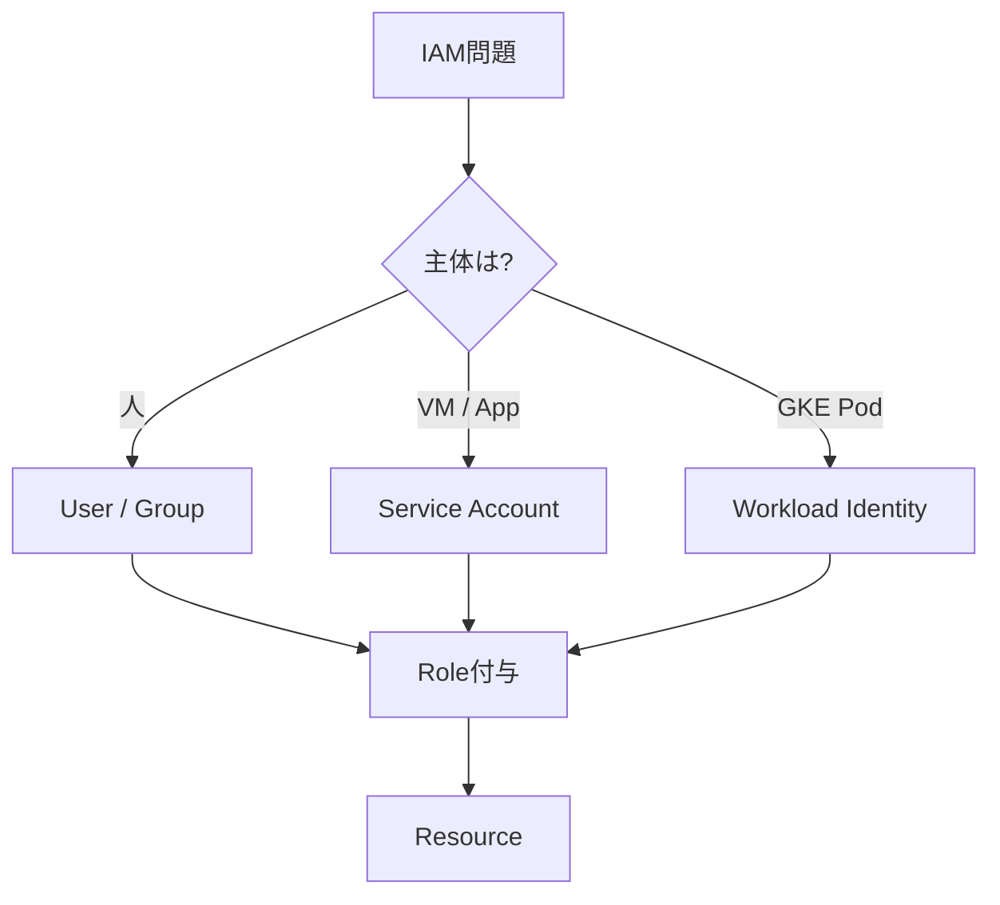

---

# ① 人の権限

問題

```
社員
ユーザー
開発者
```

判断

```text
User
```

ただし

ACEベストプラクティス

```text
Groupに付与
```

例

```
group:dev@example.com
roles/viewer
```

---

# ② VM / Cloud Run / Function

問題

```
VMがGCSにアクセス
Cloud RunがPub/Sub
```

答え

```text
Service Account
```

図


---

# ③ GKE Pod

問題

```
PodがGCP API
```

答え

```text
Workload Identity
```

図


---

# ④ JSON Key回避

問題

```
Service account key
avoid keys
secure access
```

答え

```text
Service Account Impersonation
```

図


---

# ⑤ 組織ルール

問題

```
会社全体
制限
禁止
```

答え

```text
Organization Policy
```

例

```
外部IP禁止
SA key禁止
```

---

# IAM問題の90%パターン

| 問題        | 答え                |
| --------- | ----------------- |
| 人の権限      | Group             |
| VM → API  | Service Account   |
| Pod → API | Workload Identity |
| Key回避     | SA Impersonation  |
| 組織制御      | Org Policy        |

---

# 超短縮IAM

```text
人 → Group
VM → Service Account
Pod → Workload Identity
鍵回避 → Impersonation
組織制御 → Org Policy
```

---

# IAM判断スピード図

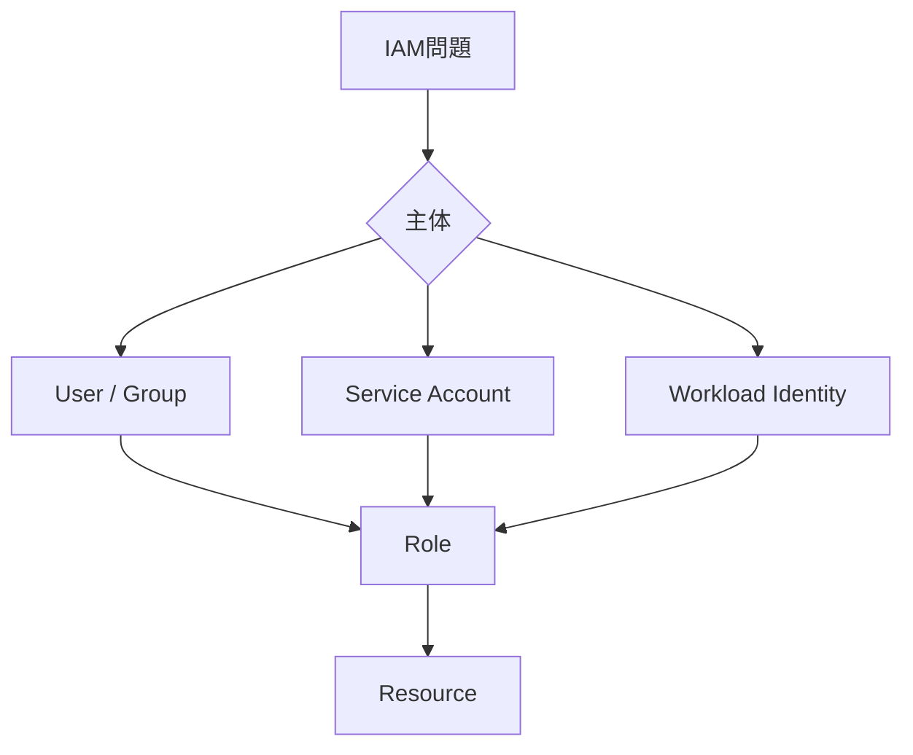

---

# 試験の最初の1秒

まずこれを見る。

```text
Who is accessing?
```

次に

```text
What resource?
```

最後

```text
Which role?
```

---

# Notes
