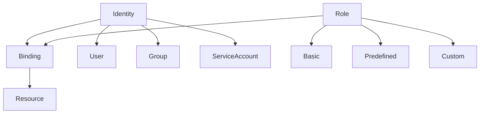
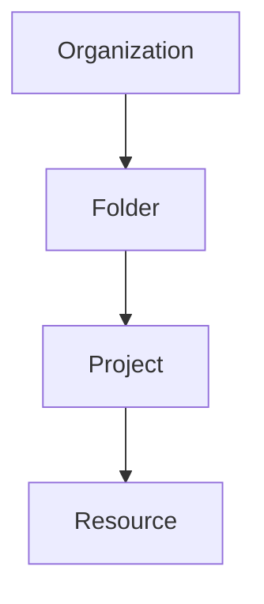
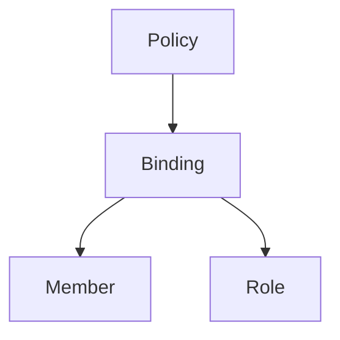
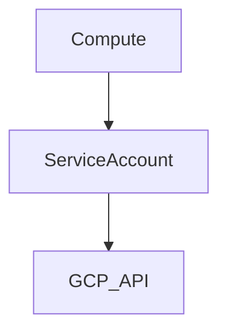
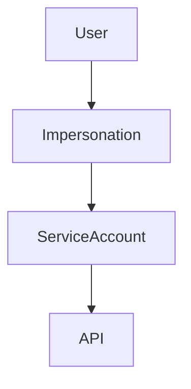
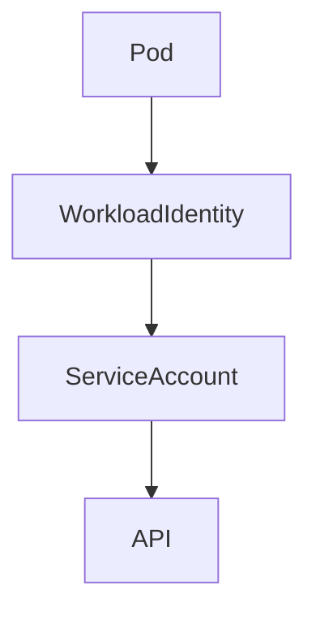
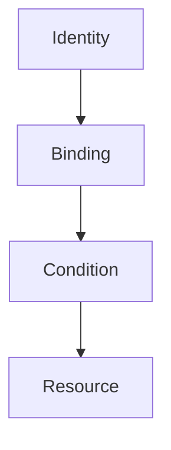
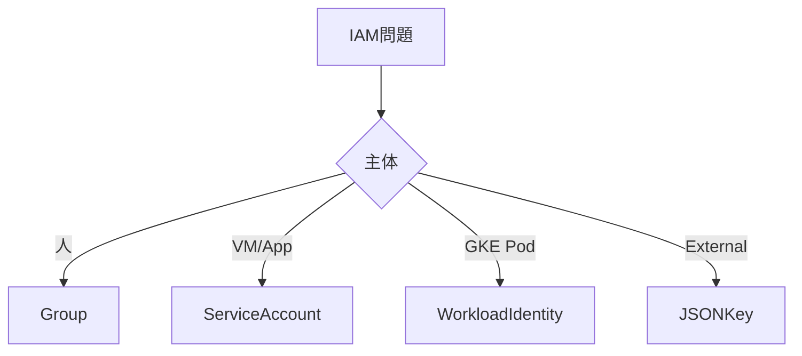
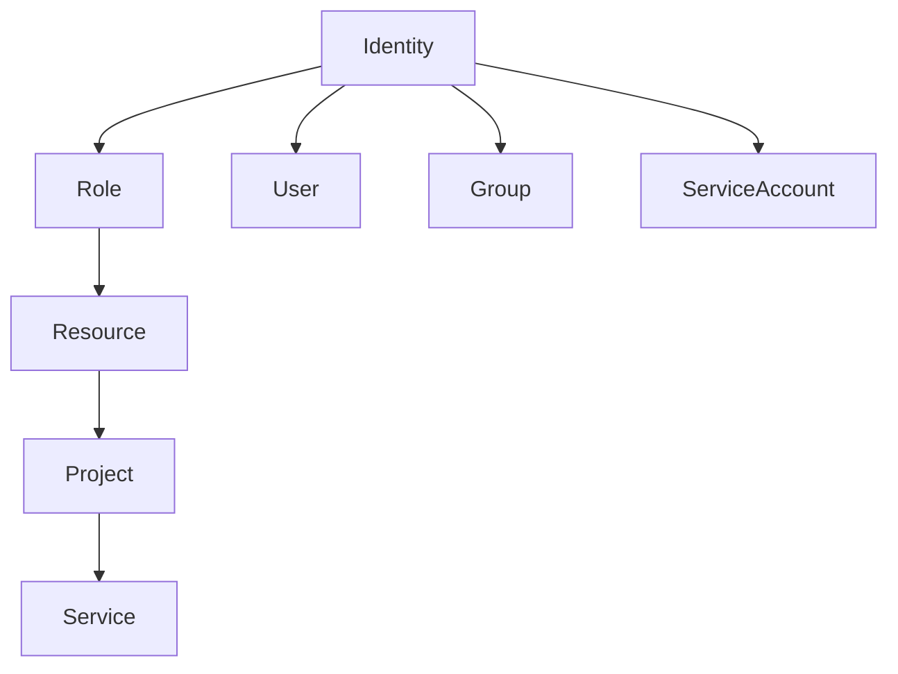
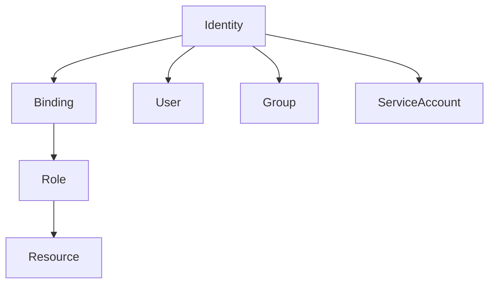

# GCP IAM（ACE / 2026）

IAMは次の構造で理解する。

```
Identity + Role → Resource
```

これを **Binding** が結ぶ。

---

# IAM構造



| 要素       | 内容    |
| -------- | ----- |
| Identity | 誰     |
| Role     | 何ができる |
| Resource | どこ    |
| Binding  | 紐付け   |

---

# Identity（主体）

| Identity        | 用途  |
| --------------- | --- |
| User            | 人   |
| Group           | チーム |
| Service Account | アプリ |

ACE判断

```
人管理 → Group
```

理由
ユーザーに直接Role付与すると管理困難。

---

# IAM階層

IAMは **上位から継承**される。



| レベル          | 用途 |
| ------------ | -- |
| Organization | 全社 |
| Folder       | 部門 |
| Project      | 環境 |
| Resource     | 個別 |

ACE判断

```
全Project
→ Organization IAM
```

---

# IAM Policy

IAMは **Policy → Binding**。

例

```
member: user:alice@example.com
role: roles/viewer
```

構造



---

# Role

Roleは3種類。

| 種類         | 説明                      |
| ---------- | ----------------------- |
| Basic      | viewer / editor / owner |
| Predefined | Google管理                |
| Custom     | カスタム                    |

ACE

```
最小権限
→ Predefined role
```

理由
Basic Roleは権限が広すぎる。

---

# Service Account

アプリ用Identity。



用途

| シナリオ                  | 解決              |
| --------------------- | --------------- |
| VM → API              | Service Account |
| Cloud Run → API       | Service Account |
| Cloud Functions → API | Service Account |

ACE

```
Compute → Service Account
```

---

# Service Account Authentication

GCP内部アクセスは **Metadata Server**。

```
Compute
   |
Service Account
   |
Metadata Server
   |
Access Token
   |
GCP API
```

ACE

```
GCP内部アクセス
→ Service Account attach
```

---

# JSON Key

Service Account Key。

用途

| 用途     | 例       |
| ------ | ------- |
| 外部システム | CI/CD   |
| オンプレ   | APIアクセス |

ACE判断

```
外部アクセス
→ JSON key
```

注意

```
内部では非推奨
```

---

# Service Account Impersonation

鍵なしSA利用。



用途

| 問題         | 解決            |
| ---------- | ------------- |
| JSON key回避 | Impersonation |
| 一時権限       | Impersonation |

ACE

```
key回避
→ SA Impersonation
```

---

# Workload Identity

GKE Pod → GCP API。



ACE

```
Pod → API
→ Workload Identity
```

理由

```
JSON key不要
```

---

# IAM Conditions

条件付きIAM。



例

| 条件       | 例      |
| -------- | ------ |
| 時間       | 勤務時間   |
| IP       | 社内IP   |
| Resource | bucket |

ACE

```
条件付きアクセス
→ IAM Conditions
```

---

# Organization Policy

組織制御。

| 制限         | 例                                    |
| ---------- | ------------------------------------ |
| 外部IP禁止     | compute.vmExternalIpAccess           |
| SA key禁止   | iam.disableServiceAccountKeyCreation |
| location制限 | resourceLocations                    |

ACE判断

```
組織制御
→ Org Policy
```

---

# Cross Project Access

別Projectアクセス。

構造

```
Project A (SA)
       |
       v
Project B (Resource)
```

重要

```
Resource側IAMで許可
```

ACE

```
別Projectアクセス
→ Resource側IAM
```

---

# Default Service Account

GCPが自動作成。

問題

```
共有される
```

例

```
Default SA
   |
 VM1
 VM2
 VM3
```

ACE

```
Default SA
→ 非推奨
```

推奨

```
Custom Service Account
```

---

# 専用Service Account

VMごとにSAを分離。

```
VM A → SA_A → Bucket
VM B → SA_B → BigQuery
```

理由

| 問題     | 解決   |
| ------ | ---- |
| 権限拡散   | 専用SA |
| セキュリティ | 最小権限 |

ACE

```
VM限定アクセス
→ 専用SA
```

---

# Project Isolation

GCPで最強の境界。

```
Project
```

用途

| 要件        | 解決      |
| --------- | ------- |
| チーム分離     | Project |
| IAM分離     | Project |
| Billing分離 | Project |

ACE判断

```
完全分離
→ 新Project
```

---

# Project Lien

削除防止。

| 機能   | 内容                |
| ---- | ----------------- |
| 削除防止 | accidental delete |

注意

```
IAM制御ではない
```

---

# IAM設計ルール

| 原則        | 内容              |
| --------- | --------------- |
| 最小権限      | least privilege |
| Group管理   | 人直接付与しない        |
| SA分離      | アプリ単位           |
| Project分離 | 強い境界            |

---

# IAM判断ツリー



---

# ACE頻出パターン

| 問題        | 答え                |
| --------- | ----------------- |
| 人管理       | Group             |
| VM → API  | Service Account   |
| Pod → API | Workload Identity |
| Key回避     | SA Impersonation  |
| 組織制御      | Org Policy        |
| 条件付き      | IAM Conditions    |
| VM限定アクセス  | 専用SA              |
| Project分離 | 新Project          |

---

# IAM超短縮

```
人 → Group
VM → Service Account
Pod → Workload Identity

鍵回避 → Impersonation
組織制御 → Org Policy
条件付き → IAM Conditions

完全分離 → Project
```

---

# IAMアーキテクチャ



---

# 2026 IAMトレンド

| 技術                | 状況   |
| ----------------- | ---- |
| Workload Identity | 標準   |
| SA Impersonation  | 推奨   |
| JSON Key          | 最小化  |
| Org Policy        | 企業必須 |
| IAM Conditions    | 普及   |

---

# IAM 最終構造



---
