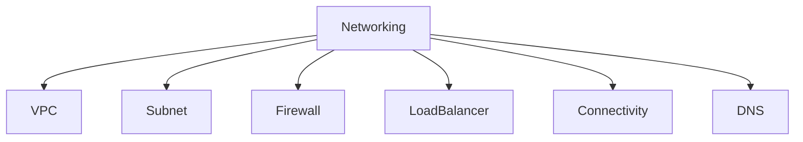
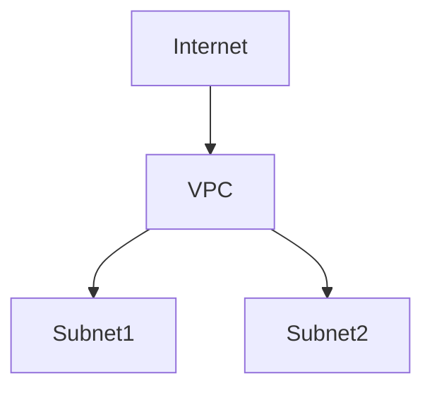
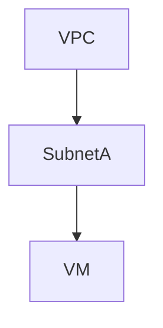
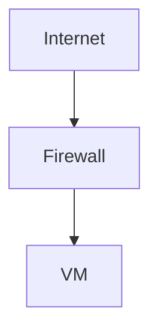
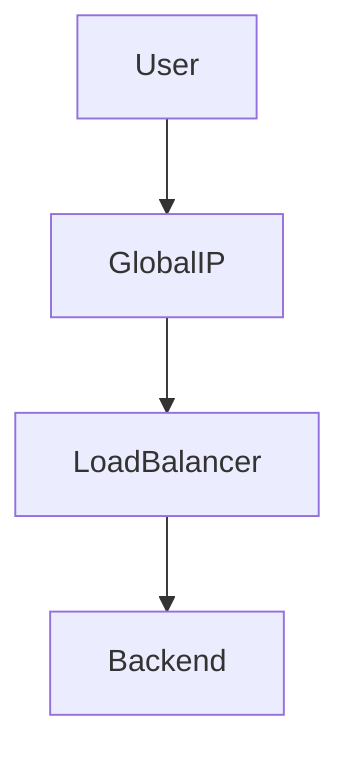
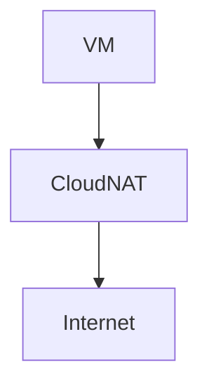
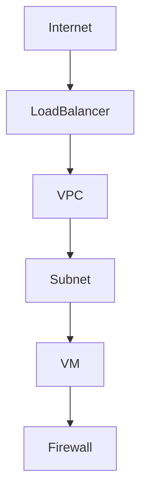
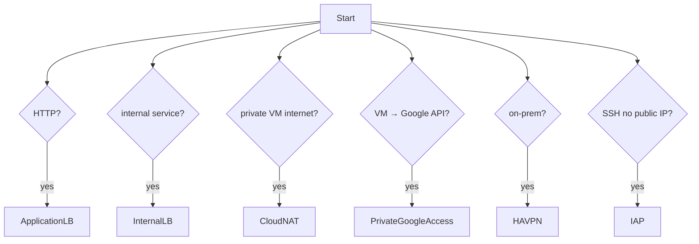
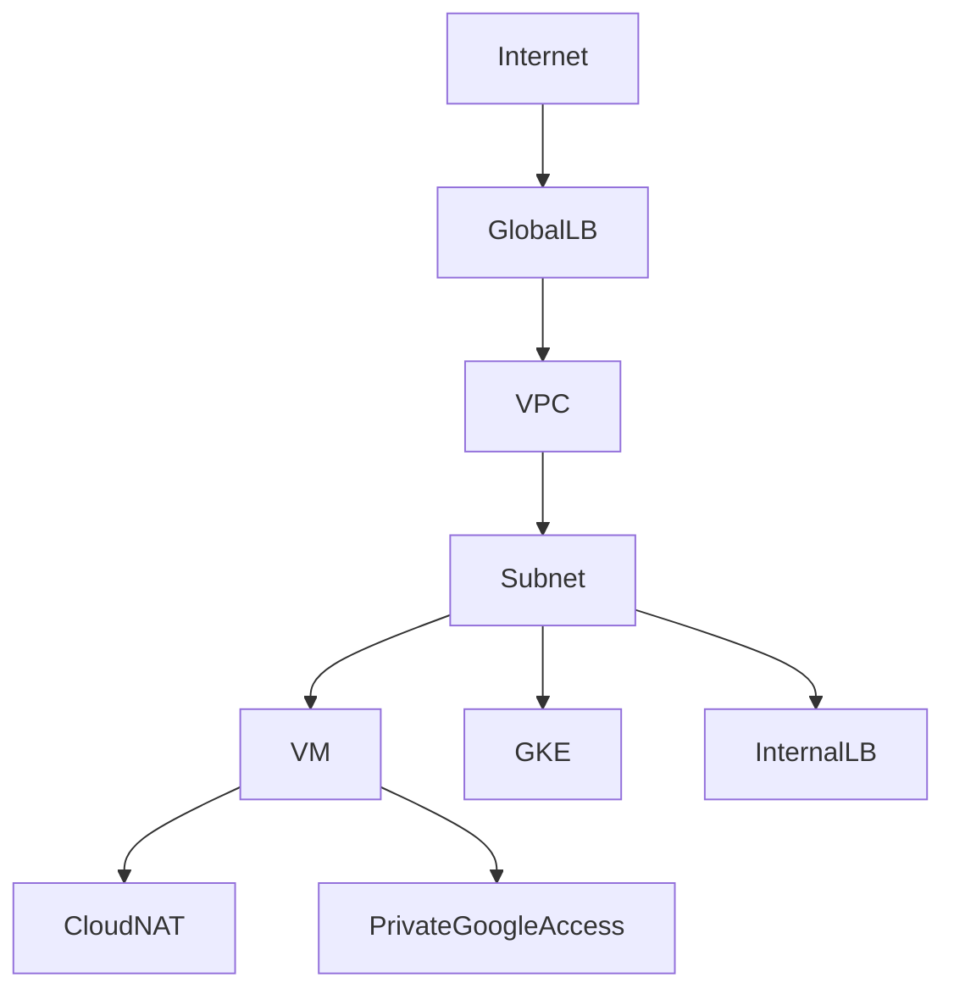
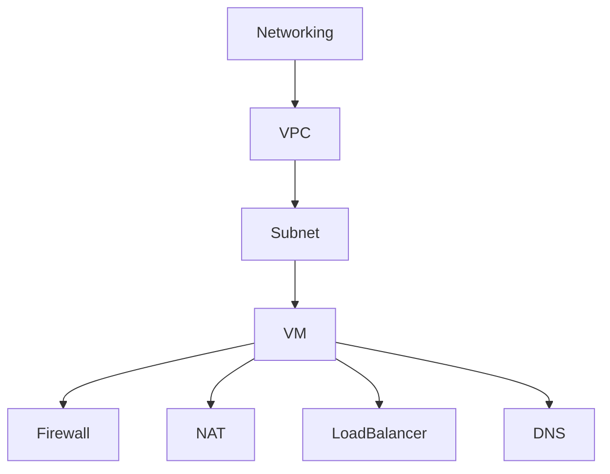

# GCP Networking（ACE / 2026）

Networkingは **6領域**で整理する。



---

# 1 VPC

VPCは **GCPネットワークの基本単位**。



特徴

| 項目     | 内容       |
| ------ | -------- |
| スコープ   | Global   |
| Subnet | Regional |
| CIDR   | RFC1918  |

ACE

```
VPC = global
Subnet = regional
```

---

# VPC設計

基本構造

```
VPC
 ├ subnet-us-east1
 ├ subnet-europe-west1
 └ subnet-asia-northeast1
```

特徴

| 項目             | 内容    |
| -------------- | ----- |
| global routing | デフォルト |
| region subnet  | 必須    |

---

# Shared VPC

ネットワーク集中管理。

```
Host Project
      |
Shared VPC
      |
Service Projects
```

用途

| 用途       | 内容              |
| -------- | --------------- |
| ネットワーク統制 | Host project    |
| アプリ実行    | Service project |

ACE

```
central network control
→ Shared VPC
```

---

# 2 Subnet

Subnetは **IP範囲**。



特徴

| 項目   | 内容       |
| ---- | -------- |
| スコープ | Regional |
| CIDR | IP範囲     |
| 拡張   | 可能       |

ACE

```
IP不足
→ subnet expand-ip-range
```

---

# Internal vs External IP

| IP       | 用途       |
| -------- | -------- |
| Internal | VPC内     |
| External | Internet |

構造

```
Internet
   |
External IP
   |
VM
   |
Internal Network
```

ACE

```
公開
→ External IP
```

---

# 3 Firewall

Firewallは **VPCレベルの通信制御**。



特徴

| 項目      | 内容       |
| ------- | -------- |
| default | deny     |
| state   | stateful |
| rule    | allow    |

ACE

```
通信許可
→ firewall rule
```

---

# Firewall Rule

構造

| 項目        | 例       |
| --------- | ------- |
| direction | ingress |
| source    | IP      |
| target    | tag     |

例

```
allow tcp:22
```

---

# Network Tag

VMに適用。

```
VM
 |
tag:web
 |
Firewall rule
```

用途

```
VMグループ制御
```

---

# 4 Load Balancer

GCP Load Balancerは **グローバルAnycast**。



---

# Load Balancer種類（2026）

| LB                        | Layer | 用途           |
| ------------------------- | ----- | ------------ |
| Application Load Balancer | L7    | HTTP / HTTPS |
| Proxy Network LB          | L4    | TCP          |
| Passthrough Network LB    | L4    | TCP / UDP    |
| Internal LB               | L7/L4 | VPC内部        |

ACE

```
HTTP service
→ Application LB
```

---

# Internal Load Balancer

VPC内部通信。

```
Client
   |
Internal LB
   |
Backend
```

ACE

```
internal service
→ Internal LB
```

---

# 5 Cloud NAT

Private VMが外部へ通信。



特徴

| 項目       | 内容 |
| -------- | -- |
| outbound | OK |
| inbound  | 不可 |

ACE

```
private VM internet
→ Cloud NAT
```

---

# Private Google Access

Private VM → Google API

```
VM
 |
Private Google Access
 |
Google API
```

ACE

```
private VM → Google API
→ Private Google Access
```

---

# 6 Hybrid Connectivity

オンプレ接続。

| 方法           | 用途  |
| ------------ | --- |
| VPN          | 小規模 |
| HA VPN       | 冗長  |
| Interconnect | 専用線 |

---

# HA VPN

高可用VPN。

```
OnPrem
   |
Internet
   |
HA VPN
   |
VPC
```

特徴

| 項目      | 内容  |
| ------- | --- |
| tunnel  | 2   |
| routing | BGP |

ACE

```
high availability VPN
→ HA VPN
```

---

# Interconnect

専用線接続。

| 種類        | 用途    |
| --------- | ----- |
| Dedicated | 専用回線  |
| Partner   | パートナー |

ACE

```
高速接続
→ Interconnect
```

---

# 7 DNS

名前解決。

| サービス      | 用途    |
| --------- | ----- |
| Cloud DNS | DNS管理 |

ACE

```
domain management
→ Cloud DNS
```

---

# 8 IAP（Identity-Aware Proxy）

公開IPなしSSH。

```
User
 |
IAP
 |
VM
```

ACE

```
SSH without public IP
→ IAP
```

Firewall

```
35.235.240.0/20
```

---

# 9 Serverless → VPC

2026標準

```
Cloud Run
   |
Direct VPC egress
   |
VPC
```

旧方式

```
Serverless VPC Access Connector
```

ACE

```
serverless → VPC
→ Direct VPC egress
```

---

# 10 Private Service Connect

VPCからGoogleサービス接続。

```
VPC
 |
Private Service Connect
 |
Cloud SQL / BigQuery
```

用途

| サービス       |
| ---------- |
| Cloud SQL  |
| BigQuery   |
| Google API |

---

# Networking構造



---

# Networking判断フロー（ACE）



---

# ACE頻出 Networking

```
VPC = global
Subnet = regional

HTTP → Application LB
internal service → Internal LB

private VM internet → Cloud NAT
VM → Google API → Private Google Access

SSH private VM → IAP

on-prem → HA VPN
serverless → Direct VPC egress
```

---

# Networking最重要キーワード（ACE）

| 単語                    | サービス                  |
| --------------------- | --------------------- |
| HTTP routing          | Application LB        |
| internal              | Internal LB           |
| private VM internet   | Cloud NAT             |
| VM → Google API       | Private Google Access |
| SSH without public IP | IAP                   |
| on-prem               | HA VPN                |

---

# Networkingアーキテクチャ



---

# 2026 Networkingトレンド

| 技術                        | 状況             |
| ------------------------- | -------------- |
| Application Load Balancer | 標準             |
| Direct VPC egress         | serverless     |
| HA VPN                    | hybrid         |
| Shared VPC                | enterprise     |
| Private Service Connect   | service access |

---

# Networking最終構造



---
