# GCP Networking（ACE）

Networking問題は **5テーマ**に分かれます。

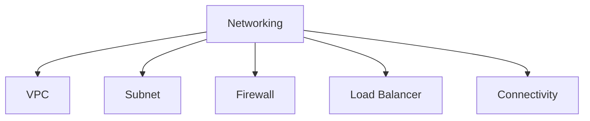

---

# 1 VPC

VPCは **ネットワークの器**

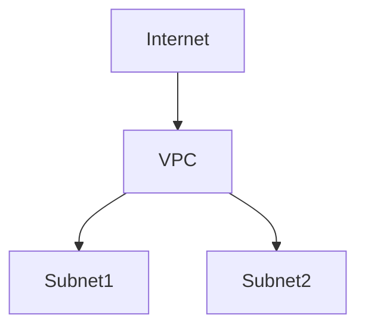

特徴

| 項目     | 説明       |
| ------ | -------- |
| スコープ   | Global   |
| Subnet | Regional |

ACE暗記

```text
VPC = global
Subnet = regional
```

---

# 2 Subnet

Subnetは **IP範囲**

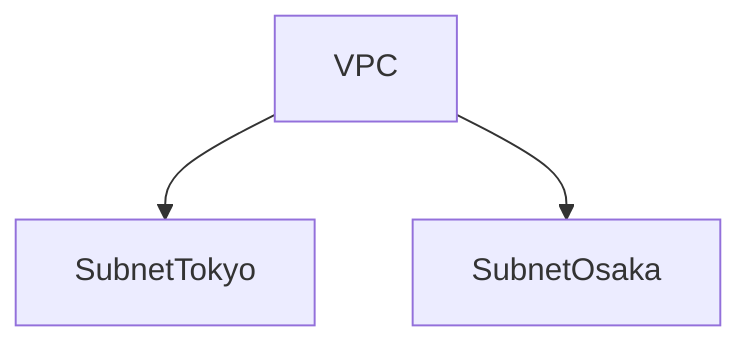

| 特徴 | 内容   |
| -- | ---- |
| 範囲 | CIDR |
| 拡張 | 可能   |

ACE問題

```text
IP不足
→ subnet expand-ip-range
```

---

# 3 Firewall

Firewallは **トラフィック制御**

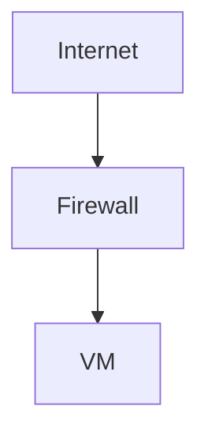

| 項目    | 説明      |
| ----- | ------- |
| デフォルト | deny    |
| ルール   | allow作成 |

ACE判断

```text
通信許可
→ firewall rule
```

---

# 4 Internal vs External IP

| IP          | 用途      |
| ----------- | ------- |
| Internal IP | VPC内    |
| External IP | インターネット |

構造

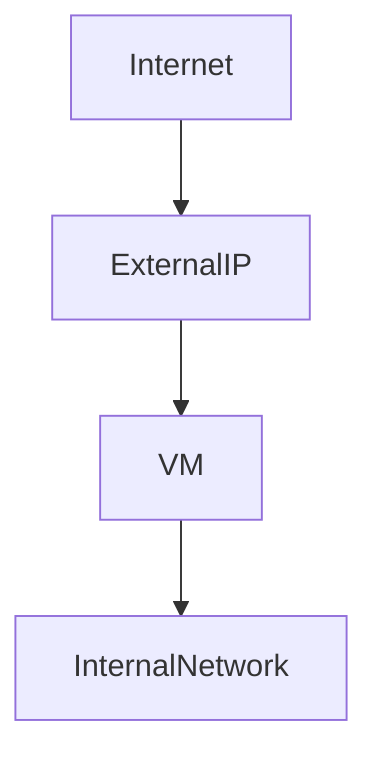

ACE

```text
公開
→ external IP
```

---

# 5 Load Balancer

GCP LBは **Global**

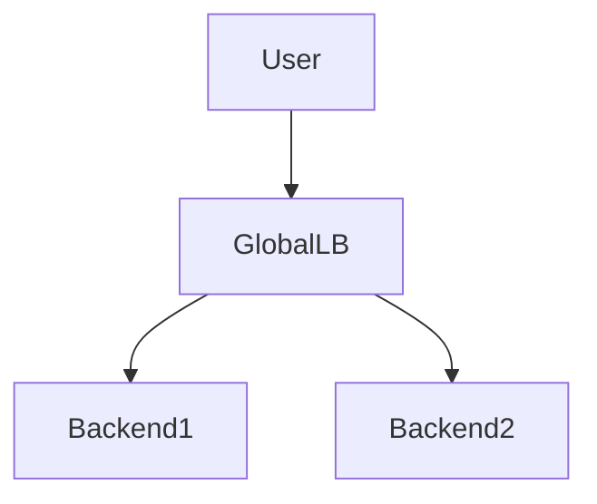

| タイプ         | 用途      |
| ----------- | ------- |
| HTTP(S)     | Web     |
| SSL Proxy   | TCP+SSL |
| TCP Proxy   | TCP     |
| Internal LB | 内部      |

ACE頻出

```text
Web公開
→ HTTP(S) Load Balancer
```

---

# 6 Internal Load Balancer

内部サービス

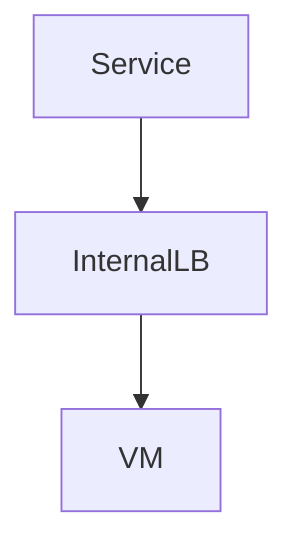

ACE

```text
VPC内サービス
→ Internal LB
```

---

# 7 Cloud NAT

Private VMがインターネットへ

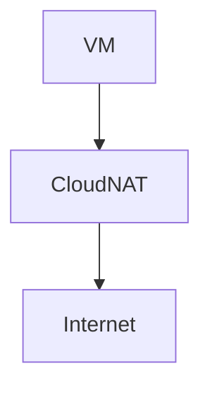

| 用途       | 内容  |
| -------- | --- |
| Outbound | NAT |
| Inbound  | 不可  |

ACE

```text
private VM internet
→ Cloud NAT
```

---

# 8 Private Google Access

Private VM → Google API

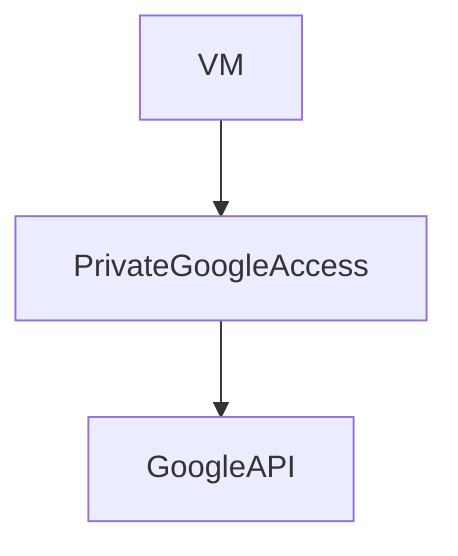

ACE

```text
private VM → GCP API
→ Private Google Access
```

---

# 9 Hybrid接続

| 方法           | 用途 |
| ------------ | -- |
| VPN          | 簡単 |
| Interconnect | 高速 |

構造

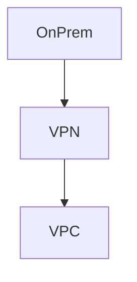

ACE

```text
オンプレ接続
→ VPN
```

---

# 10 DNS

名前解決

| サービス      | 用途    |
| --------- | ----- |
| Cloud DNS | 管理DNS |

ACE

```text
ドメイン管理
→ Cloud DNS
```

---

# Networking構造

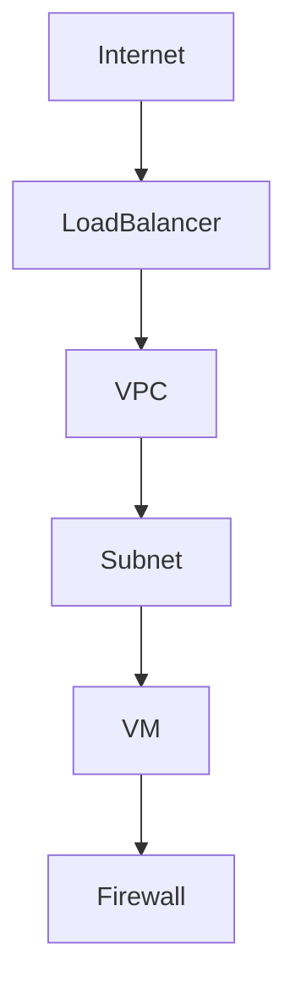

---

# ACE頻出Networking判断

| 問題                  | 答え                    |
| ------------------- | --------------------- |
| IP不足                | subnet expand         |
| private VM internet | Cloud NAT             |
| VM→GCP API          | Private Google Access |
| Web公開               | HTTP(S) LB            |
| 内部サービス              | Internal LB           |

---

# Networking思考マップ

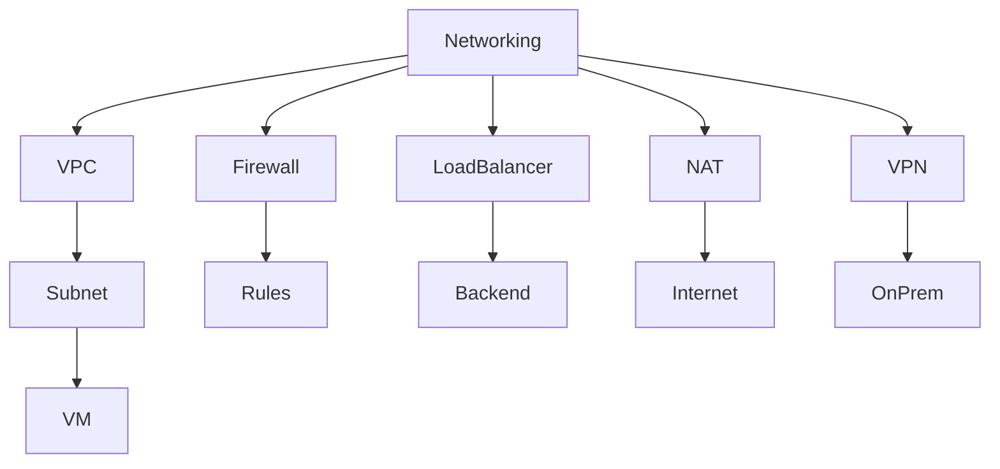

---

# ACE Networking重要暗記

```text
VPC = global
Subnet = regional
private VM internet = Cloud NAT
VM → Google API = Private Google Access
web公開 = HTTP(S) LB
IP不足 = subnet expand
```

---


---

# Notes

