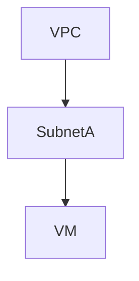
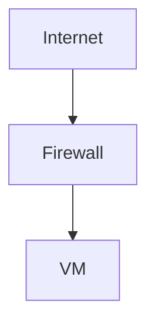
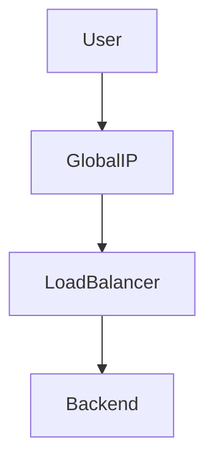
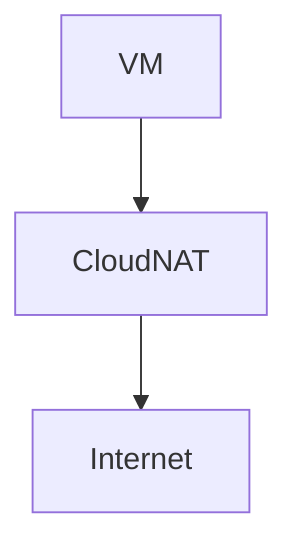
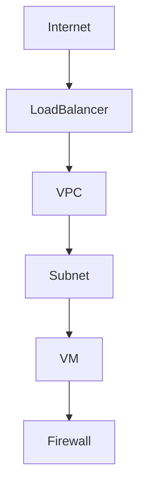
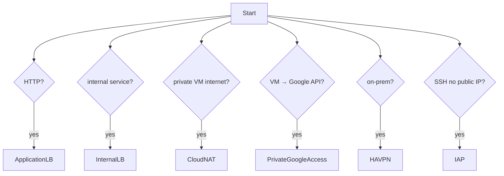
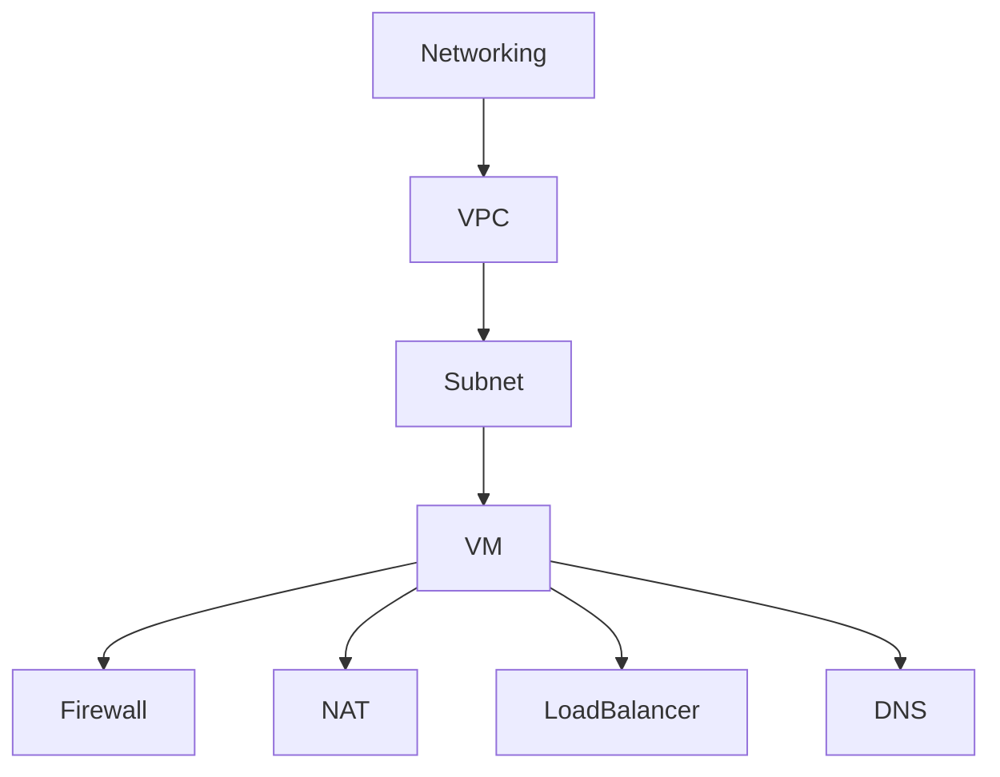

# GCP Networking（ACE / 2026）

GCP Networkingは **6つの領域**で整理する。

```mermaid
graph TD
Networking --> VPC
Networking --> Subnet
Networking --> Firewall
Networking --> LoadBalancer
Networking --> Connectivity
Networking --> DNS
````

---

# 1. VPC（Virtual Private Cloud）

VPCは **GCPネットワークの基本単位**。

## 1.1 VPC構造

```mermaid
graph TD
Internet --> VPC
VPC --> Subnet1
VPC --> Subnet2
```

## 1.2 特徴

| 項目     | 内容       |
| ------ | -------- |
| スコープ   | Global   |
| Subnet | Regional |
| CIDR   | RFC1918  |

### ACE暗記

```
VPC = global
Subnet = regional
```

---

# 2. VPC設計

VPCは **グローバルネットワーク**として設計される。

## 2.1 基本構造

```
VPC
 ├ subnet-us-east1
 ├ subnet-europe-west1
 └ subnet-asia-northeast1
```

## 2.2 特徴

| 項目             | 内容    |
| -------------- | ----- |
| global routing | デフォルト |
| region subnet  | 必須    |

---

# 3. Shared VPC

複数プロジェクトで **ネットワークを共有**する構成。

## 3.1 構造

```
Host Project
      |
Shared VPC
      |
Service Projects
```

## 3.2 用途

| 用途       | 内容              |
| -------- | --------------- |
| ネットワーク統制 | Host project    |
| アプリ実行    | Service project |

### ACE

```
central network control
→ Shared VPC
```

---

# 4. Subnet

Subnetは **IPアドレス範囲**を定義する。

## 4.1 構造



## 4.2 特徴

| 項目   | 内容              |
| ---- | --------------- |
| スコープ | Regional        |
| CIDR | IP範囲            |
| 拡張   | expand-ip-range |

### ACE

```
IP不足
→ subnet expand-ip-range
```

---

# 5. Internal IP / External IP

VMには2種類のIPが存在する。

## 5.1 IP種類

| IP       | 用途         |
| -------- | ---------- |
| Internal | VPC内通信     |
| External | Internet接続 |

## 5.2 構造

```
Internet
   |
External IP
   |
VM
   |
Internal Network
```

### ACE

```
公開サービス
→ External IP
```

---

# 6. Firewall

Firewallは **VPCレベルの通信制御**。

## 6.1 構造



## 6.2 特徴

| 項目      | 内容       |
| ------- | -------- |
| default | deny     |
| state   | stateful |
| rule    | allow    |

### ACE

```
通信許可
→ firewall rule
```

---

# 7. Firewall Rule

Firewallはルールで通信を制御する。

## 7.1 構造

| 項目        | 例       |
| --------- | ------- |
| direction | ingress |
| source    | IP      |
| target    | tag     |

## 7.2 例

```
allow tcp:22
```

---

# 8. Network Tag

Firewall制御に利用。

## 8.1 構造

```
VM
 |
tag:web
 |
Firewall rule
```

## 8.2 用途

```
VMグループ制御
```

---

# 9. Load Balancer

GCP Load Balancerは **グローバルAnycast**。

## 9.1 構造



---

# 10. Load Balancer種類（2026）

| LB                        | Layer | 用途           |
| ------------------------- | ----- | ------------ |
| Application Load Balancer | L7    | HTTP / HTTPS |
| Proxy Network LB          | L4    | TCP          |
| Passthrough Network LB    | L4    | TCP / UDP    |
| Internal LB               | L7/L4 | VPC内部        |

### ACE

```
HTTP service
→ Application Load Balancer
```

---

# 11. Internal Load Balancer

VPC内部サービスの負荷分散。

## 11.1 構造

```
Client
   |
Internal LB
   |
Backend
```

### ACE

```
internal service
→ Internal Load Balancer
```

---

# 12. Cloud NAT

Private VMが **外部へ通信**する。

## 12.1 構造



## 12.2 特徴

| 項目       | 内容 |
| -------- | -- |
| outbound | 可能 |
| inbound  | 不可 |

### ACE

```
private VM internet
→ Cloud NAT
```

---

# 13. Private Google Access

Private VMから **Google APIへアクセス**。

## 13.1 構造

```
VM
 |
Private Google Access
 |
Google API
```

### ACE

```
private VM → Google API
→ Private Google Access
```

---

# 14. Hybrid Connectivity

オンプレ接続方法。

| 方法           | 用途  |
| ------------ | --- |
| VPN          | 小規模 |
| HA VPN       | 冗長  |
| Interconnect | 専用線 |

---

# 15. HA VPN

高可用VPN。

## 15.1 構造

```
OnPrem
   |
Internet
   |
HA VPN
   |
VPC
```

## 15.2 特徴

| 項目      | 内容  |
| ------- | --- |
| tunnel  | 2   |
| routing | BGP |

### ACE

```
high availability VPN
→ HA VPN
```

---

# 16. Interconnect

専用線接続。

| 種類        | 用途    |
| --------- | ----- |
| Dedicated | 専用回線  |
| Partner   | パートナー |

### ACE

```
高速接続
→ Interconnect
```

---

# 17. DNS

名前解決サービス。

| サービス      | 用途    |
| --------- | ----- |
| Cloud DNS | DNS管理 |

### ACE

```
domain management
→ Cloud DNS
```

---

# 18. Identity-Aware Proxy（IAP）

公開IPなしSSH接続。

## 18.1 構造

```
User
 |
IAP
 |
VM
```

### ACE

```
SSH without public IP
→ IAP
```

Firewall許可

```
35.235.240.0/20
```

---

# 19. Serverless → VPC

2026標準方式。

## 19.1 構造

```
Cloud Run
   |
Direct VPC egress
   |
VPC
```

旧方式

```
Serverless VPC Access Connector
```

### ACE

```
serverless → VPC
→ Direct VPC egress
```

---

# 20. Private Service Connect

VPCからGoogleサービスへ **Private接続**。

## 20.1 構造

```
VPC
 |
Private Service Connect
 |
Cloud SQL / BigQuery
```

---

# Networking構造



---

# Networking判断フロー（ACE）



---

# ACE頻出 Networking

```
VPC = global
Subnet = regional

HTTP → Application LB
internal service → Internal LB

private VM internet → Cloud NAT
VM → Google API → Private Google Access

SSH private VM → IAP

on-prem → HA VPN
serverless → Direct VPC egress
```

---

# 2026 Networkingトレンド

| 技術                        | 状況             |
| ------------------------- | -------------- |
| Application Load Balancer | 標準             |
| Direct VPC egress         | serverless     |
| HA VPN                    | hybrid         |
| Shared VPC                | enterprise     |
| Private Service Connect   | service access |

---

# Networking最終構造



---

# ACE頻出用語（Network Glossary / GCP Networking 2026）

| 用語                        | フルスペル                                     | 定義                      | 簡単説明                                 |
| ------------------------- | ----------------------------------------- | ----------------------- | ------------------------------------ |
| VPC                       | Virtual Private Cloud                     | GCPの仮想ネットワーク            | GCPリソースが所属する論理ネットワーク。グローバルスコープで構成される |
| Subnet                    | Subnetwork                                | VPC内のIPアドレス範囲           | VMなどに割り当てるIPレンジ。リージョン単位で作成           |
| Shared VPC                | Shared Virtual Private Cloud              | ネットワーク共有                | 1つのホストプロジェクトのVPCを複数サービスプロジェクトで共有     |
| Firewall Rule             | Virtual Private Cloud Firewall Rule       | 通信制御ルール                 | VPCレベルで ingress / egress の通信を許可・拒否   |
| Network Tag               | Compute Engine Network Tag                | VMグループ識別                | Firewall rule の対象VMを識別するラベル          |
| Service Account Firewall  | Identity-based Firewall                   | Service AccountベースFW    | Network Tagの代わりにService Accountで通信制御 |
| Application Load Balancer | HTTP(S) Application Load Balancer         | L7ロードバランサ               | HTTP / HTTPS トラフィックをグローバルに分散         |
| Internal Load Balancer    | Internal TCP/UDP Load Balancer            | VPC内部負荷分散               | VPC内部のVM間トラフィックを分散                   |
| External Load Balancer    | External Load Balancing                   | 外部公開LB                  | インターネット向け負荷分散                        |
| Cloud NAT                 | Cloud Network Address Translation         | Private VM外向き通信         | 外部IPなしVMがインターネットへアクセス可能              |
| Private Google Access     | Private Google API Access                 | Private VM → Google API | 外部IPなしVMからGoogle APIへ接続              |
| HA VPN                    | High Availability Virtual Private Network | 高可用VPN                  | GCPとオンプレミスを冗長IPsec VPN接続             |
| Cloud VPN                 | Cloud Virtual Private Network             | VPN接続                   | GCPとオンプレをIPsecで接続                    |
| Interconnect              | Dedicated / Partner Interconnect          | 専用線接続                   | GCPとデータセンターを専用回線で接続                  |
| Cloud DNS                 | Cloud Domain Name System                  | DNS管理                   | GCPのマネージドDNS                         |
| IAP                       | Identity-Aware Proxy                      | IAMベースアクセス制御            | 公開IPなしでSSH / HTTPアクセス                |
| Direct VPC Egress         | Serverless VPC Direct Egress              | Serverless→VPC接続        | Cloud Run / Functions が直接VPCへ通信      |
| Serverless VPC Access     | Serverless VPC Connector                  | Serverless→VPC接続        | ServerlessサービスからVPC接続                |
| Private Service Connect   | Private Service Connect                   | Privateサービス公開           | VPC内からGoogleサービス / SaaSへPrivate接続    |
| VPC Peering               | Virtual Private Cloud Peering             | VPC接続                   | 2つのVPCをPrivate接続                     |
| Cloud Router              | Cloud Dynamic Routing Router              | BGPルーティング               | VPN / Interconnect の動的ルーティング         |
| Static Route              | Static Routing                            | 静的ルート                   | 手動で設定するルート                           |
| Default Route             | Default Internet Route                    | デフォルトルート                | Internet向け0.0.0.0/0                  |
| Alias IP                  | Alias IP Range                            | セカンダリIP                 | Pod / Service 用IP                    |
| Secondary Range           | Secondary IP Range                        | Pod用IP範囲                | GKE Pod / Service用                   |
| Global Load Balancer      | Global HTTP(S) Load Balancer              | グローバルLB                 | Anycastで世界負荷分散                       |
| Regional Load Balancer    | Regional Load Balancer                    | リージョンLB                 | リージョン内負荷分散                           |
| Cloud Armor               | Cloud Armor Security                      | WAF / DDoS防御            | LB前段のセキュリティ                          |
| Network Endpoint Group    | NEG (Network Endpoint Group)              | LBバックエンド                | Cloud Run / VMなどをLBに登録               |
| Hybrid Connectivity       | Hybrid Network Architecture               | オンプレ接続                  | VPN / Interconnect構成                 |
| VPC Service Controls      | VPC Service Controls                      | データ境界                   | Googleサービスのデータ持ち出し防止                 |

---

