# GCP コンピュート選択（ACE）

まず試験では **この3つの比較**がよく出ます。

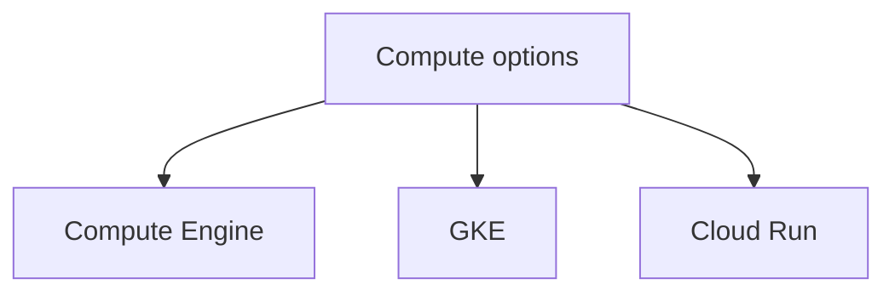

---

# 全体比較

| サービス           | 特徴         | 運用 |
| -------------- | ---------- | -- |
| Compute Engine | VM         | 自分 |
| GKE            | Kubernetes | 中  |
| Cloud Run      | コンテナ実行     | 最小 |

短覚え

```text
VM → Compute Engine
Container → Cloud Run
Kubernetes → GKE
```

---

# 判断フロー

試験では **この順で判断**すると早いです。

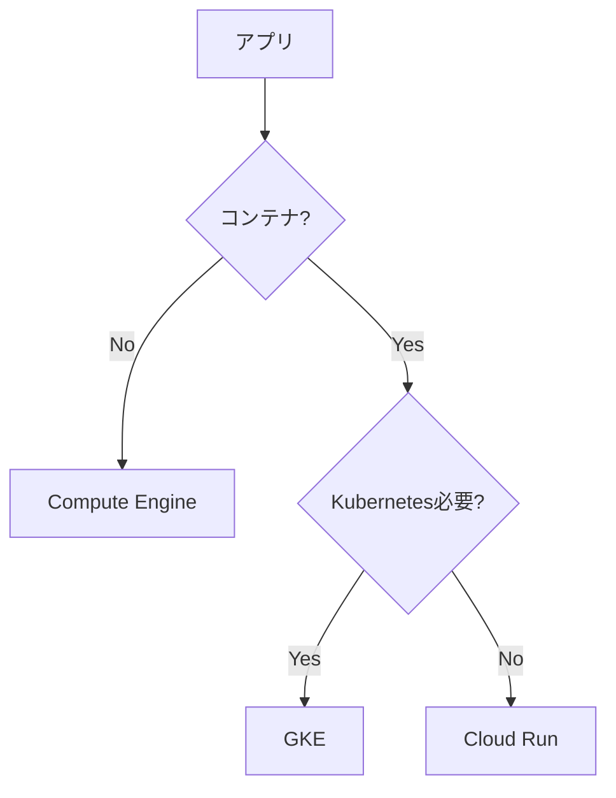

---

# Compute Engine

構造

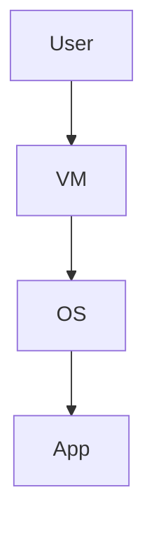

特徴

| 項目   | 説明 |
| ---- | -- |
| 単位   | VM |
| OS管理 | 必要 |
| 柔軟性  | 高  |

典型問題

```text
既存VMアプリ
OS必要
SSH必要
```

答え

```
Compute Engine
```

---

# GKE

構造

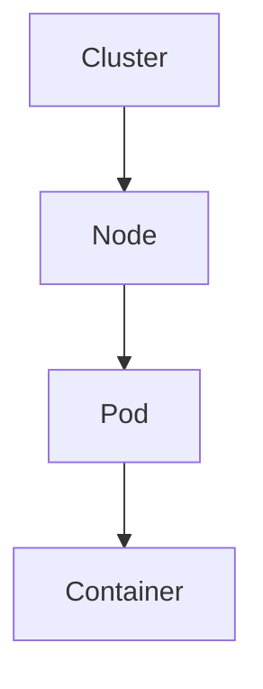

特徴

| 項目         | 説明         |
| ---------- | ---------- |
| 単位         | Pod        |
| オーケストレーション | Kubernetes |
| スケール       | 高度         |

典型問題

```text
マイクロサービス
多数コンテナ
Kubernetes
```

答え

```
GKE
```

---

# Cloud Run

構造

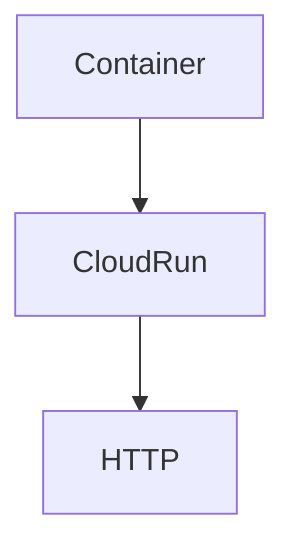

特徴

| 項目   | 説明   |
| ---- | ---- |
| 単位   | コンテナ |
| スケール | 自動   |
| 運用   | 最小   |

典型問題

```text
HTTP
コンテナ
トラフィック少
```

答え

```
Cloud Run
```

---

# スケール比較

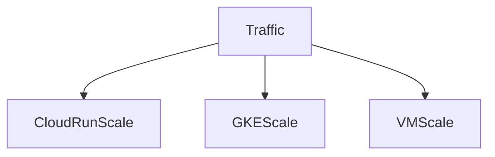

| サービス           | スケール     |
| -------------- | -------- |
| Cloud Run      | 完全自動     |
| GKE            | HPA / CA |
| Compute Engine | MIG      |

---

# ネットワーク比較

| サービス           | 公開方法              |
| -------------- | ----------------- |
| Compute Engine | Load Balancer     |
| GKE            | Service / Ingress |
| Cloud Run      | HTTP endpoint     |

---

# 運用比較

| 項目   | Compute Engine | GKE    | Cloud Run |
| ---- | -------------- | ------ | --------- |
| OS管理 | 必要             | Nodeのみ | 不要        |
| スケール | 手動             | 自動     | 自動        |
| 運用負荷 | 高              | 中      | 低         |

---

# 試験ひっかけ

| 問題           | 答え             |
| ------------ | -------------- |
| コンテナ + HTTP  | Cloud Run      |
| Kubernetes必要 | GKE            |
| VM必要         | Compute Engine |

---

# ACE判断チート

```text
SSH必要 → Compute Engine
Kubernetes → GKE
HTTPコンテナ → Cloud Run
```

---

# 全体構造

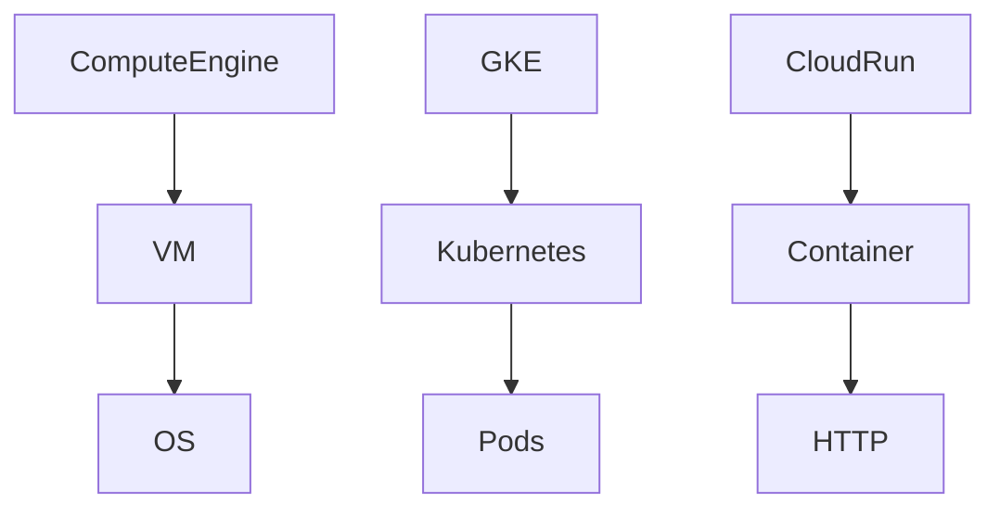

---

# ACE頻出まとめ

```text
Compute Engine → VM
GKE → Kubernetes
Cloud Run → serverless container
```

---


# Compute Engine 試験対策（ACE）

Compute Engine問題は **6テーマ**に集約されます。

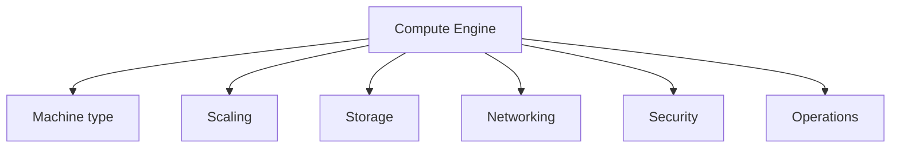

---

# 1 Machine Type

VMの性能選択。

| タイプ         | 用途    |
| ----------- | ----- |
| Standard    | 一般    |
| High-CPU    | CPU処理 |
| High-Memory | メモリ処理 |
| Custom      | 自由調整  |

ACE頻出

```text
メモリ偏重
→ Custom machine type
```

理由
RAMを増やすとコスト効率が良い。

---

# 2 Managed Instance Group（MIG）

VMスケール管理。

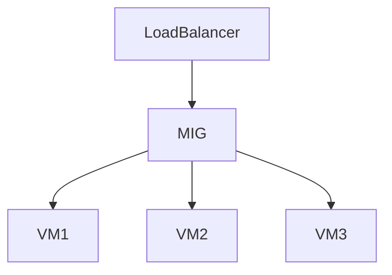

| 機能          | 説明      |
| ----------- | ------- |
| MIG         | VMグループ  |
| Autoscaling | 負荷でVM増減 |

ACE判断

```text
VM auto scale
→ Managed Instance Group
```

---

# 3 Persistent Disk

VMストレージ。

| 種類       | 特徴  |
| -------- | --- |
| Standard | HDD |
| Balanced | SSD |
| SSD      | 高性能 |

ACEひっかけ

```text
最高IO
→ Local SSD
```

理由
Local SSDは **最高スループット**。

---

# 4 Snapshot

バックアップ。

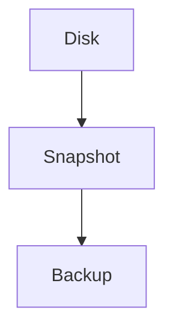

| 用途     | 機能               |
| ------ | ---------------- |
| バックアップ | Snapshot         |
| 復元     | Snapshot restore |

ACE

```text
Disk backup
→ Snapshot
```

---

# 5 Networking

VM公開。

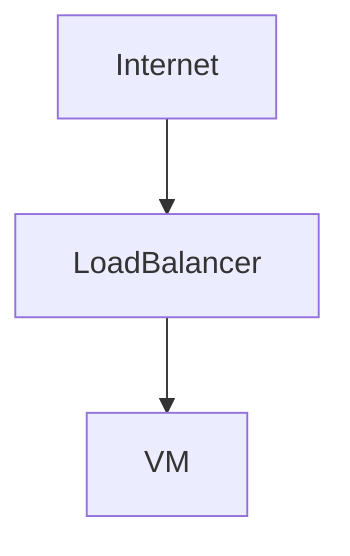

| 用途  | 方法            |
| --- | ------------- |
| 公開  | External IP   |
| 高可用 | Load Balancer |

ACE判断

```text
高可用VM
→ Load Balancer + MIG
```

---

# 6 Service Account

VM認証。

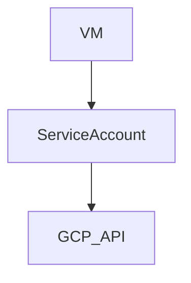

| 用途     | 機能              |
| ------ | --------------- |
| VM→API | Service Account |

ACE

```text
VM access GCP API
→ Service Account
```

---

# 7 Startup Script

VM初期化。

| 用途   | 方法             |
| ---- | -------------- |
| 初期設定 | Startup script |

例

```bash
#!/bin/bash
apt update
apt install nginx
```

ACE問題

```text
VM起動時にソフトインストール
→ Startup script
```

---

# 8 Preemptible VM

低コストVM。

| 特徴  | 内容    |
| --- | ----- |
| コスト | 約80%安 |
| 寿命  | 最大24h |

ACE用途

```text
バッチ
→ Preemptible VM
```

---

# 9 OS Login

SSH管理。

| 機能       | 説明      |
| -------- | ------- |
| OS Login | IAMでSSH |

ACE

```text
SSH管理
→ OS Login
```

---

# 10 API Enable

新規プロジェクト。

| 問題     | 答え                 |
| ------ | ------------------ |
| VM作れない | Compute API enable |

ACE

```text
まず疑う
→ API enable
```

---

# Compute Engine 構造

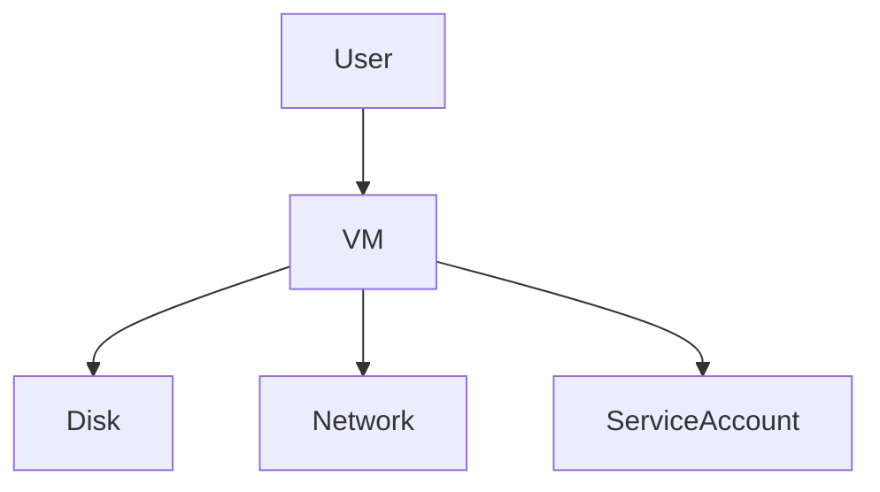

---

# ACE頻出Compute Engine判断

| 問題     | 答え              |
| ------ | --------------- |
| メモリ偏重  | Custom machine  |
| VMスケール | MIG             |
| 最高IO   | Local SSD       |
| バックアップ | Snapshot        |
| VM→API | Service Account |
| 安いVM   | Preemptible     |

---

# Compute Engine 思考マップ

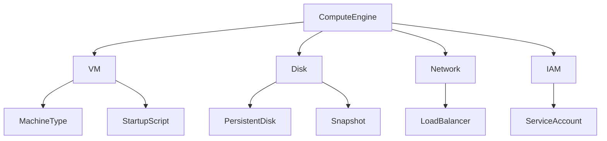

---

# ACEで一番出るパターン

```text
Custom machine type
Managed Instance Group
Snapshot
Local SSD
Service Account
Preemptible VM
Startup script
```

---


---

# Notes

