# GCP Compute 選択（ACE 2026）

GCPのComputeは **5種類で判断**すると試験が解きやすい。

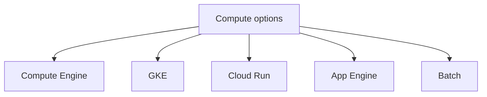

---

# 全体比較

| サービス           | 実行単位      | 管理           | 主用途        |
| -------------- | --------- | ------------ | ---------- |
| Compute Engine | VM        | OS管理         | 既存アプリ      |
| GKE            | Pod       | Kubernetes管理 | マイクロサービス   |
| Cloud Run      | Container | Serverless   | API / イベント |
| App Engine     | App       | Serverless   | Webアプリ     |
| Batch          | Job       | Serverless   | 大量バッチ      |

---

# ACE判断フロー

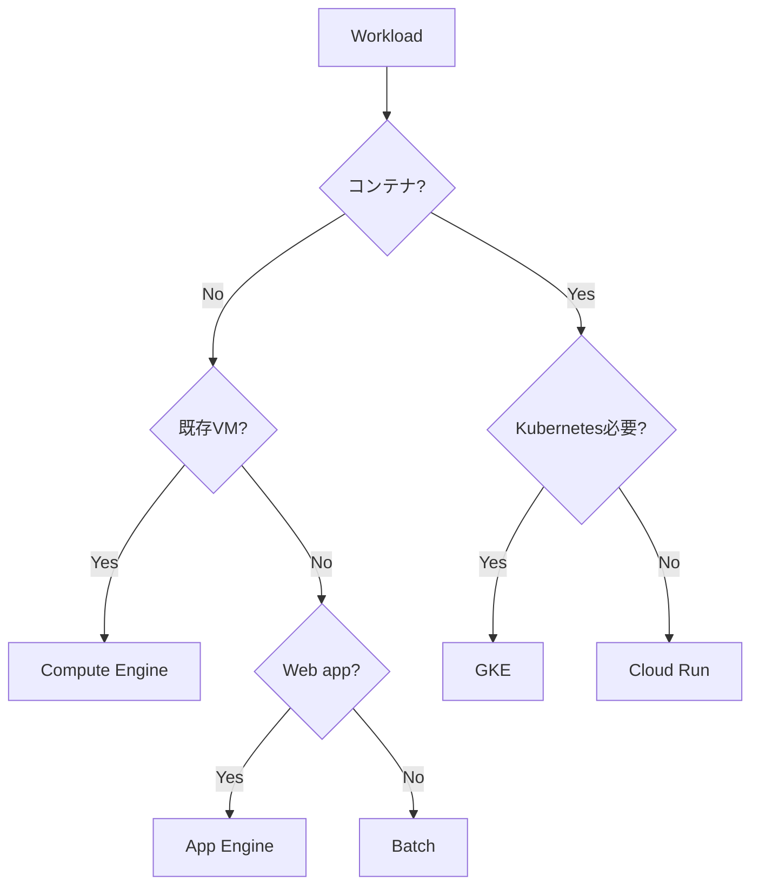

---

# Compute Engine

VMベースコンピュート。

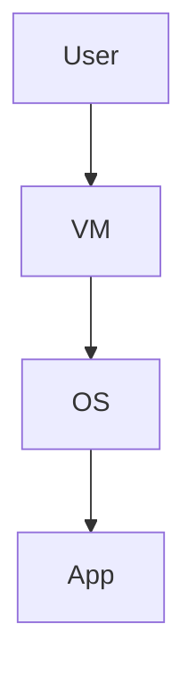

特徴

| 項目   | 内容 |
| ---- | -- |
| 単位   | VM |
| OS管理 | 必要 |
| SSH  | 可能 |
| カスタム | 可能 |

ACE判断

```text
SSH必要
既存VM
OSカスタム

→ Compute Engine
```

---

# Machine Type

VM性能選択。

| タイプ         | 用途    |
| ----------- | ----- |
| Standard    | 一般    |
| High-CPU    | CPU処理 |
| High-Memory | メモリ処理 |
| Custom      | 自由    |

ACE

```
RAM偏重
→ Custom machine type
```

---

# Managed Instance Group

VMスケール。

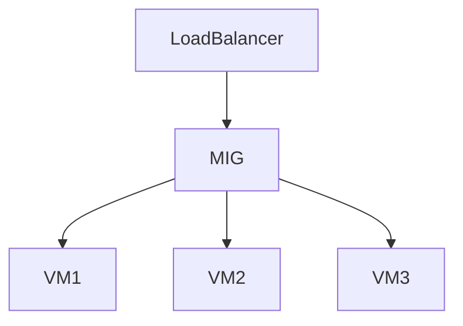

機能

| 機能             | 内容   |
| -------------- | ---- |
| Autoscaling    | 自動増減 |
| Autohealing    | 自動復旧 |
| Rolling update | 更新   |

ACE

```
VM auto scale
→ Managed Instance Group
```

---

# VM Storage

| 種類              | 特徴  |
| --------------- | --- |
| Persistent Disk | 標準  |
| Local SSD       | 高IO |
| Filestore       | NFS |

ACE

```
最高IO
→ Local SSD
```

---

# Snapshot

ディスクバックアップ。

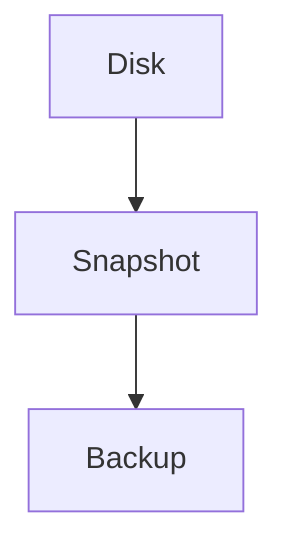

ACE

```
Disk backup
→ Snapshot
```

---

# Custom Image

VMテンプレート。

| 用途   | 内容    |
| ---- | ----- |
| VM複製 | Image |

ACE

```
VMテンプレート
→ Image
```

---

# Networking

VM公開。

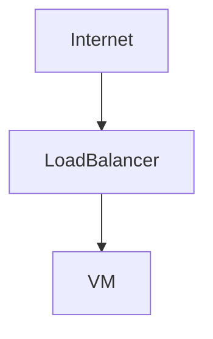

ACE

```
高可用VM
→ Load Balancer + MIG
```

---

# Service Account

VMからGCP API利用。

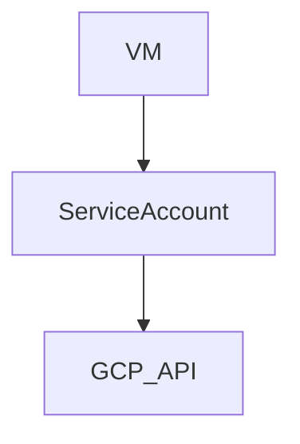

ACE

```
VM → GCP API
→ Service Account
```

---

# Startup Script

VM初期化。

```bash
#!/bin/bash
apt update
apt install nginx
```

ACE

```
VM起動時設定
→ Startup script
```

---

# Spot VM

低コストVM。

| 特徴 | 内容    |
| -- | ----- |
| 割引 | 最大90% |
| 停止 | いつでも  |

ACE

```
バッチ
→ Spot VM
```

---

# OS Login

SSH管理。

| 機能       | 内容      |
| -------- | ------- |
| OS Login | IAMでSSH |

ACE

```
SSH管理
→ OS Login
```

---

# Cloud Run

Serverlessコンテナ。

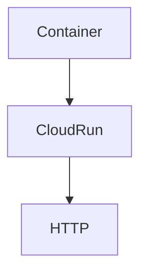

特徴

| 項目   | 内容        |
| ---- | --------- |
| 単位   | Container |
| スケール | 自動        |
| 課金   | リクエスト     |
| 運用   | 最小        |

ACE

```
HTTP API
コンテナ

→ Cloud Run
```

---

# Cloud Run Jobs

バッチ処理用Cloud Run。

| 用途  | 内容   |
| --- | ---- |
| Job | 一回処理 |

ACE

```
Container batch
→ Cloud Run Jobs
```

---

# Cloud Run イベント処理

Pub/Sub。

```
Pub/Sub
 ↓ push
Cloud Run
```

ACE

```
Pub/Sub → Cloud Run
→ Push subscription
```

---

# GKE

Kubernetes管理。

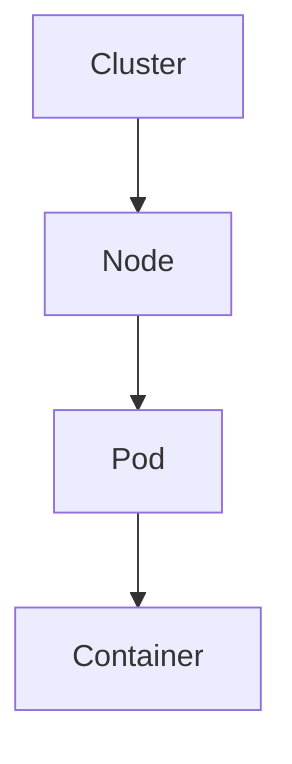

特徴

| 項目   | 内容         |
| ---- | ---------- |
| 単位   | Pod        |
| 管理   | Kubernetes |
| スケール | HPA        |

ACE

```
多数コンテナ
Kubernetes

→ GKE
```

---

# GKE Autopilot

ノード管理不要。

| モード       | 特徴         |
| --------- | ---------- |
| Standard  | Node管理     |
| Autopilot | Serverless |

ACE

```
Kubernetes
運用最小

→ GKE Autopilot
```

---

# App Engine

PaaS型アプリ。

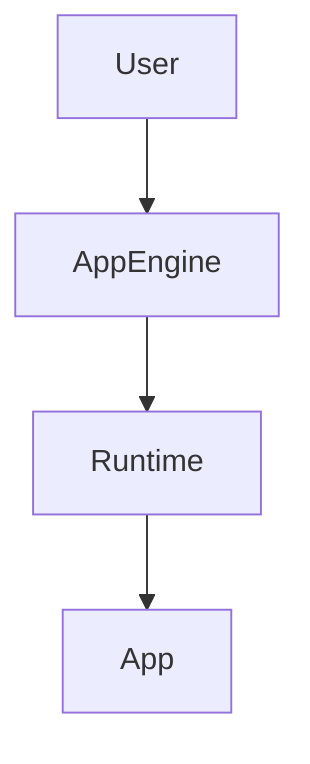

特徴

| 項目   | 内容  |
| ---- | --- |
| スケール | 自動  |
| 運用   | 最小  |
| 用途   | Web |

ACE

```
Flask
Django

→ App Engine
```

---

# Batch

大規模バッチ処理。

| 特徴   | 内容 |
| ---- | -- |
| 大量処理 | 可能 |
| VM管理 | 自動 |

ACE

```
大規模バッチ
→ Batch
```

---

# スケール比較

| サービス           | スケール |
| -------------- | ---- |
| Cloud Run      | 自動   |
| App Engine     | 自動   |
| GKE            | HPA  |
| Compute Engine | MIG  |
| Batch          | 自動   |

---

# 運用負荷

| サービス           | 運用 |
| -------------- | -- |
| Compute Engine | 高  |
| GKE            | 中  |
| App Engine     | 低  |
| Cloud Run      | 最低 |
| Batch          | 最低 |

---

# Snapshot vs Image

| 機能       | 用途     |
| -------- | ------ |
| Snapshot | バックアップ |
| Image    | VMテンプレ |

ACE

```
バックアップ → Snapshot
VM複製 → Image
```

---

# ACE Compute 頻出

```
Custom machine type
Managed Instance Group
Snapshot
Local SSD
Service Account
Spot VM
Startup script
```

---

# ACE Compute 判断まとめ

```
SSH必要 → Compute Engine
Kubernetes → GKE
HTTPコンテナ → Cloud Run
Webアプリ → App Engine
大量バッチ → Batch
```

---

# Compute 構造

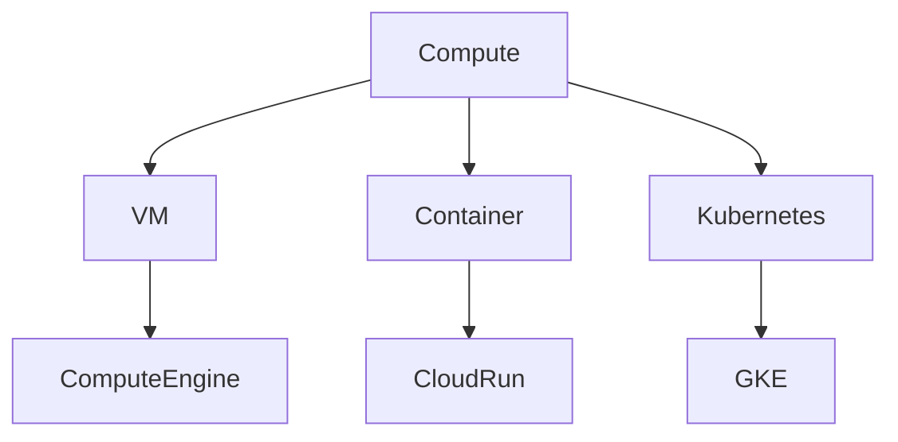

---

# 最終ACE暗記

```
VM → Compute Engine
Container → Cloud Run
Kubernetes → GKE
Web app → App Engine
Batch → Batch
```

---

