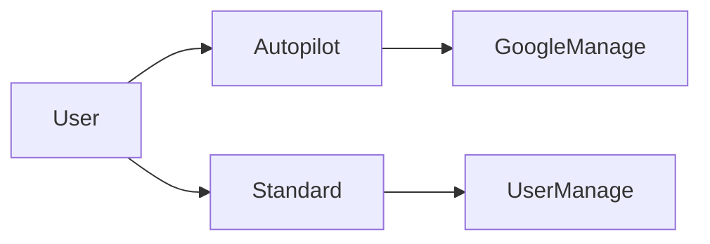
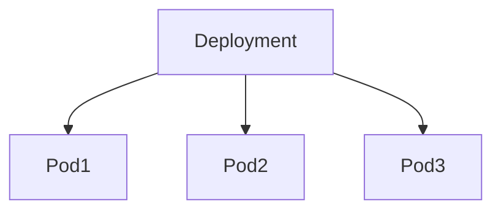
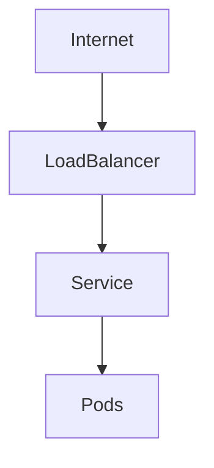
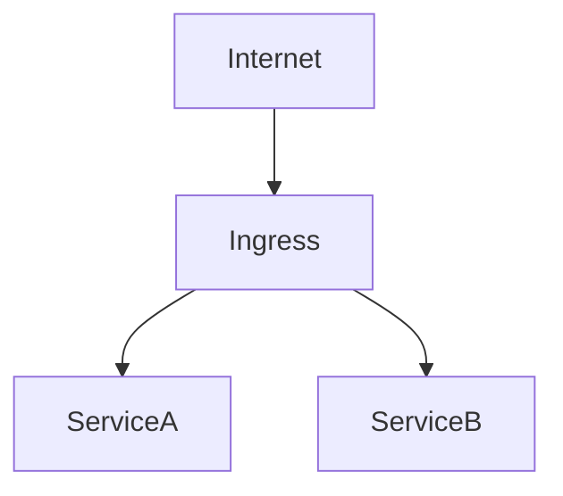
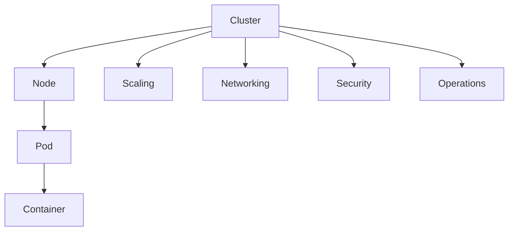

````markdown
# GKE 試験対策（ACE 2026 / 実務整理版）

GKEは **6領域で整理**すると試験・実務ともに理解しやすい。

```mermaid
graph TD
A[GKE] --> B[Cluster]
A --> C[Workload]
A --> D[Scaling]
A --> E[Networking]
A --> F[Security]
A --> G[Operations]
````

---

# 1. Cluster

GKEの基本単位。

## 構造

```
Cluster
 └ Node (VM)
     └ Pod
         └ Container
```

| 要素        | 説明                |
| --------- | ----------------- |
| Cluster   | Kubernetes環境      |
| Node      | Compute Engine VM |
| Pod       | コンテナ実行単位          |
| Container | アプリ               |

### ACE暗記

```
Pod = 最小実行単位
```

---

## Clusterタイプ

| タイプ       | 特徴               |
| --------- | ---------------- |
| Autopilot | Node管理をGoogleが実施 |
| Standard  | Node管理を自分        |



### 判断

```
運用最小 → Autopilot
Node制御必要 → Standard
```

### 2026実務

Autopilot採用が増加（SRE運用削減）

---

## Node Pool

GKEでは **Node pool分離が基本設計**

| ノード               | 用途    |
| ----------------- | ----- |
| General-purpose   | Web   |
| Compute-optimized | CPU処理 |
| Memory-optimized  | DB    |

### 構造

```
Cluster
 ├ NodePool-A (E2)
 ├ NodePool-B (C2)
 └ NodePool-C (M2)
```

### ACE

```
ワークロード分離
→ Node pool
```

---

# 2. Workload

Pod管理。



| 種類          | 用途        |
| ----------- | --------- |
| Deployment  | stateless |
| StatefulSet | database  |
| DaemonSet   | 全Node     |
| Job         | バッチ       |
| CronJob     | 定期        |

---

## Deployment

最も一般的。

| 機能             | 内容     |
| -------------- | ------ |
| Replica        | Pod数維持 |
| Rolling update | 無停止更新  |
| Self healing   | Pod復旧  |

### ACE

```
Pod安定管理
→ Deployment
```

---

## StatefulSet

DB用。

```
Pod-0 ↔ Disk-0
Pod-1 ↔ Disk-1
Pod-2 ↔ Disk-2
```

| 特徴      | 内容              |
| ------- | --------------- |
| 固定ID    | db-0            |
| ディスク紐付け | Persistent Disk |
| 起動順序    | あり              |

### ACE

```
DB
→ StatefulSet
```

---

## DaemonSet

全NodeにPod配置。

```
Node1 → Pod
Node2 → Pod
Node3 → Pod
```

| 用途         | 例             |
| ---------- | ------------- |
| Logging    | fluentd       |
| Monitoring | node exporter |

### ACE

```
全node
→ DaemonSet
```

---

## Job / CronJob

バッチ処理。

| 種類      | 用途 |
| ------- | -- |
| Job     | 一回 |
| CronJob | 定期 |

---

# 3. Scaling

GKEのスケールは **3種類**

| 機能                 | 対象           |
| ------------------ | ------------ |
| HPA                | Pod          |
| VPA                | Pod resource |
| Cluster Autoscaler | Node         |

---

## HPA

Pod数スケール

```
CPU → HPA → Pod増加
```

### ACE

```
Pod増やす
→ HPA
```

---

## VPA

Podリソース調整

```
Pod CPU/Mem調整
```

### ACE

```
resource最適化
→ VPA
```

---

## Cluster Autoscaler

Node増減

```
Pod増 → Node追加
```

### ACE

```
Node不足
→ Cluster Autoscaler
```

---

# 4. Networking

GKE通信構造



---

## Service

Pod公開。

| タイプ          | 用途     |
| ------------ | ------ |
| ClusterIP    | 内部     |
| NodePort     | Node公開 |
| LoadBalancer | 外部公開   |

### ACE

```
GKE公開
→ Service LoadBalancer
```

---

## Ingress

HTTPルーティング

```
/api → ServiceA
/web → ServiceB
```



### ACE

```
URL routing
→ Ingress
```

---

## Gateway API（2026）

Ingress後継。

| 機能        | 内容        |
| --------- | --------- |
| Gateway   | L7 router |
| HTTPRoute | routing   |

### 実務

```
Ingress → Gateway API移行中
```

---

# 5. Security

## Workload Identity

PodからGCP API。

```
Pod → Workload Identity → GCP API
```

理由

* JSONキー不要
* IAM管理

### ACE

```
Pod→GCP
→ Workload Identity
```

---

## Private Cluster

Nodeを非公開。

| 項目            | 内容         |
| ------------- | ---------- |
| Node          | private IP |
| control plane | Google     |

### ACE

```
安全なGKE
→ Private cluster
```

---

## Binary Authorization

コンテナ署名検証。

| 機能      | 内容    |
| ------- | ----- |
| Image検証 | 未署名拒否 |

実務

```
Supply chain security
```

---

# 6. Operations

## Rolling Update

Deployment更新。

```
OldPod → NewPod
```

### ACE

```
無停止更新
→ rolling update
```

---

## Rollback

```
kubectl rollout undo
```

### ACE

```
更新失敗
→ rollback
```

---

## Cluster接続

```
gcloud container clusters get-credentials CLUSTER
```

### ACE

```
kubectl接続
→ get-credentials
```

---

## kubectl 基本

| コマンド                 | 用途       |
| -------------------- | -------- |
| kubectl get pods     | Pod確認    |
| kubectl get nodes    | Node確認   |
| kubectl describe pod | Pod詳細    |
| kubectl logs         | Podログ    |
| kubectl rollout undo | rollback |

---

# Artifact Registry

コンテナ保存。

```
Build
 ↓
Artifact Registry
 ↓
GKE pull
```

### ACE

```
Container registry
→ Artifact Registry
```

---

# GKE ストレージ

| 種類              | 用途  |
| --------------- | --- |
| Persistent Disk | 永続  |
| Local SSD       | 高IO |
| Filestore       | NFS |

### ACE

```
高IO
→ Local SSD
```

---

# GKE StorageClass

動的ボリューム作成。

```
PVC → PV
```

実務

```
CSI driver
```

---

# ACEで最も出るGKE

```
Autopilot vs Standard
HPA
Cluster Autoscaler
Service LoadBalancer
Ingress
Workload Identity
rollout undo
get-credentials
```

---

# 最終チート

```
運用減らす → Autopilot
Pod増 → HPA
Node不足 → Cluster Autoscaler
外部公開 → Service LoadBalancer
HTTP routing → Ingress
Pod→GCP → Workload Identity
rollback → rollout undo
接続 → get-credentials
```

---

# 2026 GKE実務トレンド

| 技術                   | 状況                    |
| -------------------- | --------------------- |
| Autopilot            | 普及                    |
| Gateway API          | Ingress後継             |
| Workload Identity    | 標準                    |
| Artifact Registry    | Container Registry置換  |
| Binary Authorization | supply chain security |

---

# GKE 最終構造



```

---

