# GKE 試験対策（ACE）

GKEの問題は大きく **5領域**だけです。

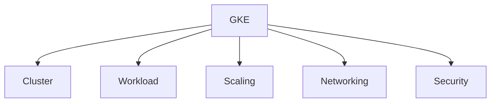

---

# 1 Clusterタイプ

| タイプ       | 特徴               | 試験ポイント |
| --------- | ---------------- | ------ |
| Autopilot | Node管理をGoogleが担当 | 運用最小   |
| Standard  | Nodeを自分で管理       | 自由度高   |

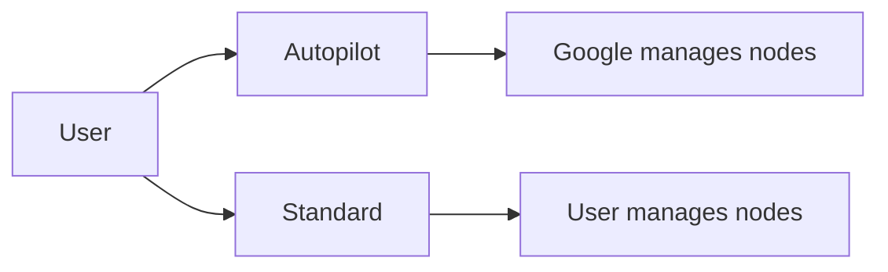

補足

* **Autopilot**

  * Node操作不可
  * Pod単位課金
  * 運用負荷小

* **Standard**

  * Node pool管理
  * GPUなど自由に設定

ACE判断

```
運用減らす → Autopilot
自由構築 → Standard
```

---

# 2 Workload（Pod / Deployment）

GKEの最小単位

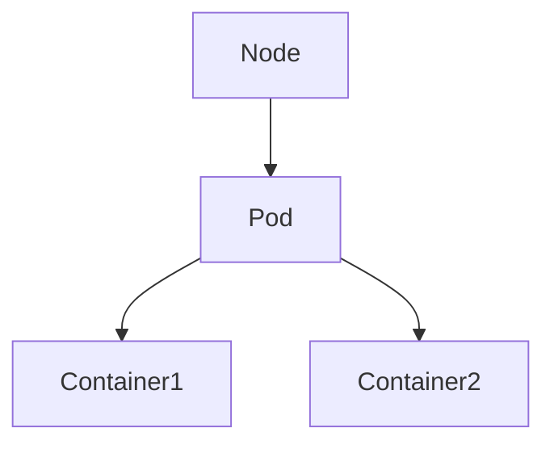

| 概念         | 説明    |
| ---------- | ----- |
| Pod        | 最小単位  |
| Deployment | Pod管理 |

Deployment構造

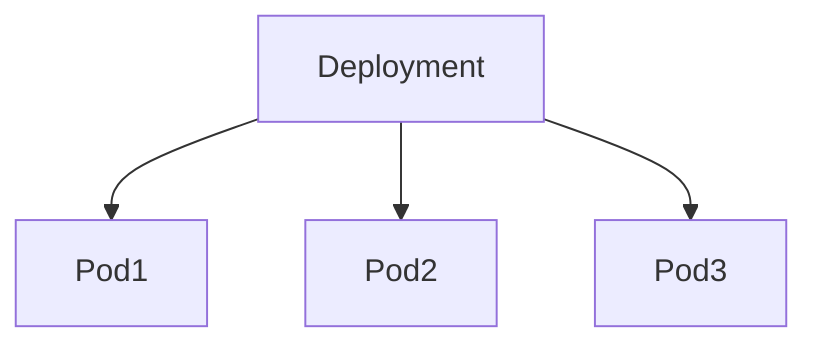

補足

Deploymentが

* Pod数維持
* Rolling update

を担当します。

ACEポイント

```
Podを安定管理 → Deployment
```

---

# 3 DaemonSet

DaemonSetは

**全Nodeに1つPodを配置**

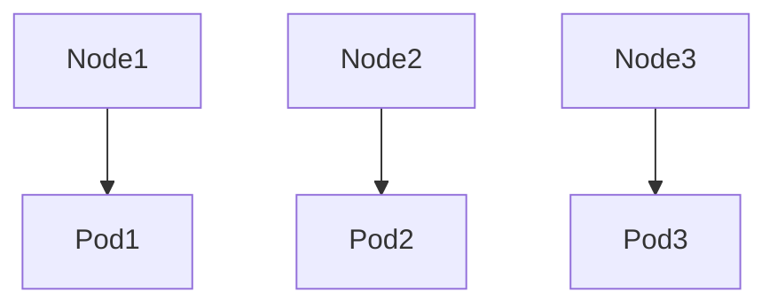

用途

| 用途     | 例             |
| ------ | ------------- |
| 監視     | logging agent |
| ネットワーク | node exporter |

ACEでは

```
全nodeに配置
→ DaemonSet
```

---

# 4 Autoscaling

GKEのスケールは **3種類**

| 種類                 | 対象      |
| ------------------ | ------- |
| HPA                | Pod数    |
| VPA                | Podリソース |
| Cluster Autoscaler | Node    |

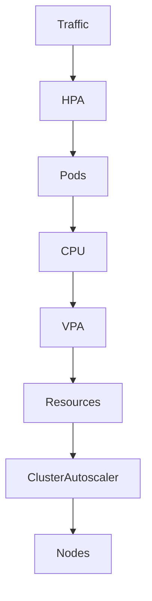

補足

### HPA

```
CPU / memory / metrics
→ Pod数を増減
```

### VPA

```
PodのCPU / memoryを調整
```

### Cluster Autoscaler

```
Node数を増減
```

覚える

```
HPA = Pod
VPA = Resource
CA  = Node
```

---

# 5 Networking

GKEの公開構造

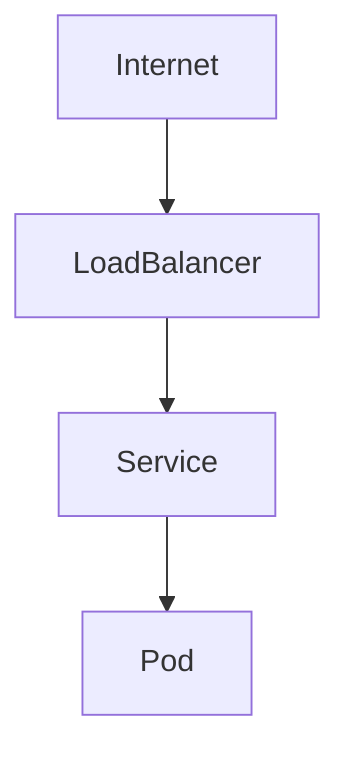

| 要素           | 役割         |
| ------------ | ---------- |
| Service      | Podをまとめる   |
| LoadBalancer | 外部公開       |
| Ingress      | HTTPルーティング |

Serviceタイプ

| Type         | 用途     |
| ------------ | ------ |
| ClusterIP    | 内部     |
| NodePort     | Node公開 |
| LoadBalancer | 外部公開   |

ACE頻出

```
GKEを外部公開
→ Service type LoadBalancer
```

---

# 6 Ingress

HTTPルーティング

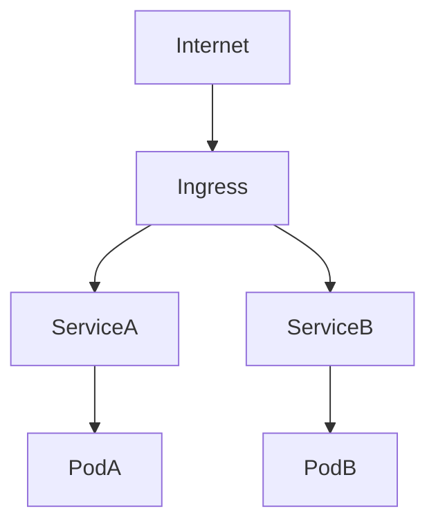

用途

```
URL routing
TLS
HTTP load balancing
```

---

# 7 Rolling Update / Rollback

Deployment更新

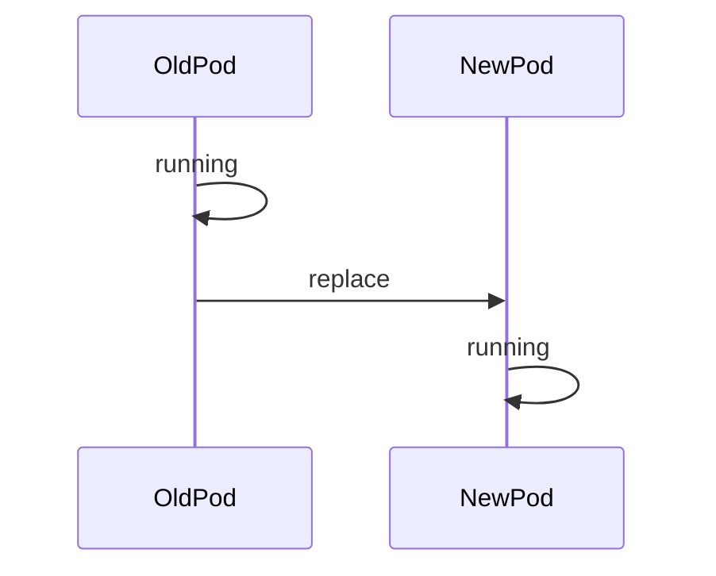

Rollback

```
kubectl rollout undo
```

ACE頻出

```
update失敗
→ rollout undo
```

---

# 8 Private GKE

Nodeを非公開

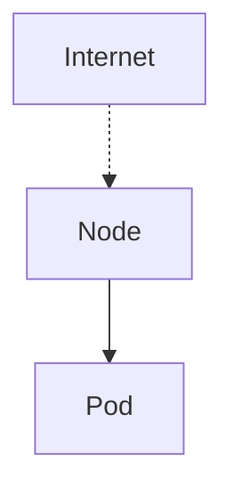

特徴

| 項目            | 説明         |
| ------------- | ---------- |
| Node          | private IP |
| control plane | Google管理   |

ACE問題

```
安全なGKE
→ Private cluster
```

---

# 9 Workload Identity

PodからGCP APIアクセス

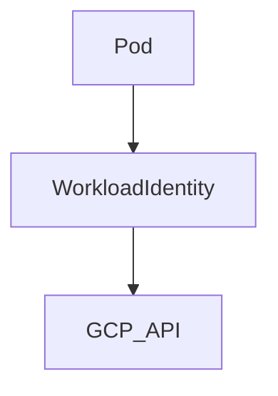

理由

* JSONキー不要
* IAM管理

ACE

```
Pod → GCP API
→ Workload Identity
```

---

# 10 接続コマンド

| 目的        | コマンド                |
| --------- | ------------------- |
| cluster接続 | `get-credentials`   |
| Pod確認     | `kubectl get pods`  |
| Node確認    | `kubectl get nodes` |

例

```
gcloud container clusters get-credentials CLUSTER
```

---

# ACE試験でのGKE重要度

最重要

```
Autopilot vs Standard
HPA / VPA / CA
Service LoadBalancer
rollout undo
get-credentials
```

---

# GKE全体構造（まとめ）

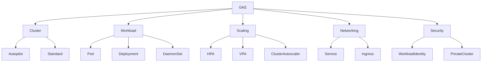

---

# GKE ひっかけ問題10（ACE）

---

## ① Autopilot vs Standard

**問**
運用を最小化したいGKE環境

**答**

```
Autopilot
```

解説
Autopilotでは

* Node管理不要
* Pod単位課金
* OSパッチ管理不要

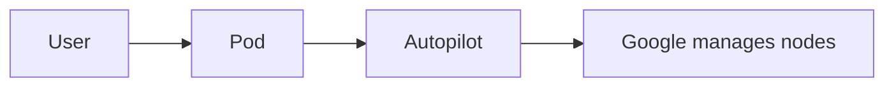

---

## ② Podスケール

**問**

CPUが高いのでPod数を増やす

**答**

```
Horizontal Pod Autoscaler
```

解説

HPAは **Pod数スケール**

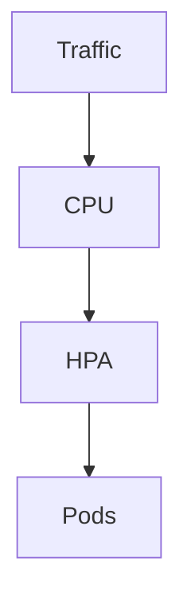

---

## ③ Podリソース調整

**問**

PodのCPU / Memoryが不明
最適値を自動調整

**答**

```
Vertical Pod Autoscaler
```

解説

VPAは **Podサイズ調整**

---

## ④ Node不足

**問**

Pod増えたがNode足りない

**答**

```
Cluster Autoscaler
```

解説

Nodeを追加

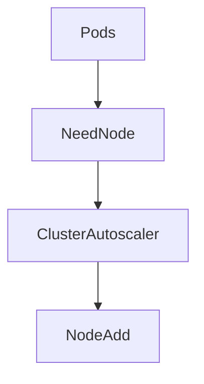

---

## ⑤ 全NodeにPod

**問**

監視Agentを全Nodeに配置

**答**

```
DaemonSet
```

解説

DaemonSetは

```
1 Node = 1 Pod
```

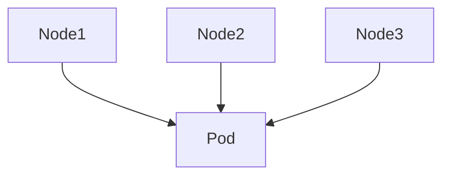

---

## ⑥ GKE公開

**問**

GKEサービスをインターネット公開

**答**

```
Service type LoadBalancer
```

解説

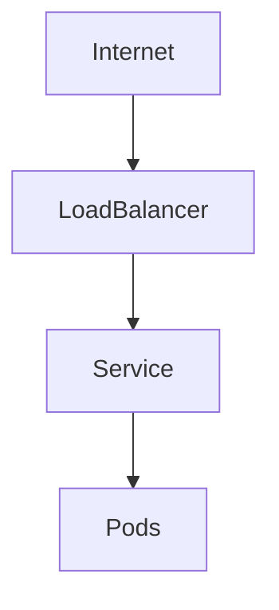

---

## ⑦ HTTPルーティング

**問**

複数サービスをURL分岐

**答**

```
Ingress
```

解説

Ingressは **HTTPルーター**

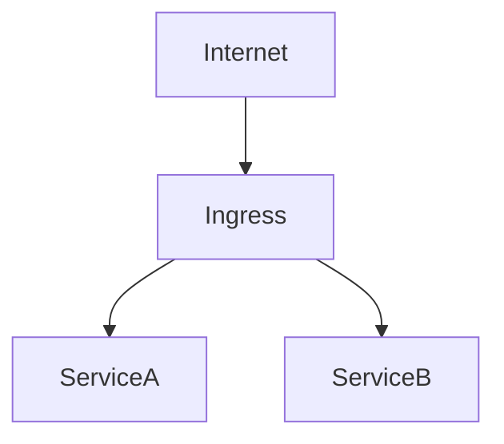

---

## ⑧ Pod→GCP API

**問**

PodがGCP APIアクセス

**答**

```
Workload Identity
```

解説

JSONキー不要


---

## ⑨ 更新失敗

**問**

Deployment更新失敗
元に戻す

**答**

```
kubectl rollout undo
```

解説

Deploymentの履歴から戻す

---

## ⑩ cluster接続

**問**

kubectlでGKE接続

**答**

```
gcloud container clusters get-credentials
```

解説

kubeconfig更新

---

# GKE ひっかけまとめ

| 問題           | 答え                   |
| ------------ | -------------------- |
| 運用最小         | Autopilot            |
| Pod数         | HPA                  |
| Podサイズ       | VPA                  |
| Node数        | Cluster Autoscaler   |
| 全Node        | DaemonSet            |
| 外部公開         | Service LoadBalancer |
| HTTP routing | Ingress              |
| Pod→GCP      | Workload Identity    |
| rollback     | rollout undo         |
| kubectl接続    | get-credentials      |

---

# ACE GKE 思考マップ

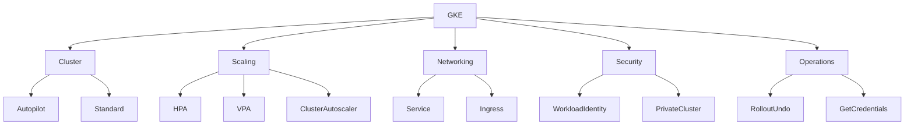

---

# GKE問題 90秒判断フロー（ACE）

まず最初に **問題の種類を判定**します。

```mermaid
flowchart TD
Q[GKE問題] --> A{何の問題?}

A --> B[Cluster]
A --> C[Scaling]
A --> D[Networking]
A --> E[Security]
A --> F[Operations]
```

ACEでは **この5分類しか出ません。**

---

# ① Cluster問題

典型問題

```
運用減らす
安全
クラスタ作成
```

判断

```mermaid
flowchart TD
A[Cluster作成] --> B{運用最小?}
B -->|Yes| C[Autopilot]
B -->|No| D[Standard]
```

補足

| キーワード  | 答え        |
| ------ | --------- |
| 運用減らす  | Autopilot |
| Node制御 | Standard  |

---

# ② Scaling問題

問題文

```
CPU上昇
トラフィック増
```

判断

```mermaid
flowchart TD
A[Scaling] --> B{何を増やす?}

B -->|Pod数| C[HPA]
B -->|Podサイズ| D[VPA]
B -->|Node| E[Cluster Autoscaler]
```

補足

| 対象      | 機能                 |
| ------- | ------------------ |
| Pod数    | HPA                |
| Podリソース | VPA                |
| Node    | Cluster Autoscaler |

---

# ③ Networking問題

典型問題

```
公開
HTTP routing
```

判断

```mermaid
flowchart TD
A[Networking] --> B{公開?}

B -->|Yes| C[Service LoadBalancer]
B -->|No| D[ClusterIP]
```

HTTP分岐

```mermaid
flowchart TD
Internet --> Ingress
Ingress --> ServiceA
Ingress --> ServiceB
```

補足

| 用途           | 機能                   |
| ------------ | -------------------- |
| 外部公開         | Service LoadBalancer |
| HTTP routing | Ingress              |

---

# ④ Security問題

典型問題

```
PodがGCP API
JSONキー回避
```

判断

```mermaid
flowchart TD
A[Pod access API] --> B[Workload Identity]
```

補足

| 問題          | 答え                |
| ----------- | ----------------- |
| Pod→GCP API | Workload Identity |

---

# ⑤ Operations問題

典型問題

```
更新
接続
```

判断

```mermaid
flowchart TD
A[Operations] --> B{何する?}

B -->|Rollback| C[kubectl rollout undo]
B -->|Connect| D[get-credentials]
```

補足

| 目的        | コマンド            |
| --------- | --------------- |
| rollback  | rollout undo    |
| cluster接続 | get-credentials |

---

# GKE問題の解き方（ACE）

90秒思考

```mermaid
flowchart TD
Q[問題] --> A{分類}

A --> Cluster
A --> Scaling
A --> Networking
A --> Security
A --> Operations
```

次に

```mermaid
flowchart TD
Cluster --> Autopilot
Scaling --> HPA
Networking --> Service
Security --> WorkloadIdentity
Operations --> RolloutUndo
```

---

# 最終判断チート

ACEで迷ったら

```text
運用減らす → Autopilot
Pod増やす → HPA
外部公開 → Service LoadBalancer
HTTP分岐 → Ingress
Pod→GCP → Workload Identity
rollback → rollout undo
接続 → get-credentials
```

---

# 最重要パターン（7個）

試験で一番出る

```text
Autopilot
HPA
VPA
Cluster Autoscaler
Service LoadBalancer
Ingress
Workload Identity
```

---

# GKE 全体構造（ACE 1枚図）

```mermaid
graph TD
A[GKE Cluster]

A --> B[Nodes]
B --> C[Pods]

C --> D[Containers]

A --> E[Scaling]
A --> F[Networking]
A --> G[Security]
A --> H[Operations]
```

補足
GKEは **「Cluster → Node → Pod → Container」** の階層。

---

# 基本構造

```mermaid
graph TD
Cluster --> Node1
Cluster --> Node2
Cluster --> Node3

Node1 --> PodA
Node1 --> PodB

Node2 --> PodC

PodA --> Container1
PodA --> Container2
```

説明

| 要素        | 説明           |
| --------- | ------------ |
| Cluster   | Kubernetes環境 |
| Node      | VM           |
| Pod       | コンテナ実行単位     |
| Container | アプリ          |

ACE暗記

```
Pod = 最小実行単位
```

---

# Clusterタイプ

```mermaid
graph LR
User --> Autopilot
User --> Standard

Autopilot --> GoogleManage
Standard --> UserManage
```

| タイプ       | 特徴            |
| --------- | ------------- |
| Autopilot | GoogleがNode管理 |
| Standard  | Node管理を自分     |

判断

```
運用最小 → Autopilot
自由構築 → Standard
```

---

# Workload管理

```mermaid
graph TD
Deployment --> Pod1
Deployment --> Pod2
Deployment --> Pod3
```

| 機能         | 役割      |
| ---------- | ------- |
| Deployment | Pod管理   |
| DaemonSet  | 全Node配置 |
| Job        | バッチ     |

DaemonSet

```mermaid
graph TD
Node1 --> Pod
Node2 --> Pod
Node3 --> Pod
```

ACE判断

```
全Nodeに配置 → DaemonSet
```

---

# Scaling

```mermaid
graph TD
Traffic --> HPA
HPA --> Pods

Pods --> VPA

Nodes --> ClusterAutoscaler
```

| 機能                 | 対象     |
| ------------------ | ------ |
| HPA                | Pod数   |
| VPA                | Podサイズ |
| Cluster Autoscaler | Node数  |

覚える

```
HPA = Pod
VPA = Resource
CA  = Node
```

---

# Networking

```mermaid
graph TD
Internet --> LoadBalancer
LoadBalancer --> Service
Service --> Pods
```

| 機能           | 用途         |
| ------------ | ---------- |
| Service      | Pod公開      |
| LoadBalancer | 外部公開       |
| Ingress      | HTTPルーティング |

Ingress

```mermaid
graph TD
Internet --> Ingress
Ingress --> ServiceA
Ingress --> ServiceB
```

ACE判断

```
外部公開 → Service LoadBalancer
URL routing → Ingress
```

---

# Security

```mermaid
graph TD
Pod --> WorkloadIdentity
WorkloadIdentity --> GCP_API
```

| 機能                | 用途          |
| ----------------- | ----------- |
| Workload Identity | Pod→GCP API |
| Private Cluster   | Node非公開     |

ACE判断

```
PodがGCP API → Workload Identity
```

---

# Operations

Deployment更新

```mermaid
sequenceDiagram
OldPod ->> NewPod: rolling update
```

Rollback

```
kubectl rollout undo
```

接続

```
gcloud container clusters get-credentials
```

---

# GKE 全体マップ

```mermaid
graph TD
GKE --> Cluster
GKE --> Workload
GKE --> Scaling
GKE --> Networking
GKE --> Security
GKE --> Operations

Cluster --> Autopilot
Cluster --> Standard

Workload --> Deployment
Workload --> DaemonSet

Scaling --> HPA
Scaling --> VPA
Scaling --> ClusterAutoscaler

Networking --> Service
Networking --> Ingress

Security --> WorkloadIdentity
Security --> PrivateCluster
```

---

# ACEで最も出るGKEパターン

```
Autopilot vs Standard
HPA / VPA / Cluster Autoscaler
Service LoadBalancer
Ingress
Workload Identity
rollout undo
get-credentials
```

---

```markdown
---

# kubectl 基本

GKE操作の基本CLI。

| コマンド | 用途 |
|---|---|
| kubectl get pods | Pod確認 |
| kubectl get nodes | Node確認 |
| kubectl describe pod | Pod詳細 |
| kubectl logs | Podログ |
| kubectl rollout undo | rollback |

例

```

kubectl get pods
kubectl get nodes
kubectl logs POD_NAME
kubectl rollout undo deployment APP

```

ACE反射

```

rollback
→ kubectl rollout undo

```

---

# NodePort

NodePortは **Nodeのポートを使って公開する方式**。

```

Internet
|
NodeIP:30000
|
Service (NodePort)
|
Pod

```

特徴

| 項目 | 内容 |
|---|---|
| ポート | 30000–32767 |
| 公開 | Node経由 |
| 本番 | あまり使わない |

ACE判断

```

外部公開
→ Service LoadBalancer

```

NodePortは **中間構造**。

---

# GKE 超短縮まとめ（ACE）

GKE問題はほぼこのパターン。

```

Autopilot → 運用最小
Standard → Node自由管理

HPA → Pod数
VPA → Podサイズ
CA  → Node数

外部公開 → Service LoadBalancer
HTTP routing → Ingress

全Node配置 → DaemonSet

Pod → GCP API
→ Workload Identity

rollback
→ kubectl rollout undo

kubectl接続
→ get-credentials

```

---
```


# Notes

