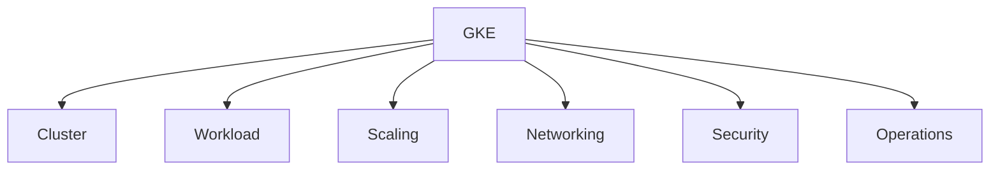
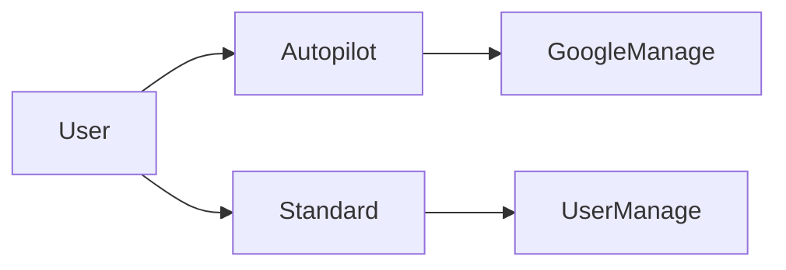
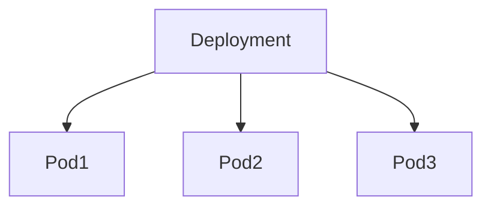
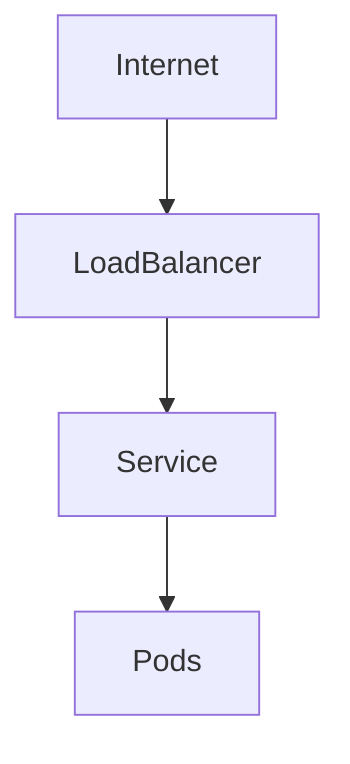
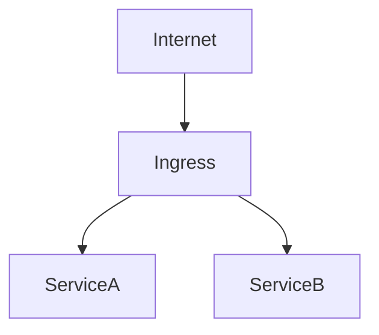
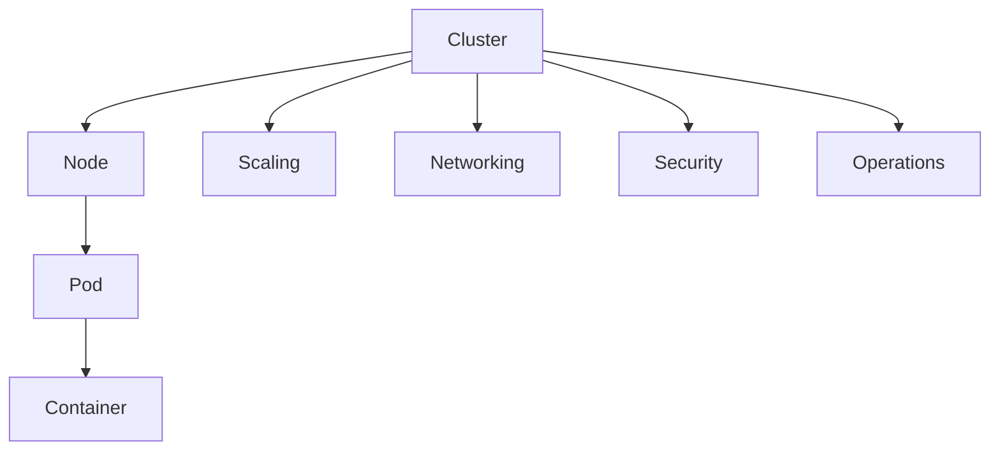

# GKE 試験対策（ACE 2026 / 実務整理版）

GKEは **6領域で整理**すると試験・実務ともに理解しやすい。



---

# 1. Cluster

## 1.1 GKE基本構造

GKEはKubernetesクラスタをマネージドで提供するサービス。

### 構造

```
Cluster
 └ Node (VM)
     └ Pod
         └ Container
```

| 要素        | 説明                |
| --------- | ----------------- |
| Cluster   | Kubernetes環境      |
| Node      | Compute Engine VM |
| Pod       | コンテナ実行単位          |
| Container | アプリ               |

### ACE暗記

```
Pod = Kubernetes最小実行単位
```

---

## 1.2 Clusterタイプ

| タイプ       | 特徴               |
| --------- | ---------------- |
| Autopilot | Node管理をGoogleが実施 |
| Standard  | Node管理をユーザー      |



### ACE判断

```
運用最小 → Autopilot
Node制御必要 → Standard
```

### 2026実務

Autopilot採用が増加。
SRE運用削減のため標準選択になるケースが多い。

---

## 1.3 Node Pool

GKEでは **Node pool分離が基本設計**

```
Cluster
 ├ NodePool-A (E2)
 ├ NodePool-B (C2)
 └ NodePool-C (M2)
```

| ノード               | 用途    |
| ----------------- | ----- |
| General-purpose   | Web   |
| Compute-optimized | CPU処理 |
| Memory-optimized  | DB    |

### ACE

```
ワークロード分離
→ Node pool
```

---

# 2. Workload

## 2.1 Pod管理



| 種類          | 用途        |
| ----------- | --------- |
| Deployment  | stateless |
| StatefulSet | database  |
| DaemonSet   | 全Node     |
| Job         | バッチ       |
| CronJob     | 定期        |

---

## 2.2 Deployment

最も一般的なPod管理。

| 機能             | 内容     |
| -------------- | ------ |
| Replica        | Pod数維持 |
| Rolling update | 無停止更新  |
| Self healing   | Pod復旧  |

### ACE

```
Pod安定管理
→ Deployment
```

---

## 2.3 StatefulSet

DB系ワークロード。

```
Pod-0 ↔ Disk-0
Pod-1 ↔ Disk-1
Pod-2 ↔ Disk-2
```

| 特徴      | 内容              |
| ------- | --------------- |
| 固定ID    | db-0            |
| ディスク紐付け | Persistent Disk |
| 起動順序    | あり              |

### ACE

```
DB
→ StatefulSet
```

---

## 2.4 DaemonSet

全NodeにPod配置。

```
Node1 → Pod
Node2 → Pod
Node3 → Pod
```

| 用途         | 例             |
| ---------- | ------------- |
| Logging    | fluentd       |
| Monitoring | node exporter |

### ACE

```
全node
→ DaemonSet
```

---

## 2.5 Job / CronJob

| 種類      | 用途   |
| ------- | ---- |
| Job     | 一回処理 |
| CronJob | 定期処理 |

---

# 3. Scaling

GKEのスケールは **3種類**

| 機能                 | 対象           |
| ------------------ | ------------ |
| HPA                | Pod          |
| VPA                | Pod resource |
| Cluster Autoscaler | Node         |

---

## 3.1 HPA

Pod数スケール

```
CPU → HPA → Pod増加
```

### ACE

```
Pod増やす
→ HPA
```

---

## 3.2 VPA

Podリソース調整

```
Pod CPU/Mem調整
```

### ACE

```
resource最適化
→ VPA
```

---

## 3.3 Cluster Autoscaler

Node増減

```
Pod増 → Node追加
```

### ACE

```
Node不足
→ Cluster Autoscaler
```

---

# 4. Networking

## 4.1 通信構造



---

## 4.2 Service

Pod公開。

| タイプ          | 用途     |
| ------------ | ------ |
| ClusterIP    | 内部通信   |
| NodePort     | Node公開 |
| LoadBalancer | 外部公開   |

### ACE

```
GKE外部公開
→ Service LoadBalancer
```

---

## 4.3 Ingress

HTTPルーティング

```
/api → ServiceA
/web → ServiceB
```



### ACE

```
URL routing
→ Ingress
```

---

## 4.4 Gateway API（2026）

Ingressの後継。

| 機能        | 内容        |
| --------- | --------- |
| Gateway   | L7 router |
| HTTPRoute | routing   |

### 実務

```
Ingress → Gateway API移行中
```

---

# 5. Security

## 5.1 Workload Identity

PodからGCP APIアクセス。

```
Pod → Workload Identity → GCP API
```

理由

* JSONキー不要
* IAM統合

### ACE

```
Pod→GCP
→ Workload Identity
```

---

## 5.2 Private Cluster

Nodeを非公開化。

| 項目            | 内容         |
| ------------- | ---------- |
| Node          | private IP |
| control plane | Google管理   |

### ACE

```
安全なGKE
→ Private cluster
```

---

## 5.3 Binary Authorization

コンテナ署名検証。

| 機能      | 内容    |
| ------- | ----- |
| Image検証 | 未署名拒否 |

実務用途

```
Supply chain security
```

---

# 6. Operations

## 6.1 Rolling Update

Deployment更新。

```
OldPod → NewPod
```

### ACE

```
無停止更新
→ rolling update
```

---

## 6.2 Rollback

```
kubectl rollout undo
```

### ACE

```
更新失敗
→ rollback
```

---

## 6.3 Cluster接続

```
gcloud container clusters get-credentials CLUSTER
```

### ACE

```
kubectl接続
→ get-credentials
```

---

## 6.4 kubectl基本

| コマンド                 | 用途       |
| -------------------- | -------- |
| kubectl get pods     | Pod確認    |
| kubectl get nodes    | Node確認   |
| kubectl describe pod | Pod詳細    |
| kubectl logs         | Podログ    |
| kubectl rollout undo | rollback |

---

# 7. Artifact Registry

コンテナ保存。

```
Build
 ↓
Artifact Registry
 ↓
GKE pull
```

### ACE

```
Container registry
→ Artifact Registry
```

---

# 8. GKE Storage

| 種類              | 用途  |
| --------------- | --- |
| Persistent Disk | 永続  |
| Local SSD       | 高IO |
| Filestore       | NFS |

### ACE

```
高IO
→ Local SSD
```

---

# 9. StorageClass

動的ボリューム作成。

```
PVC → PV
```

実務

```
CSI driver
```

---

# 10. ACEで最も出るGKE

```
Autopilot vs Standard
HPA
Cluster Autoscaler
Service LoadBalancer
Ingress
Workload Identity
rollout undo
get-credentials
```

---

# 11. 最終チート

```
運用減らす → Autopilot
Pod増 → HPA
Node不足 → Cluster Autoscaler
外部公開 → Service LoadBalancer
HTTP routing → Ingress
Pod→GCP → Workload Identity
rollback → rollout undo
接続 → get-credentials
```

---

# 12. 2026 GKE実務トレンド

| 技術                   | 状況                    |
| -------------------- | --------------------- |
| Autopilot            | 普及                    |
| Gateway API          | Ingress後継             |
| Workload Identity    | 標準                    |
| Artifact Registry    | Container Registry置換  |
| Binary Authorization | supply chain security |

---

# 13. GKE構造



---

# 14. ACE頻出用語集（2026）

| 用語                                 | 定義                               |
| ---------------------------------- | -------------------------------- |
| **GKE (Google Kubernetes Engine)** | Google CloudのマネージドKubernetesサービス |
| **Cluster**                        | Kubernetes環境の単位                  |
| **Node**                           | Podを実行するCompute Engine VM        |
| **Pod**                            | Kubernetesの最小実行単位                |
| **Container**                      | Pod内で動くアプリ                       |
| **Node Pool**                      | 同一構成Nodeのグループ                    |
| **Deployment**                     | statelessアプリ管理                   |
| **StatefulSet**                    | DB等のstatefulアプリ                  |
| **DaemonSet**                      | 全Nodeで実行されるPod                   |
| **Job**                            | 一回実行バッチ                          |
| **CronJob**                        | 定期バッチ                            |
| **HPA**                            | Pod数自動スケール                       |
| **VPA**                            | Podリソース自動調整                      |
| **Cluster Autoscaler**             | Node自動スケール                       |
| **Service**                        | Pod公開                            |
| **Ingress**                        | HTTPルーティング                       |
| **Gateway API**                    | Ingress後継L7ルーティング                |
| **Workload Identity**              | PodからGCP APIアクセス                 |
| **Private Cluster**                | Nodeをprivate IP化                 |
| **Binary Authorization**           | コンテナ署名検証                         |
| **Artifact Registry**              | コンテナイメージ保存                       |
| **StorageClass**                   | 動的ボリューム作成                        |
| **Persistent Volume (PV)**         | Kubernetesストレージ                  |
| **Persistent Volume Claim (PVC)**  | PV要求                             |
| **Rolling Update**                 | 無停止更新                            |
| **Rollback**                       | 更新取り消し                           |

---

