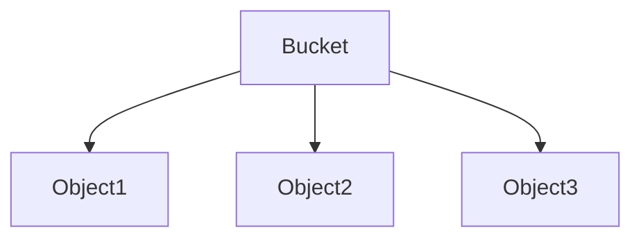
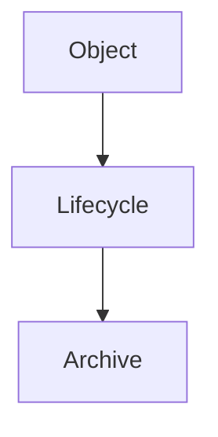
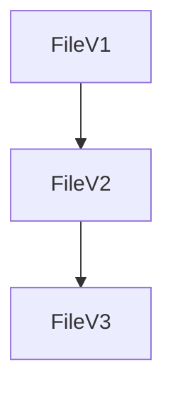
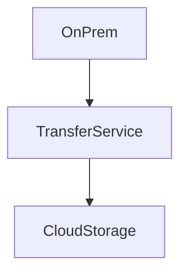
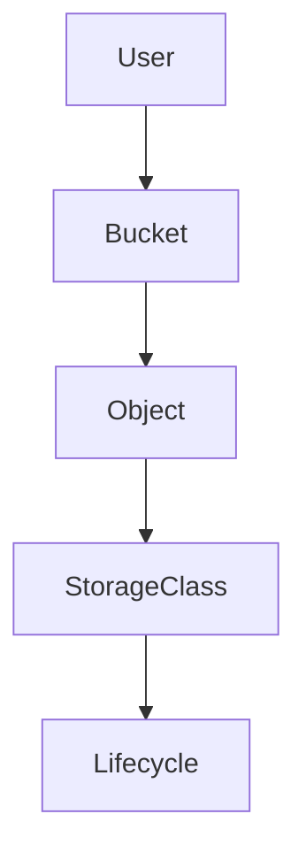
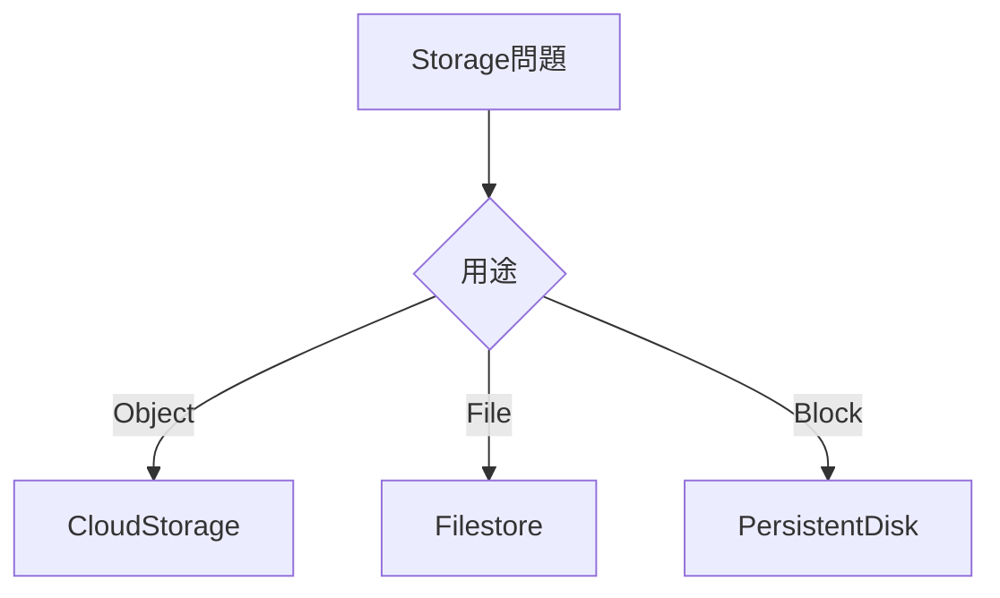

# 05_storage.md

````markdown
# GCP Storage（ACE）

ACE試験では **Cloud Storage が中心**。

覚えるポイント

- Storage Class
- Lifecycle
- Versioning
- Transfer

---

# Storage種類

```mermaid
graph TD
Storage --> Object
Storage --> File
Storage --> Block

Object --> CloudStorage
File --> Filestore
Block --> PersistentDisk
````

| 種類     | サービス            |
| ------ | --------------- |
| Object | Cloud Storage   |
| File   | Filestore       |
| Block  | Persistent Disk |

ACE頻出

```text
オブジェクト保存
→ Cloud Storage
```

---

# Cloud Storage

オブジェクトストレージ。



| 要素     | 説明   |
| ------ | ---- |
| Bucket | コンテナ |
| Object | ファイル |

---

# Storage Class

アクセス頻度で選ぶ。

| Class    | 用途     |
| -------- | ------ |
| Standard | 頻繁アクセス |
| Nearline | 月1回    |
| Coldline | 年1回    |
| Archive  | 長期保存   |

ACE判断

```text
頻繁アクセス → Standard
月1回 → Nearline
年1回 → Coldline
長期保存 → Archive
```

---

# Lifecycle

オブジェクト自動管理。



例

| 条件    | 動作       |
| ----- | -------- |
| 30日後  | Coldline |
| 365日後 | Archive  |

ACE問題

```text
30日後に安く
→ Lifecycle rule
```

---

# Object Versioning

履歴保持。



用途

| 用途    | 機能         |
| ----- | ---------- |
| 履歴保持  | Versioning |
| 誤削除防止 | Versioning |

ACE問題

```text
履歴保持
→ Object Versioning
```

---

# Storage Transfer Service

データ移行。



用途

| 用途     | サービス             |
| ------ | ---------------- |
| オンプレ移行 | Transfer Service |
| S3移行   | Transfer Service |

ACE問題

```text
オンプレ → GCS
→ Storage Transfer Service
```

---

# Signed URL

一時アクセス。

| 用途   | 説明         |
| ---- | ---------- |
| 一時DL | Signed URL |

ACE問題

```text
一時公開
→ Signed URL
```

---

# Storage構造



---

# Storage判断フロー



---

# ACE重要ポイント

```text
Object storage → Cloud Storage
頻繁アクセス → Standard
30日後安く → Lifecycle
履歴保持 → Versioning
オンプレ移行 → Transfer Service
一時公開 → Signed URL
```

```

---


---

# Notes

