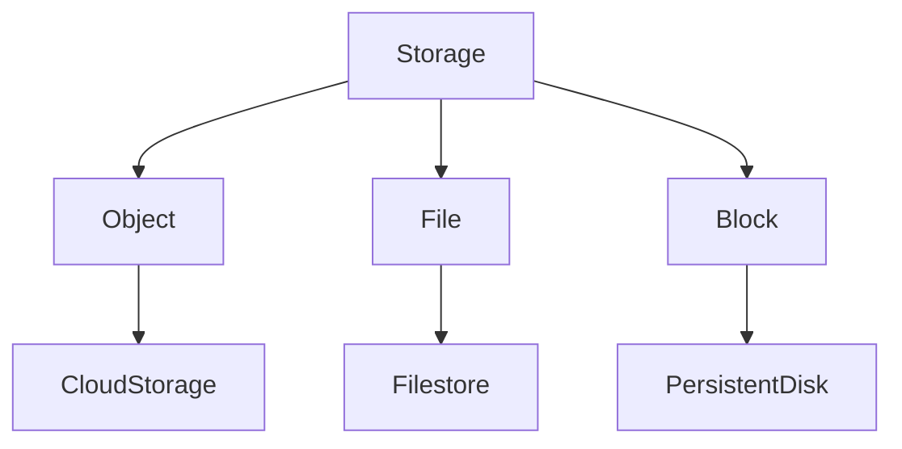
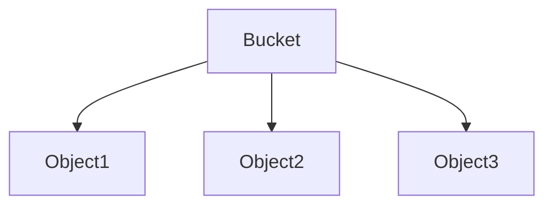
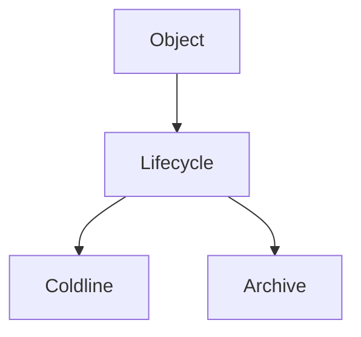
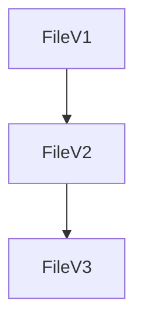
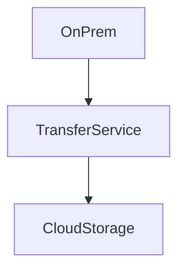
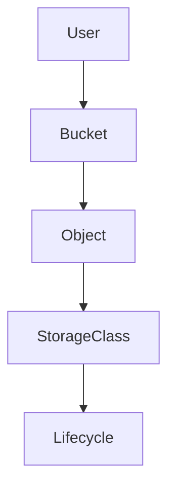
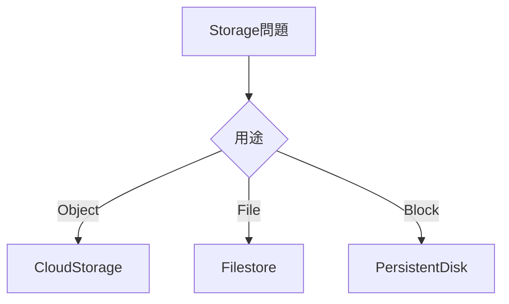
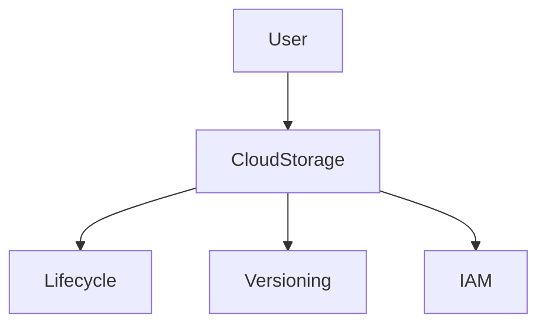
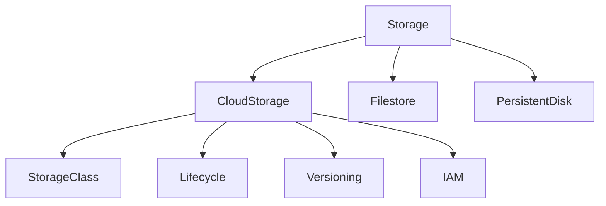

# GCP Storage（ACE / 2026）

ACEでは **Cloud Storage が中心**。
ただし GCPには **3種類のストレージモデル**が存在する。

```
Object
File
Block
```

これを最初に理解しておく。

---

# 1. GCP Storageの種類

## 1.1 ストレージ分類



| 種類     | サービス            | 用途     |
| ------ | --------------- | ------ |
| Object | Cloud Storage   | ファイル保存 |
| File   | Filestore       | NFS共有  |
| Block  | Persistent Disk | VMディスク |

---

## 1.2 ACE判断

```
オブジェクト保存
→ Cloud Storage
```

ACEでは **ほぼCloud Storageが答え**になる。

---

# 2. Cloud Storage基本構造

Cloud Storageは **Object Storage**。

---

## 2.1 構造



| 要素     | 説明   |
| ------ | ---- |
| Bucket | コンテナ |
| Object | ファイル |

---

## 2.2 特徴

| 特徴       | 内容       |
| -------- | -------- |
| HTTPアクセス | 可能       |
| 無制限スケール  | 可能       |
| 完全マネージド  | インフラ管理不要 |

---

# 3. Storage Class

Storage Classは **アクセス頻度で選択**する。

---

## 3.1 Storage Class一覧

| Class    | アクセス頻度 | 最低保持 |
| -------- | ------ | ---- |
| Standard | 頻繁     | なし   |
| Nearline | 月1回以下  | 30日  |
| Coldline | 年1回程度  | 90日  |
| Archive  | 長期保存   | 365日 |

---

## 3.2 ACE判断

```
頻繁アクセス → Standard
月1回 → Nearline
年1回 → Coldline
長期保存 → Archive
```

---

## 3.3 コスト特性

| Class    | 保存費用 | 取り出し費用 |
| -------- | ---- | ------ |
| Standard | 高    | 無料     |
| Nearline | 中    | 低      |
| Coldline | 低    | 高      |
| Archive  | 最低   | 非常に高   |

重要

```
頻繁アクセス → Standard
```

理由

```
取り出し料金が発生するため
```

---

# 4. Bucket Location

バケットは配置場所を指定する。

---

## 4.1 Location種類

| Location     | 用途      |
| ------------ | ------- |
| Regional     | 単一リージョン |
| Dual-region  | 2リージョン  |
| Multi-region | 複数リージョン |

---

## 4.2 ACE判断

```
コスト最小 → Regional
高可用 → Dual-region / Multi-region
```

---

# 5. Lifecycle Management

オブジェクトを **自動で管理する機能**。

---

## 5.1 構造



---

## 5.2 Lifecycle例

| 条件    | 動作       |
| ----- | -------- |
| 30日後  | Nearline |
| 90日後  | Coldline |
| 365日後 | Archive  |

---

## 5.3 ACE判断

```
古いデータを自動で安く
→ Lifecycle rule
```

---

# 6. Lifecycle Action

Lifecycleには2種類のアクションがある。

---

## 6.1 Action種類

| Action          | 内容    |
| --------------- | ----- |
| SetStorageClass | クラス変更 |
| Delete          | 削除    |

---

## 6.2 例

```
30日後 → Coldline
365日後 → Delete
```

---

# 7. Object Versioning

オブジェクト履歴を保持する機能。

---

## 7.1 構造



---

## 7.2 用途

| 用途    | 機能         |
| ----- | ---------- |
| 誤削除防止 | Versioning |
| 履歴管理  | Versioning |

---

## 7.3 ACE判断

```
履歴保持
→ Object Versioning
```

---

# 8. Retention Policy

削除禁止期間を設定する機能。

---

## 8.1 機能

| 機能         | 内容       |
| ---------- | -------- |
| 保持期間       | 指定期間削除不可 |
| Compliance | 法規制対応    |

---

## 8.2 ACE判断

```
法規制
→ Retention Policy
```

例

```
7年保存
```

---

# 9. Lifecycle vs Retention

ACEでよく混同される。

---

## 9.1 比較

| 機能        | 目的    |
| --------- | ----- |
| Lifecycle | コスト削減 |
| Retention | データ保護 |

---

## 9.2 ACE判断

```
コスト最適化 → Lifecycle
法規制 → Retention
```

---

# 10. Signed URL

一時的なアクセスを許可する。

---

## 10.1 用途

| 用途       | 方法         |
| -------- | ---------- |
| 一時ダウンロード | Signed URL |

---

## 10.2 例

```
10分アクセス
```

---

## 10.3 ACE判断

```
一時公開 → Signed URL
```

---

# 11. Storage Transfer Service

データ移行サービス。

---

## 11.1 構造



---

## 11.2 用途

| 移行            | サービス             |
| ------------- | ---------------- |
| On-prem → GCS | Storage Transfer |
| AWS S3 → GCS  | Storage Transfer |

---

## 11.3 ACE判断

```
オンプレ移行 → Storage Transfer Service
```

---

# 12. Transfer Appliance

物理デバイスを使用する移行方法。

---

## 12.1 用途

| 用途     | 内容      |
| ------ | ------- |
| PB級データ | オフライン移行 |

---

## 12.2 ACE判断

```
巨大データ → Transfer Appliance
```

---

# 13. Cloud Storage CLI

Cloud StorageはCLIで操作可能。

---

## 13.1 コマンド

| コマンド              | 用途   |
| ----------------- | ---- |
| gsutil cp         | コピー  |
| gsutil rsync      | 同期   |
| gcloud storage cp | 新CLI |

---

## 13.2 例

```
gsutil cp file gs://bucket
```

---

# 14. Cloud Storageセキュリティ

アクセス制御の方法。

---

## 14.1 セキュリティ機能

| 機能                          | 用途     |
| --------------------------- | ------ |
| IAM                         | バケット権限 |
| Signed URL                  | 一時公開   |
| Uniform bucket-level access | ACL無効  |

---

## 14.2 ACE判断

```
アクセス管理 → IAM
```

---

# 15. Public Access

バケット公開方法。

---

## 15.1 方法

| 方法            | 内容   |
| ------------- | ---- |
| Public bucket | 全公開  |
| Signed URL    | 一時公開 |

---

## 15.2 ACE判断

```
短時間公開 → Signed URL
```

---

# 16. Storage構造



---

# 17. Storage判断フロー



---

# 18. ACE重要パターン

```
Object storage → Cloud Storage
頻繁アクセス → Standard
古いデータ → Lifecycle
履歴保持 → Versioning
オンプレ移行 → Storage Transfer
大容量移行 → Transfer Appliance
一時公開 → Signed URL
```

---

# 19. Cloud Storage実務パターン

## 19.1 ログ保存

```
Standard
↓
Lifecycle
↓
Coldline
```

---

## 19.2 バックアップ

```
Nearline
```

---

## 19.3 長期保管

```
Archive
```

---

# 20. Storageアーキテクチャ



---

# 21. ACE頻出まとめ

```
Cloud Storage
Storage Class
Lifecycle
Versioning
Transfer Service
Signed URL
Retention Policy
```

---

# 22. 2026 Storageトレンド

| 技術                    | 状況       |
| --------------------- | -------- |
| Cloud Storage         | 中核       |
| Lifecycle             | コスト最適化   |
| Dual-region           | DR用途     |
| Archive               | コンプライアンス |
| Uniform bucket access | 標準       |

---

# 23. Storage最終構造



---