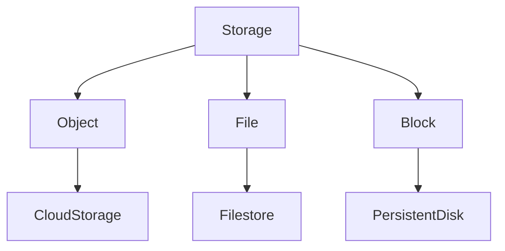
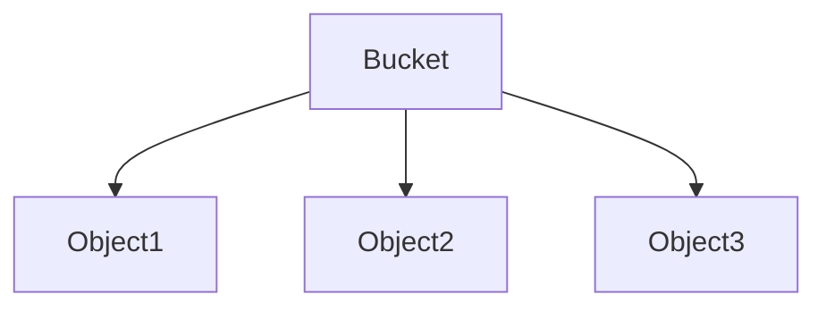
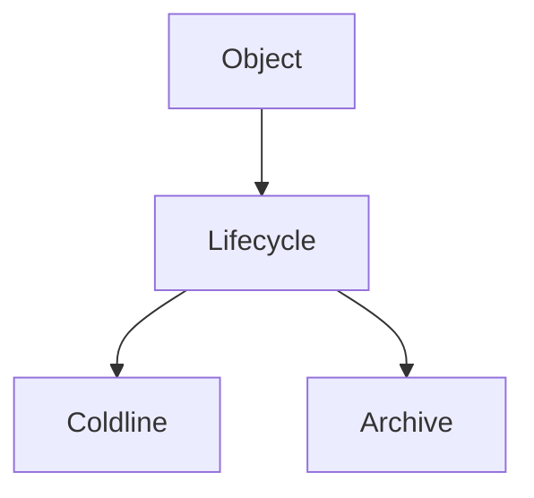
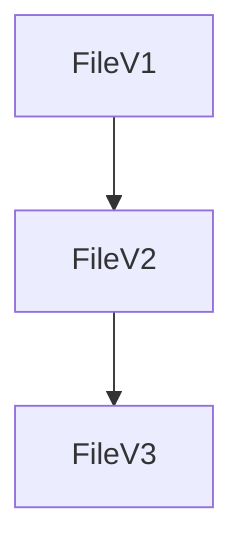
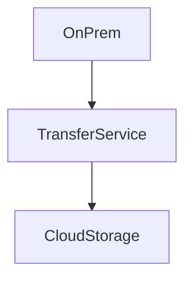
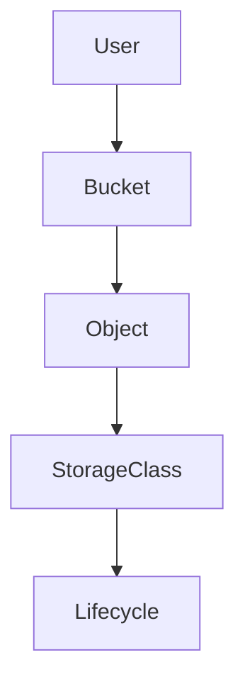
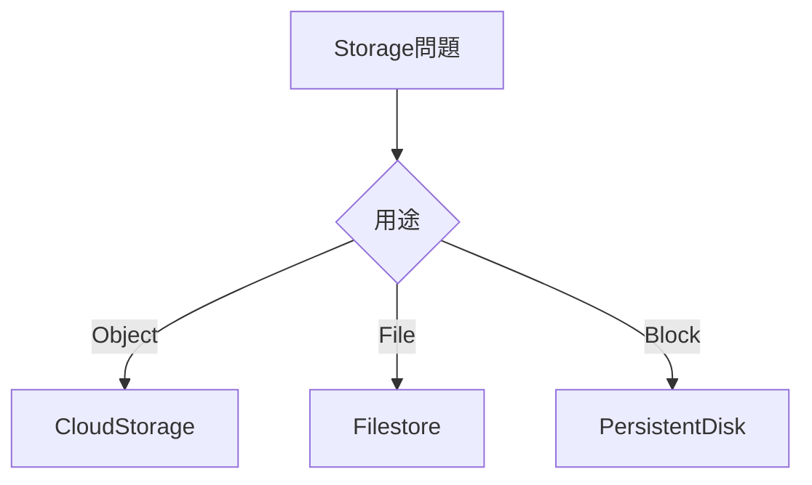
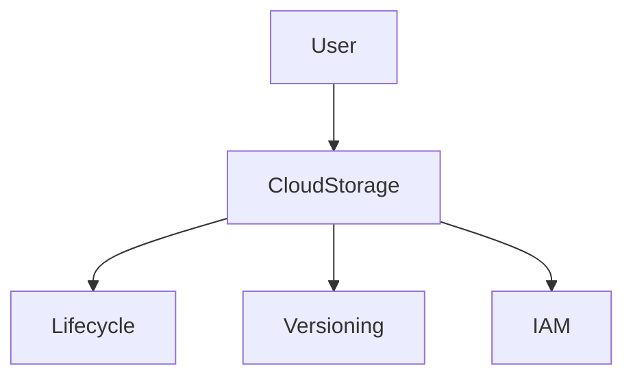
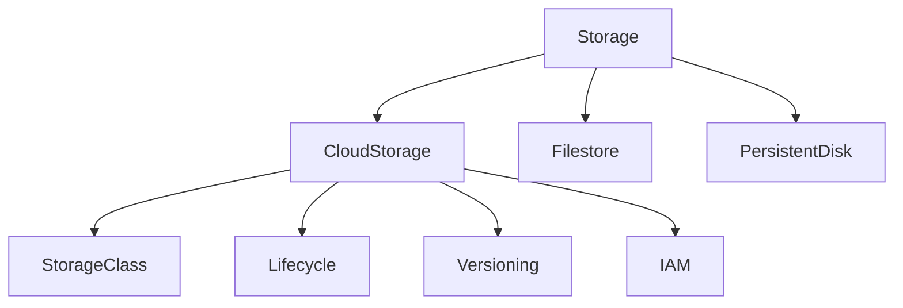

# GCP Storage（ACE / 2026）

ACEでは **Cloud Storage が中心**。
ただし **3種類のストレージ**を理解しておく必要があります。



| 種類     | サービス            | 用途     |
| ------ | --------------- | ------ |
| Object | Cloud Storage   | ファイル保存 |
| File   | Filestore       | NFS    |
| Block  | Persistent Disk | VMディスク |

ACE判断

```
オブジェクト保存
→ Cloud Storage
```

---

# Cloud Storage 基本構造

Cloud Storageは **Object Storage**。



| 要素     | 説明   |
| ------ | ---- |
| Bucket | コンテナ |
| Object | ファイル |

特徴

| 特徴       | 内容 |
| -------- | -- |
| HTTPアクセス | 可  |
| 無制限スケール  | 可  |
| マネージド    | 完全 |

---

# Storage Class

アクセス頻度で選択。

| Class    | アクセス頻度 | 最低保持 |
| -------- | ------ | ---- |
| Standard | 頻繁     | なし   |
| Nearline | 月1回以下  | 30日  |
| Coldline | 年1回    | 90日  |
| Archive  | 長期保存   | 365日 |

ACE判断

```
頻繁アクセス → Standard
月1回 → Nearline
年1回 → Coldline
長期保存 → Archive
```

---

# Storage Class 比較

| Class    | 保存費用 | 取り出し費用 |
| -------- | ---- | ------ |
| Standard | 高    | 無料     |
| Nearline | 中    | 低      |
| Coldline | 低    | 高      |
| Archive  | 最低   | 非常に高   |

重要

```
頻繁アクセス → Standard
```

理由
取り出しコストが高くなるため。

---

# Location

バケットの配置。

| Location     | 用途      |
| ------------ | ------- |
| Regional     | 単一リージョン |
| Dual-region  | 2リージョン  |
| Multi-region | グローバル   |

ACE判断

```
コスト最小
→ Regional
```

```
高可用
→ Dual / Multi
```

---

# Lifecycle Management

オブジェクト自動管理。



例

| 条件    | 動作       |
| ----- | -------- |
| 30日後  | Nearline |
| 90日後  | Coldline |
| 365日後 | Archive  |

ACE問題

```
古いデータを自動で安く
→ Lifecycle rule
```

---

# Lifecycle Action

| Action          | 内容    |
| --------------- | ----- |
| SetStorageClass | クラス変更 |
| Delete          | 削除    |

例

```
30日後 → Coldline
365日後 → Delete
```

---

# Object Versioning

オブジェクト履歴保持。



用途

| 用途    | 機能         |
| ----- | ---------- |
| 誤削除防止 | Versioning |
| 履歴管理  | Versioning |

ACE問題

```
履歴保持
→ Object Versioning
```

---

# Retention Policy

削除禁止期間。

| 機能         | 内容       |
| ---------- | -------- |
| 保持期間       | 指定期間削除不可 |
| Compliance | 法規対応     |

ACE判断

```
法規制
→ Retention Policy
```

例

```
7年保存
```

---

# Lifecycle vs Retention

| 機能        | 目的    |
| --------- | ----- |
| Lifecycle | コスト削減 |
| Retention | データ保護 |

ACE判断

```
コスト最適化
→ Lifecycle
```

```
法規制
→ Retention
```

---

# Signed URL

一時アクセス。

| 用途       | 方法         |
| -------- | ---------- |
| 一時ダウンロード | Signed URL |

例

```
10分アクセス
```

ACE問題

```
一時公開
→ Signed URL
```

---

# Storage Transfer Service

データ移行。



用途

| 移行            | サービス             |
| ------------- | ---------------- |
| On-prem → GCS | Storage Transfer |
| AWS S3 → GCS  | Storage Transfer |

ACE問題

```
オンプレ移行
→ Storage Transfer Service
```

---

# Transfer Appliance

大容量移行。

| 用途     | 内容      |
| ------ | ------- |
| PB級データ | オフライン移行 |

ACE判断

```
巨大データ
→ Transfer Appliance
```

---

# gsutil / gcloud storage

CLI操作。

| コマンド              | 用途   |
| ----------------- | ---- |
| gsutil cp         | コピー  |
| gsutil rsync      | 同期   |
| gcloud storage cp | 新CLI |

例

```
gsutil cp file gs://bucket
```

---

# Cloud Storage セキュリティ

| 機能                          | 用途     |
| --------------------------- | ------ |
| IAM                         | バケット権限 |
| Signed URL                  | 一時公開   |
| Uniform bucket-level access | ACL無効  |

ACE判断

```
アクセス管理
→ IAM
```

---

# Public Access

公開方法。

| 方法            | 内容   |
| ------------- | ---- |
| Public bucket | 全公開  |
| Signed URL    | 一時公開 |

ACE判断

```
短時間公開
→ Signed URL
```

---

# Storage 構造



---

# Storage 判断フロー



---

# ACE重要パターン

```
Object storage → Cloud Storage
頻繁アクセス → Standard
古いデータ → Lifecycle
履歴保持 → Versioning
オンプレ移行 → Storage Transfer
大容量移行 → Transfer Appliance
一時公開 → Signed URL
```

---

# Cloud Storage 実務パターン

よくある設計

### ログ保存

```
Standard
↓
Lifecycle
↓
Coldline
```

---

### バックアップ

```
Nearline
```

---

### 長期保管

```
Archive
```

---

# Storage アーキテクチャ



---

# ACE頻出まとめ

```
Cloud Storage
Storage Class
Lifecycle
Versioning
Transfer Service
Signed URL
Retention Policy
```

---

# 2026 Storageトレンド

重要

| 技術                    | 状況       |
| --------------------- | -------- |
| Cloud Storage         | 中核       |
| Lifecycle             | コスト最適化   |
| Dual-region           | DR       |
| Archive               | コンプライアンス |
| Uniform bucket access | 標準       |

---

# Storage 最終構造



---

