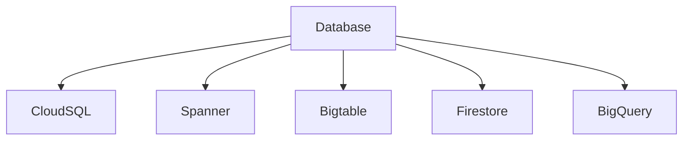
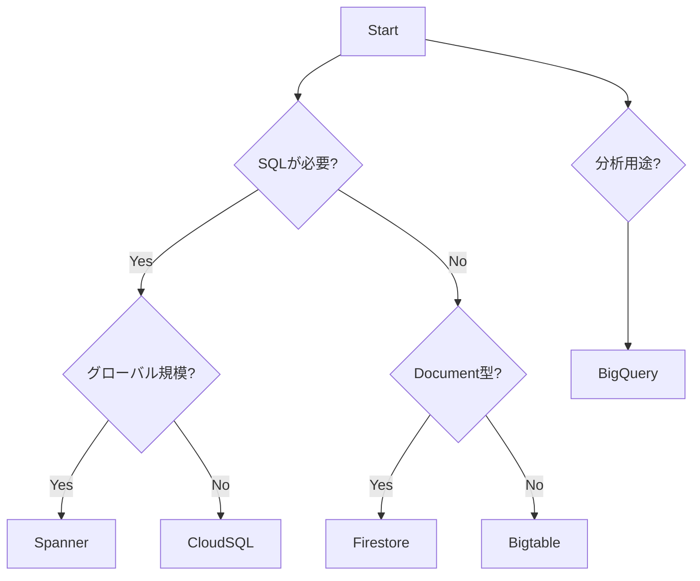
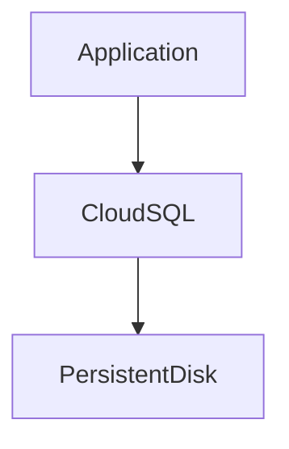
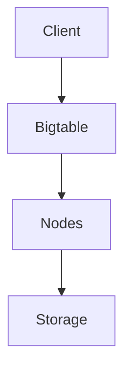
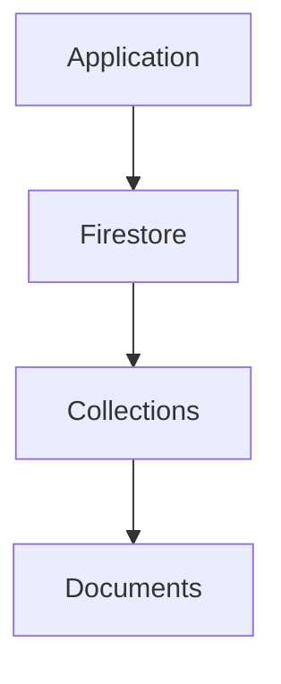
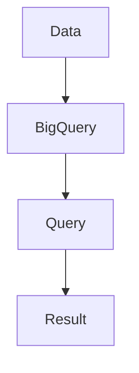
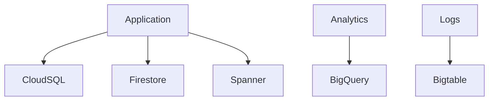

# GCP Databases（ACE / 2026）

---

# 1. GCP Database Overview

## 1.1 GCP Database全体像

GCPの主要データベースは **5系統**に分類される。



---

## 1.2 Database分類

| Database      | タイプ                | 主用途       |
| ------------- | ------------------ | --------- |
| Cloud SQL     | リレーショナルDB          | 既存DB移行    |
| Cloud Spanner | 分散リレーショナルDB        | グローバルシステム |
| Bigtable      | NoSQL（Wide Column） | 時系列・IoT   |
| Firestore     | Document DB        | アプリ       |
| BigQuery      | Data Warehouse     | 分析        |

---

# 2. Database選択フロー

## 2.1 DB選択判断



---

# 3. Cloud SQL

## 3.1 Cloud SQL概要

Cloud SQLは **GCPのマネージドRDBサービス**。

対応エンジン

| Engine     |
| ---------- |
| MySQL      |
| PostgreSQL |
| SQL Server |

---

## 3.2 Cloud SQL特徴

| 特徴   | 内容         |
| ---- | ---------- |
| ACID | トランザクション保証 |
| 互換性  | 既存RDBと高互換  |
| スケール | 垂直スケール     |
| 運用   | フルマネージド    |

---

## 3.3 Cloud SQL用途

| 用途     |
| ------ |
| 既存DB移行 |
| Webアプリ |
| SaaS   |

---

## 3.4 ACE試験ポイント

```
PostgreSQL移行
MySQL移行
→ Cloud SQL
```

---

## 3.5 Cloud SQLアーキテクチャ



---

# 4. Cloud Spanner

## 4.1 Spanner概要

Spannerは **グローバル分散型RDB**。

---

## 4.2 Spanner特徴

| 特徴   | 内容           |
| ---- | ------------ |
| SQL  | 対応           |
| スケール | 水平スケール       |
| 整合性  | TrueTime     |
| 配置   | Multi-region |

---

## 4.3 Spanner用途

| 用途      |
| ------- |
| 金融システム  |
| グローバルEC |
| SaaS    |

---

## 4.4 ACE試験ポイント

```
巨大RDB
高トランザクション
グローバル
→ Spanner
```

---

## 4.5 Spannerスケーリング

```
CPU 65% → ノード追加
```

理由

| 理由         |
| ---------- |
| 高可用性       |
| バックグラウンド処理 |
| レプリケーション   |

---

# 5. Cloud Bigtable

## 5.1 Bigtable概要

Bigtableは **Wide Column型NoSQL DB**。

---

## 5.2 Bigtable特徴

| 特徴    | 内容        |
| ----- | --------- |
| モデル   | Key-Value |
| レイテンシ | ms        |
| スケール  | PB        |

---

## 5.3 Bigtable用途

| 用途      |
| ------- |
| IoT     |
| ログ      |
| 広告      |
| センサーデータ |

---

## 5.4 ACE試験ポイント

```
時系列
IoT
大量ログ
→ Bigtable
```

---

## 5.5 Bigtable構造



---

# 6. Firestore

## 6.1 Firestore概要

Firestoreは **Document型NoSQL DB**。

---

## 6.2 Firestore特徴

| 特徴     | 内容         |
| ------ | ---------- |
| データ形式  | JSON       |
| リアルタイム | 対応         |
| スケール   | 自動         |
| モード    | Serverless |

---

## 6.3 Firestore用途

| 用途       |
| -------- |
| モバイル     |
| Webアプリ   |
| Firebase |

---

## 6.4 ACE試験ポイント

```
モバイルアプリ
リアルタイムDB
→ Firestore
```

---

## 6.5 Firestore構造



---

# 7. BigQuery

## 7.1 BigQuery概要

BigQueryは **Serverless Data Warehouse**。

---

## 7.2 BigQuery特徴

| 特徴   | 内容         |
| ---- | ---------- |
| SQL  | 分析         |
| スケール | PB         |
| 管理   | Serverless |

---

## 7.3 BigQuery用途

| 用途    |
| ----- |
| BI    |
| データ分析 |
| ETL   |
| ログ分析  |

---

## 7.4 ACE試験ポイント

```
分析
BI
ログ分析
→ BigQuery
```

---

## 7.5 BigQuery構造



---

# 8. Database選択まとめ

| 要件                 | DB        |
| ------------------ | --------- |
| MySQL / PostgreSQL | Cloud SQL |
| グローバルRDB           | Spanner   |
| 時系列                | Bigtable  |
| モバイル               | Firestore |
| 分析                 | BigQuery  |

---

# 9. Databaseアーキテクチャ



---

# 10. 2026 Databaseトレンド

| 技術        | 状況           |
| --------- | ------------ |
| Spanner   | 金融           |
| Firestore | モバイル         |
| BigQuery  | 分析           |
| AlloyDB   | PostgreSQL高速 |

※ AlloyDBは **ACEでは補助知識レベル**

---

# 11. GCP ACE 用語集（Database / 2026）

| 用語                             | フルスペル                                         | 定義                        | 説明                                      |
| ------------------------------ | --------------------------------------------- | ------------------------- | --------------------------------------- |
| **Cloud SQL**                  | Cloud SQL for MySQL / PostgreSQL / SQL Server | フルマネージドRDB                | MySQL / PostgreSQL / SQL Serverのマネージド運用 |
| **Cloud Spanner**              | Google Cloud Spanner                          | グローバル分散リレーショナルDB          | 強整合性を持つ水平スケールRDB                        |
| **Cloud Bigtable**             | Google Cloud Bigtable                         | Wide Column型NoSQLDB       | 大規模時系列データ / IoT / ログ                    |
| **Firestore**                  | Cloud Firestore                               | Document型NoSQLDB          | モバイル / Webアプリ向け                         |
| **Firestore Native Mode**      | Firestore Native                              | Firestore標準モード            | 高スケーラブルNoSQL                            |
| **Firestore Datastore Mode**   | Firestore Datastore Mode                      | Datastore互換モード            | 旧Datastore互換                            |
| **BigQuery**                   | Google BigQuery                               | Serverless Data Warehouse | SQL分析 / BI / データ分析                      |
| **AlloyDB**                    | AlloyDB for PostgreSQL                        | PostgreSQL互換DB            | 高性能PostgreSQL                           |
| **Memorystore**                | Cloud Memorystore                             | インメモリDB                   | Redis / Memcached                       |
| **Redis**                      | Remote Dictionary Server                      | Key-ValueインメモリDB          | キャッシュ / セッション                           |
| **Memcached**                  | Memory Cache Daemon                           | 分散キャッシュ                   | アプリ高速化                                  |
| **Primary Instance**           | Primary Database Instance                     | 書き込み可能DB                  | Cloud SQLのメインDB                         |
| **Read Replica**               | Read Replica Instance                         | 読み取り専用DB                  | 読み取りスケール                                |
| **Failover Replica**           | Failover Instance                             | 自動フェイルオーバー                | 高可用性構成                                  |
| **High Availability (HA)**     | High Availability                             | 高可用性構成                    | マルチゾーンDB                                |
| **Automatic Backup**           | Automated Backup                              | 自動バックアップ                  | DBバックアップ                                |
| **Point-in-Time Recovery**     | PITR (Point-in-Time Recovery)                 | 時点復旧                      | 指定時間に復元                                 |
| **Dataflow**                   | Cloud Dataflow                                | ETLデータ処理                  | DB→BigQuery等                            |
| **Database Migration Service** | DMS (Database Migration Service)              | DB移行サービス                  | オンプレ→Cloud SQL                          |
| **BigQuery ML**                | BigQuery Machine Learning                     | SQLベースML                  | データ分析 + ML                              |
| **Partitioned Table**          | Table Partitioning                            | テーブル分割                    | 時系列データ管理                                |
| **Clustered Table**            | Table Clustering                              | テーブル最適化                   | クエリ高速化                                  |
| **Streaming Insert**           | Streaming Data Insert                         | リアルタイムデータ投入               | BigQueryストリーム                           |
| **Query Slot**                 | BigQuery Slot                                 | クエリ処理リソース                 | BigQuery処理単位                            |
| **Materialized View**          | Materialized View                             | キャッシュビュー                  | クエリ高速化                                  |
| **Data Catalog**               | Cloud Data Catalog                            | メタデータ管理                   | データ検索                                   |
| **Dataform**                   | Dataform                                      | SQLデータパイプライン              | BigQuery ETL                            |

---


