# GCP Databases（ACE / 2026）

GCPの主要DBは **5系統**で整理する。

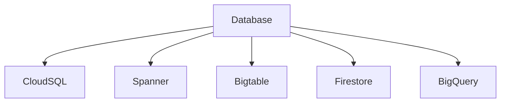

---

# Database分類

| DB            | タイプ            | 用途    |
| ------------- | -------------- | ----- |
| Cloud SQL     | RDB            | 既存DB  |
| Cloud Spanner | 分散RDB          | グローバル |
| Bigtable      | NoSQL          | 時系列   |
| Firestore     | Document       | アプリ   |
| BigQuery      | Data Warehouse | 分析    |

---

# Database判断フロー

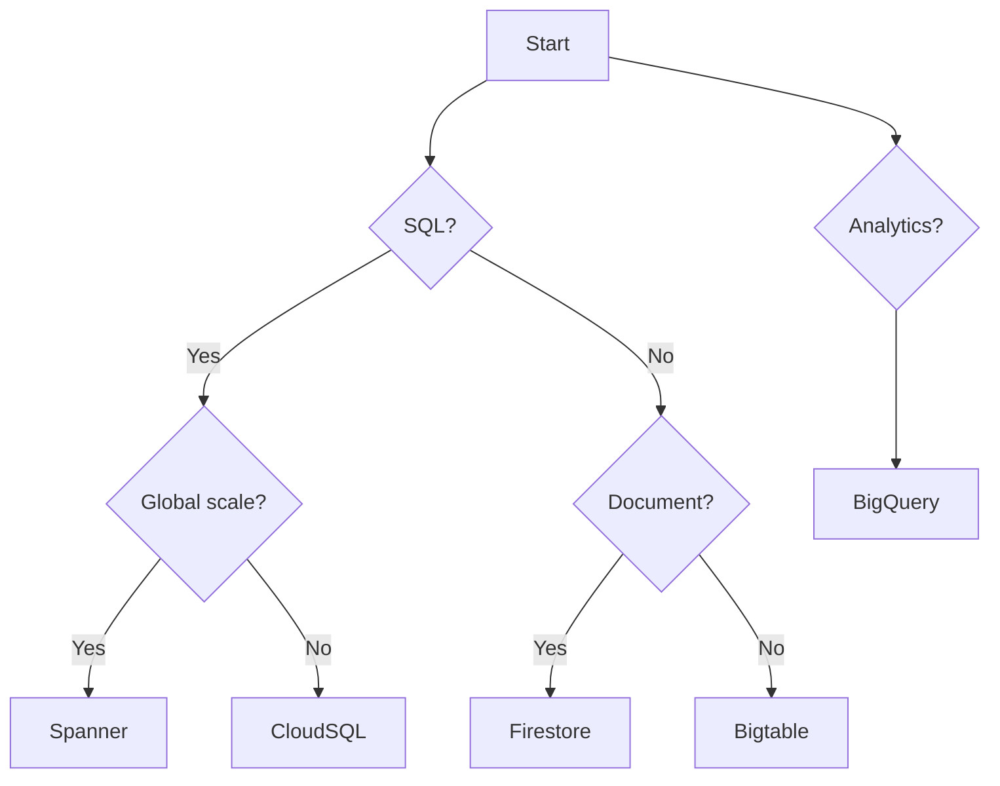

---

# 1 Cloud SQL

マネージドRDB。

| Engine     |
| ---------- |
| MySQL      |
| PostgreSQL |
| SQL Server |

特徴

| 特徴   | 内容 |
| ---- | -- |
| ACID | 対応 |
| 互換性  | 高  |
| スケール | 垂直 |

ACE

```
PostgreSQL移行
→ Cloud SQL
```

実務用途

| 用途     |
| ------ |
| 既存DB   |
| Webアプリ |
| SaaS   |

---

# Cloud SQL構造

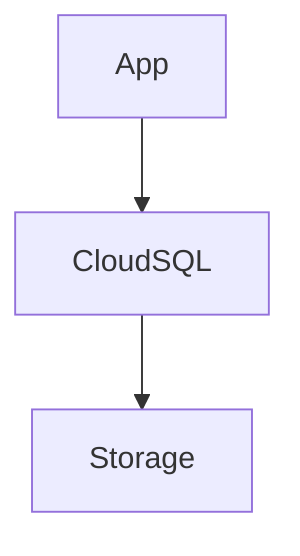

---

# 2 Cloud Spanner

分散RDB。

特徴

| 特徴     | 内容           |
| ------ | ------------ |
| 水平スケール | 可能           |
| 強整合    | TrueTime     |
| グローバル  | Multi-region |

ACE

```
巨大RDB
→ Spanner
```

用途

| 用途         |
| ---------- |
| 金融         |
| グローバルアプリ   |
| 巨大トランザクション |

---

# Spannerスケーリング

```
CPU 65% → ノード追加
```

理由

| 理由         |
| ---------- |
| 高可用        |
| バックグラウンド処理 |

---

# 3 Cloud Bigtable

ワイドカラムDB。

特徴

| 特徴     | 内容        |
| ------ | --------- |
| NoSQL  | key-value |
| 低レイテンシ | ms        |
| スケール   | PB        |

ACE

```
大量データ
→ Bigtable
```

用途

| 用途  |
| --- |
| IoT |
| ログ  |
| 広告  |

---

# Bigtable構造

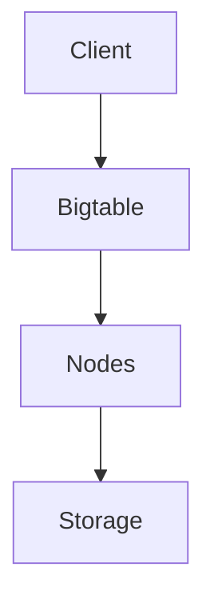

---

# 4 Firestore

Document DB。

特徴

| 特徴         | 内容       |
| ---------- | -------- |
| JSON       | document |
| realtime   | 対応       |
| serverless | Yes      |

ACE

```
モバイルアプリ
→ Firestore
```

用途

| 用途       |
| -------- |
| モバイル     |
| Webアプリ   |
| Firebase |

---

# Firestore構造

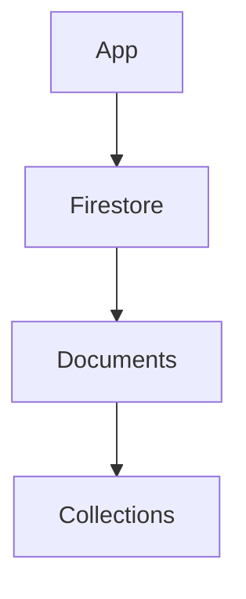

---

# 5 BigQuery

データウェアハウス。

特徴

| 特徴         | 内容  |
| ---------- | --- |
| SQL        | 分析  |
| serverless | Yes |
| スケール       | PB  |

ACE

```
分析
→ BigQuery
```

用途

| 用途   |
| ---- |
| BI   |
| ログ分析 |
| ETL  |

---

# BigQuery構造

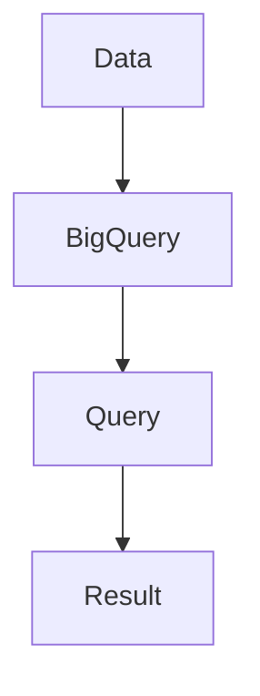

---

# DB選択まとめ

| 要件                 | DB        |
| ------------------ | --------- |
| MySQL / PostgreSQL | Cloud SQL |
| グローバルRDB           | Spanner   |
| 時系列                | Bigtable  |
| モバイル               | Firestore |
| 分析                 | BigQuery  |

---

# Databaseアーキテクチャ

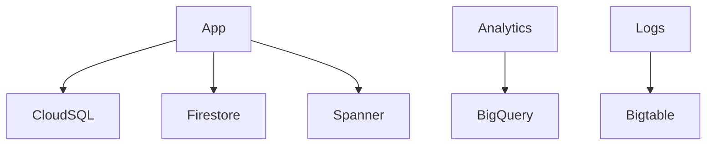

---

# ACE頻出DB

```
PostgreSQL → Cloud SQL
巨大RDB → Spanner
IoT / 時系列 → Bigtable
アプリ → Firestore
分析 → BigQuery
```

---

# 2026 Databaseトレンド

| 技術        | 状況           |
| --------- | ------------ |
| Spanner   | 金融           |
| Firestore | モバイル         |
| BigQuery  | 分析           |
| AlloyDB   | PostgreSQL高速 |

※補足
**AlloyDBはProfessional / Architect向け。**

---

# GCP Observability（ACE / 2026）

旧名称
Stackdriver

現在

```
Google Cloud Operations Suite
```

---

# Observability構成

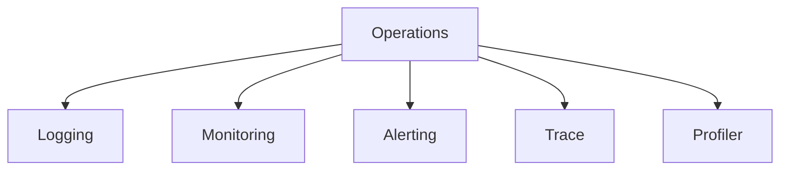

---

# 1 Cloud Logging

ログ収集。

| 用途    | 内容 |
| ----- | -- |
| VMログ  | 収集 |
| GKEログ | 収集 |
| アプリログ | 収集 |

ACE

```
ログ確認
→ Cloud Logging
```

---

# Log Sink

ログ転送。

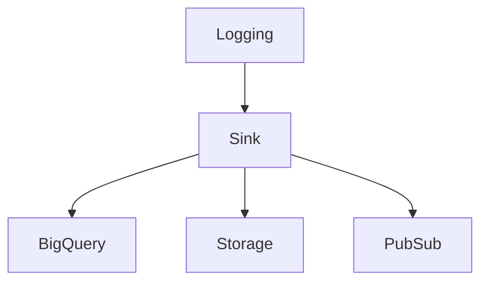

用途

| 転送先      | 用途   |
| -------- | ---- |
| BigQuery | 分析   |
| Storage  | 保存   |
| Pub/Sub  | SIEM |

ACE

```
ログ分析
→ BigQuery sink
```

---

# 2 Cloud Monitoring

メトリクス監視。

| 対象        |
| --------- |
| VM        |
| GKE       |
| Cloud Run |

ACE

```
CPU監視
→ Monitoring
```

---

# Dashboard

可視化。

| 内容      |
| ------- |
| CPU     |
| Memory  |
| Network |

---

# 3 Alert Policy

アラート。

| 条件         | 例 |
| ---------- | - |
| CPU > 90%  |   |
| Error rate |   |

通知

| 方法        |
| --------- |
| Email     |
| Slack     |
| PagerDuty |

ACE

```
CPU > 90%
→ Alert policy
```

---

# Uptime Check

外形監視。

```
HTTP endpoint
```

用途

| 用途  |
| --- |
| API |
| Web |

---

# Logging / Monitoring構造

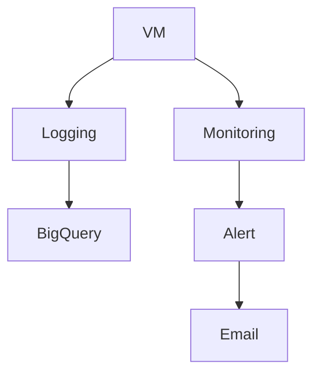

---

# Observability判断

| 要件    | サービス          |
| ----- | ------------- |
| ログ確認  | Logging       |
| ログ分析  | BigQuery sink |
| メトリクス | Monitoring    |
| 通知    | Alert policy  |
| 外形監視  | Uptime check  |

---

# Observabilityアーキテクチャ


---

# ACE重要まとめ

```
ログ → Cloud Logging
ログ分析 → BigQuery Sink
メトリクス → Monitoring
通知 → Alert Policy
外形監視 → Uptime Check
```

---

# 2026 Observabilityトレンド

| 技術               | 状況  |
| ---------------- | --- |
| Cloud Logging    | 標準  |
| Cloud Monitoring | SRE |
| OpenTelemetry    | 推奨  |
| BigQueryログ分析     | 普及  |

---

# GCP Observability最終構造

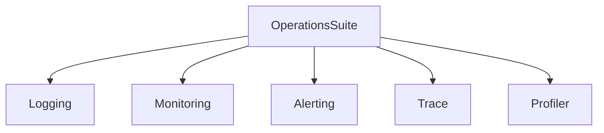

---

