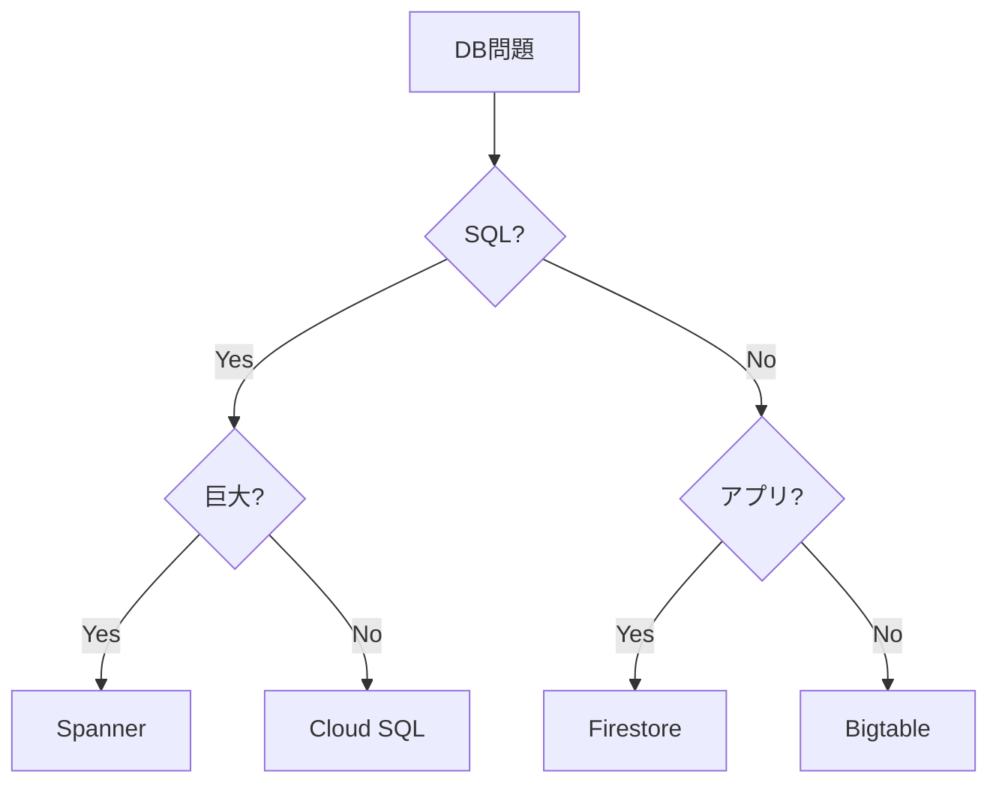
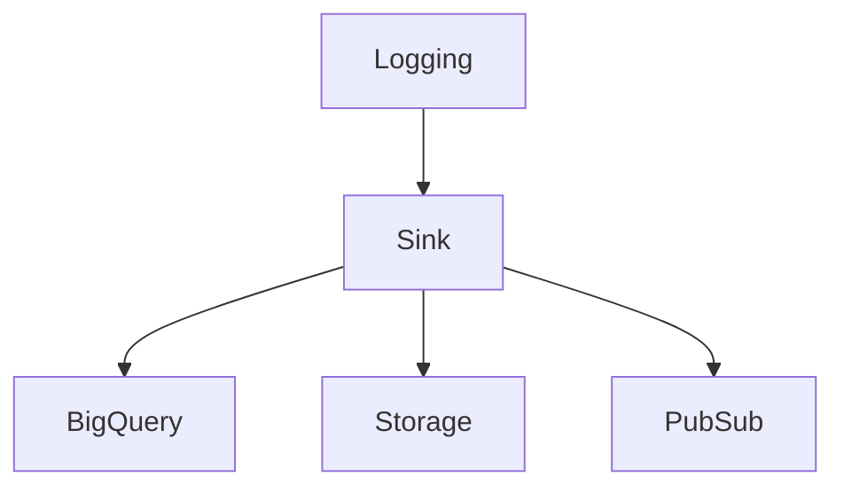
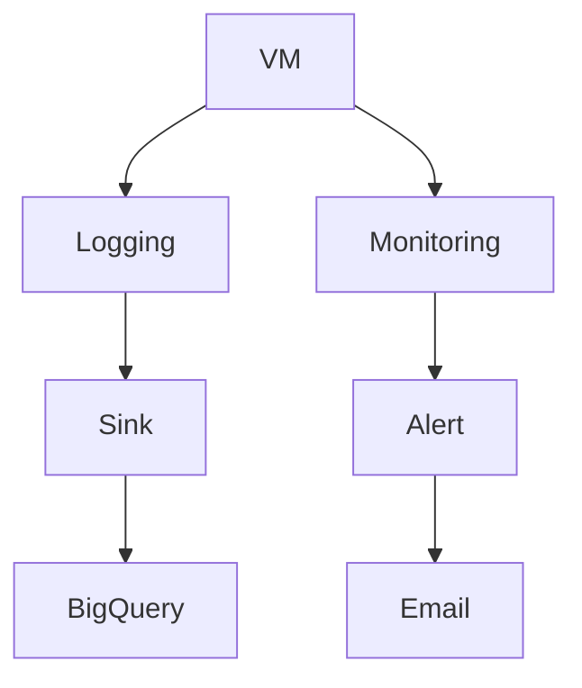

# 06_database.md

````markdown
# GCP Database（ACE）

ACE試験では **4つのDBサービス**だけ覚えれば十分。

---

## Database一覧

|DB|タイプ|用途|
|---|---|---|
Cloud SQL|RDB|MySQL / PostgreSQL|
Spanner|分散RDB|超大規模|
Bigtable|NoSQL|分析|
Firestore|Document|アプリ|

---

## 全体構造

```mermaid
graph TD
Database --> CloudSQL
Database --> Spanner
Database --> Bigtable
Database --> Firestore
````

---

# Cloud SQL

RDBマネージドサービス。

| 特徴     | 内容                              |
| ------ | ------------------------------- |
| Engine | MySQL / PostgreSQL / SQL Server |
| 管理     | Google管理                        |
| 用途     | 既存RDB移行                         |

ACE問題

```
PostgreSQL移行
→ Cloud SQL
```

---

# Spanner

分散RDB。

| 特徴   | 内容   |
| ---- | ---- |
| スケール | 水平   |
| 整合性  | 強整合  |
| 用途   | 巨大DB |

ACE問題

```
巨大RDB
→ Spanner
```

---

# Bigtable

NoSQLワイドカラムDB。

| 特徴     | 内容    |
| ------ | ----- |
| 用途     | 分析    |
| 規模     | ペタバイト |
| 低レイテンシ | 高     |

ACE問題

```
大量データ分析
→ Bigtable
```

---

# Firestore

ドキュメントDB。

| 特徴 | 内容         |
| -- | ---------- |
| 用途 | モバイル / Web |
| 形式 | JSON       |

ACE問題

```
アプリDB
→ Firestore
```

---

# Database判断フロー



---

# ACE最重要

```
PostgreSQL → Cloud SQL
巨大RDB → Spanner
分析 → Bigtable
アプリ → Firestore
```

````

---

# 07_logging-monitoring.md

```markdown
# Logging / Monitoring（ACE）

GCPの運用は **3サービス**。

---

## Operations Suite

```mermaid
graph TD
OperationsSuite --> Logging
OperationsSuite --> Monitoring
OperationsSuite --> Alerting
````

---

# Cloud Logging

ログ収集。

| 用途   | 内容       |
| ---- | -------- |
| ログ収集 | VM / GKE |
| 分析   | ログ検索     |

ACE問題

```
ログ確認
→ Cloud Logging
```

---

# Log Sink

ログ転送。



| 用途   | 例             |
| ---- | ------------- |
| 分析   | BigQuery      |
| 保存   | Cloud Storage |
| SIEM | Pub/Sub       |

ACE問題

```
ログ分析
→ BigQuery Sink
```

---

# Cloud Monitoring

メトリクス監視。

| 用途    | 内容  |
| ----- | --- |
| CPU監視 | VM  |
| GKE監視 | Pod |

ACE問題

```
CPU監視
→ Monitoring
```

---

# Alert Policy

アラート。

| 用途 | 内容    |
| -- | ----- |
| 通知 | Email |
| 通知 | Slack |

ACE問題

```
CPU > 90%
→ Alert policy
```

---

# Logging / Monitoring構造



---

# ACE最重要

```
ログ確認 → Cloud Logging
ログ分析 → BigQuery Sink
CPU監視 → Cloud Monitoring
アラート → Alert Policy
```

```

---


---

# Notes

