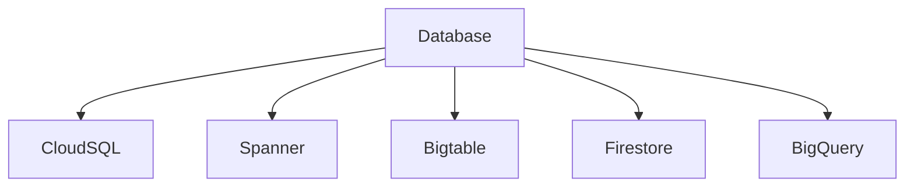
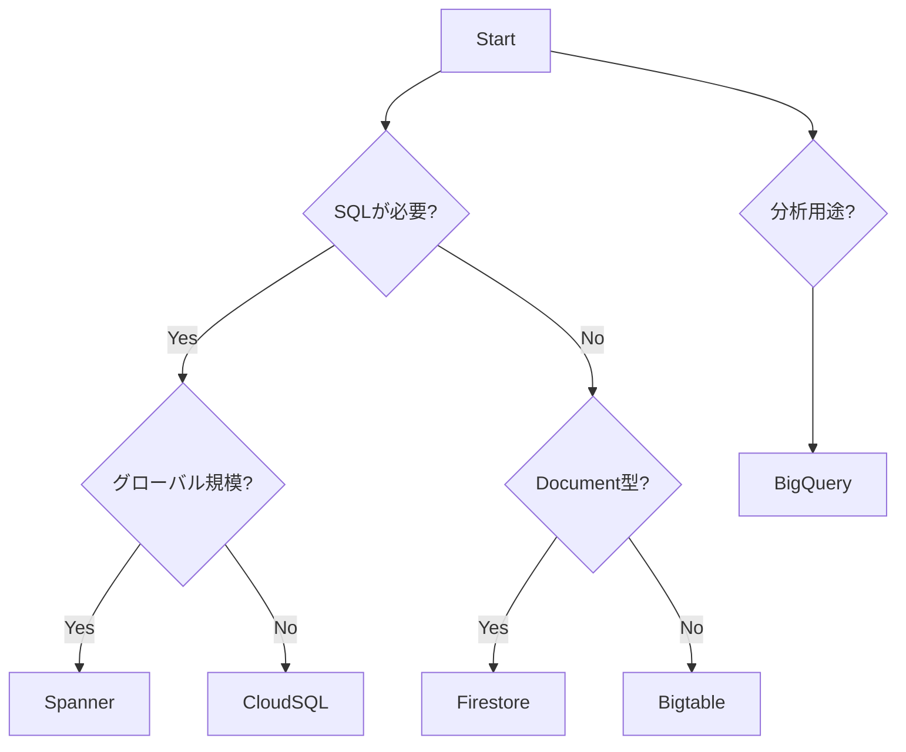
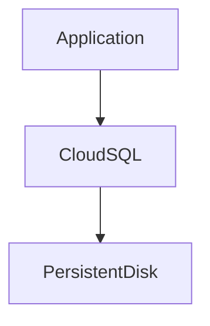
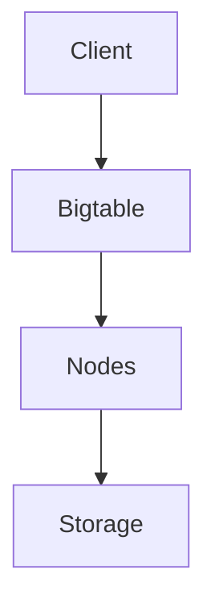
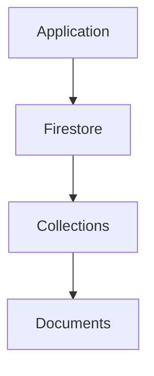
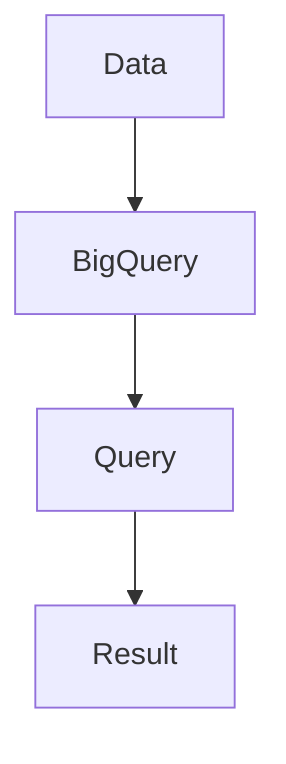
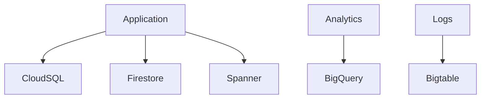
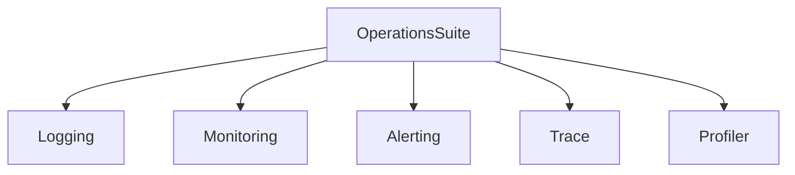
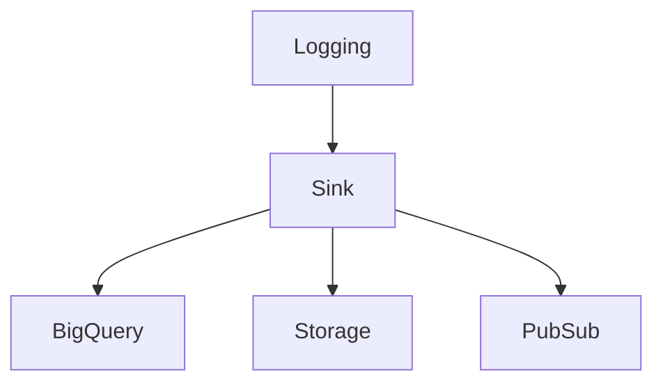
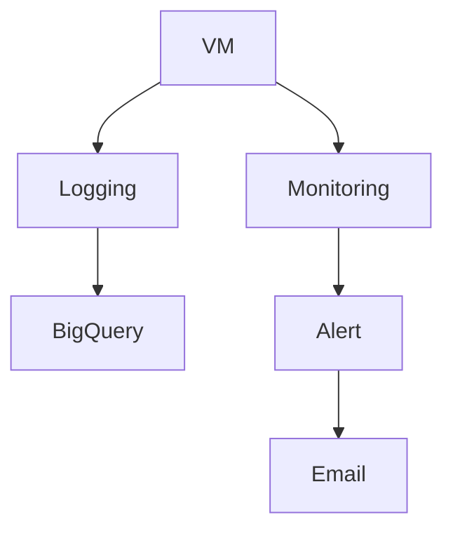

# GCP Databases（ACE / 2026）

---

# 1. GCP Database Overview

## 1.1 GCP Database全体像

GCPの主要データベースは **5系統**に分類される。



---

## 1.2 Database分類

| Database      | タイプ                | 主用途       |
| ------------- | ------------------ | --------- |
| Cloud SQL     | リレーショナルDB          | 既存DB移行    |
| Cloud Spanner | 分散リレーショナルDB        | グローバルシステム |
| Bigtable      | NoSQL（Wide Column） | 時系列・IoT   |
| Firestore     | Document DB        | アプリ       |
| BigQuery      | Data Warehouse     | 分析        |

---

# 2. Database選択フロー

## 2.1 DB選択判断



---

# 3. Cloud SQL

## 3.1 Cloud SQL概要

Cloud SQLは **GCPのマネージドRDBサービス**。

対応エンジン

| Engine     |
| ---------- |
| MySQL      |
| PostgreSQL |
| SQL Server |

---

## 3.2 Cloud SQL特徴

| 特徴   | 内容         |
| ---- | ---------- |
| ACID | トランザクション保証 |
| 互換性  | 既存RDBと高互換  |
| スケール | 垂直スケール     |
| 運用   | フルマネージド    |

---

## 3.3 Cloud SQL用途

| 用途     |
| ------ |
| 既存DB移行 |
| Webアプリ |
| SaaS   |

---

## 3.4 ACE試験ポイント

```
PostgreSQL移行
MySQL移行
→ Cloud SQL
```

---

## 3.5 Cloud SQLアーキテクチャ



---

# 4. Cloud Spanner

## 4.1 Spanner概要

Spannerは **グローバル分散型RDB**。

---

## 4.2 Spanner特徴

| 特徴   | 内容           |
| ---- | ------------ |
| SQL  | 対応           |
| スケール | 水平スケール       |
| 整合性  | TrueTime     |
| 配置   | Multi-region |

---

## 4.3 Spanner用途

| 用途      |
| ------- |
| 金融システム  |
| グローバルEC |
| SaaS    |

---

## 4.4 ACE試験ポイント

```
巨大RDB
高トランザクション
グローバル
→ Spanner
```

---

## 4.5 Spannerスケーリング

```
CPU 65% → ノード追加
```

理由

| 理由         |
| ---------- |
| 高可用性       |
| バックグラウンド処理 |
| レプリケーション   |

---

# 5. Cloud Bigtable

## 5.1 Bigtable概要

Bigtableは **Wide Column型NoSQL DB**。

---

## 5.2 Bigtable特徴

| 特徴    | 内容        |
| ----- | --------- |
| モデル   | Key-Value |
| レイテンシ | ms        |
| スケール  | PB        |

---

## 5.3 Bigtable用途

| 用途      |
| ------- |
| IoT     |
| ログ      |
| 広告      |
| センサーデータ |

---

## 5.4 ACE試験ポイント

```
時系列
IoT
大量ログ
→ Bigtable
```

---

## 5.5 Bigtable構造



---

# 6. Firestore

## 6.1 Firestore概要

Firestoreは **Document型NoSQL DB**。

---

## 6.2 Firestore特徴

| 特徴     | 内容         |
| ------ | ---------- |
| データ形式  | JSON       |
| リアルタイム | 対応         |
| スケール   | 自動         |
| モード    | Serverless |

---

## 6.3 Firestore用途

| 用途       |
| -------- |
| モバイル     |
| Webアプリ   |
| Firebase |

---

## 6.4 ACE試験ポイント

```
モバイルアプリ
リアルタイムDB
→ Firestore
```

---

## 6.5 Firestore構造



---

# 7. BigQuery

## 7.1 BigQuery概要

BigQueryは **Serverless Data Warehouse**。

---

## 7.2 BigQuery特徴

| 特徴   | 内容         |
| ---- | ---------- |
| SQL  | 分析         |
| スケール | PB         |
| 管理   | Serverless |

---

## 7.3 BigQuery用途

| 用途    |
| ----- |
| BI    |
| データ分析 |
| ETL   |
| ログ分析  |

---

## 7.4 ACE試験ポイント

```
分析
BI
ログ分析
→ BigQuery
```

---

## 7.5 BigQuery構造



---

# 8. Database選択まとめ

| 要件                 | DB        |
| ------------------ | --------- |
| MySQL / PostgreSQL | Cloud SQL |
| グローバルRDB           | Spanner   |
| 時系列                | Bigtable  |
| モバイル               | Firestore |
| 分析                 | BigQuery  |

---

# 9. Databaseアーキテクチャ



---

# 10. 2026 Databaseトレンド

| 技術        | 状況           |
| --------- | ------------ |
| Spanner   | 金融           |
| Firestore | モバイル         |
| BigQuery  | 分析           |
| AlloyDB   | PostgreSQL高速 |

※ AlloyDBは **ACEでは補助知識レベル**

---

# GCP Observability（ACE / 2026）

---

# 1. Observability概要

旧名称

```
Stackdriver
```

現在

```
Google Cloud Operations Suite
```

---

# 2. Observability構成



---

# 3. Cloud Logging

## 3.1 Logging概要

ログ収集サービス。

---

## 3.2 Logging用途

| 用途    | 内容 |
| ----- | -- |
| VMログ  | 収集 |
| GKEログ | 収集 |
| アプリログ | 収集 |

---

## 3.3 ACE試験ポイント

```
ログ確認
→ Cloud Logging
```

---

## 3.4 Log Sink

ログ転送機能。



---

## 3.5 Sink用途

| 転送先      | 用途   |
| -------- | ---- |
| BigQuery | 分析   |
| Storage  | 保存   |
| Pub/Sub  | SIEM |

---

# 4. Cloud Monitoring

## 4.1 Monitoring概要

メトリクス監視。

---

## 4.2 Monitoring対象

| 対象        |
| --------- |
| VM        |
| GKE       |
| Cloud Run |

---

## 4.3 ACE試験ポイント

```
CPU監視
→ Monitoring
```

---

# 5. Alert Policy

## 5.1 Alert概要

監視条件に基づき通知。

---

## 5.2 Alert条件

| 条件         |
| ---------- |
| CPU > 90%  |
| Error rate |

---

## 5.3 通知方法

| 方法        |
| --------- |
| Email     |
| Slack     |
| PagerDuty |

---

# 6. Uptime Check

## 6.1 外形監視

```
HTTP endpoint
```

---

## 6.2 用途

| 用途  |
| --- |
| API |
| Web |

---

# 7. Observabilityアーキテクチャ



---

# 8. ACE重要まとめ

```
ログ → Cloud Logging
ログ分析 → BigQuery Sink
メトリクス → Monitoring
通知 → Alert Policy
外形監視 → Uptime Check
```

---

# 9. 2026 Observabilityトレンド

| 技術               | 状況  |
| ---------------- | --- |
| Cloud Logging    | 標準  |
| Cloud Monitoring | SRE |
| OpenTelemetry    | 推奨  |
| BigQueryログ分析     | 普及  |

---

# GCP ACE 用語集（2026）

| 用語               | 定義                            | 用途                                 |
| ---------------- | ----------------------------- | ---------------------------------- |
| Cloud SQL        | フルマネージドのリレーショナルデータベースサービス     | MySQL / PostgreSQL / SQL Serverの運用 |
| Cloud Spanner    | グローバル分散型リレーショナルデータベース         | 高トランザクション・グローバルシステム                |
| Cloud Bigtable   | Wide Column型NoSQLデータベース       | IoT / 時系列データ / 大規模ログ               |
| Firestore        | Document型NoSQLデータベース          | モバイルアプリ / Webアプリ                   |
| BigQuery         | Serverlessデータウェアハウス           | BI / データ分析 / ログ分析                  |
| Cloud Logging    | ログ収集・検索サービス                   | VM / GKE / アプリログ                   |
| Log Sink         | Cloud Loggingのログを他サービスへ転送する機能 | BigQuery / Storage / PubSub        |
| Cloud Monitoring | メトリクス監視サービス                   | CPU / Memory / Network監視           |
| Alert Policy     | 監視条件に基づき通知を送信する仕組み            | Email / Slack / PagerDuty          |
| Uptime Check     | HTTP / HTTPSエンドポイント監視         | API / Web外形監視                      |

---
