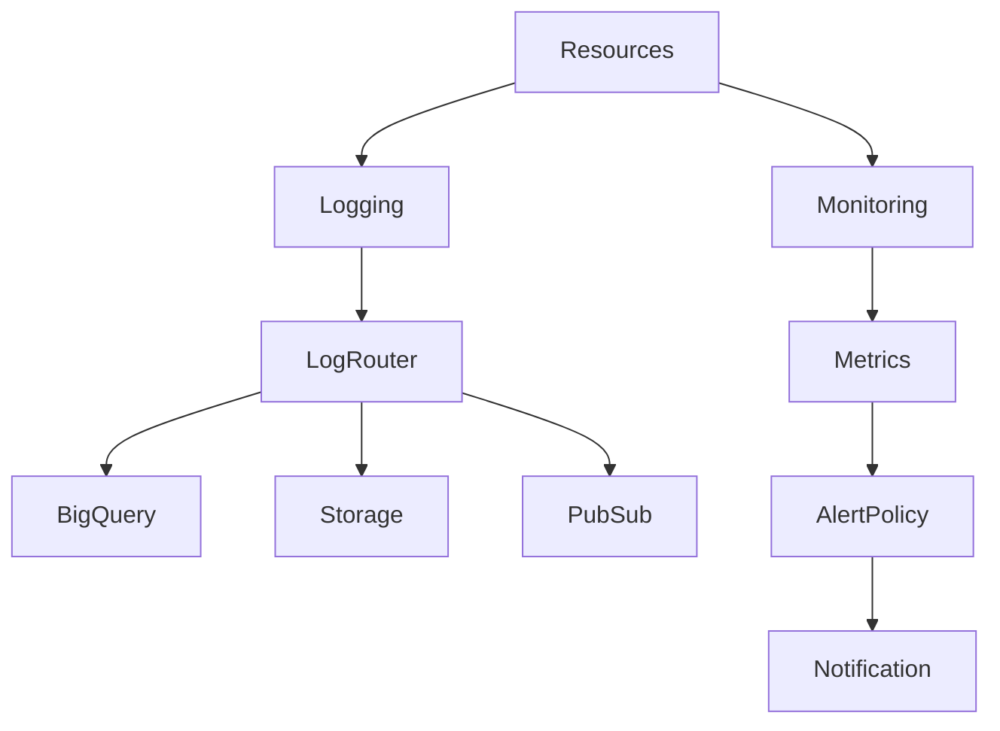
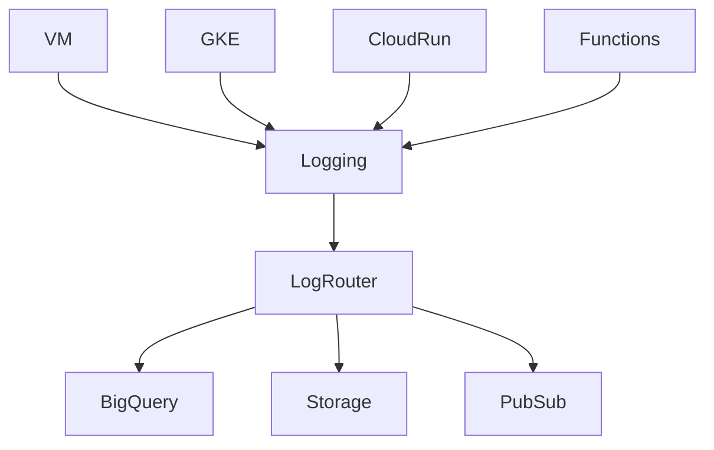
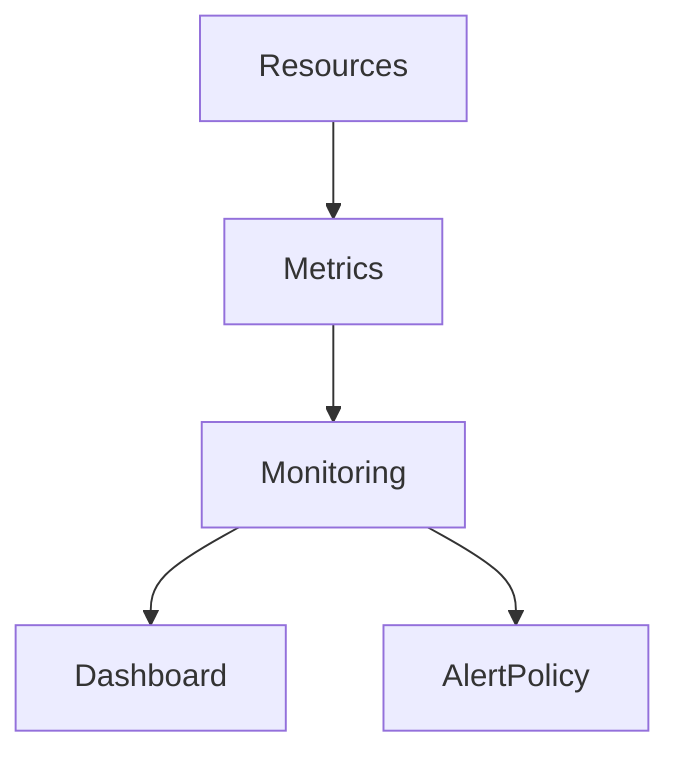
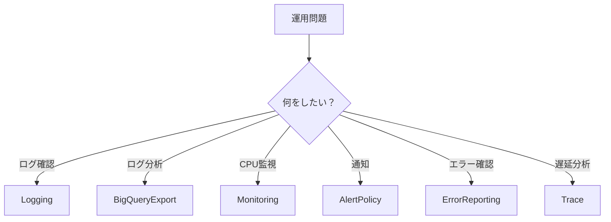

````markdown
# GCP Logging / Monitoring（ACE 2026）

GCPの運用監視は  
**Cloud Operations Suite** を使う。

主なサービス

- Cloud Logging
- Cloud Monitoring
- Alerting
- Error Reporting
- Trace / Profiler

ACEでは主に以下の3つ

```
Cloud Logging
Cloud Monitoring
Alert Policy
```

---

# Cloud Operations構造



---

# Cloud Logging

GCPの **ログ収集サービス**

自動収集

| リソース | ログ |
|---|---|
Compute Engine | syslog
GKE | container logs
Cloud Run | request logs
Cloud Functions | execution logs
IAM | audit logs

ACE問題

```
ログ確認
→ Cloud Logging
```

---

# Log Router（旧 Sink）

Loggingの内部ルーター。

ログを他サービスへ送る。

転送先

| 転送先 | 用途 |
|---|---|
BigQuery | ログ分析 |
Cloud Storage | 長期保存 |
Pub/Sub | SIEM / Event |

ACE問題

```
ログ分析
→ BigQuery Export
```

---

# Logging構造



---

# Cloud Monitoring

メトリクス監視サービス。

監視対象

| 対象 | メトリクス |
|---|---|
VM | CPU / Memory / Disk |
GKE | Pod / Node |
Cloud Run | Request / Latency |
Load Balancer | QPS / Errors |

ACE問題

```
CPU監視
→ Cloud Monitoring
```

---

# Metrics構造



---

# Alert Policy

監視アラート。

条件例

| 条件 | 例 |
|---|---|
CPU | >80% |
Memory | >85% |
Error Rate | >5% |
Latency | >500ms |

通知先

- Email
- Slack
- PagerDuty
- Webhook

ACE問題

```
CPU > threshold
→ Alert Policy
```

---

# Notification Channel

アラート通知先。

例

| Channel | 用途 |
|---|---|
Email | 管理者通知 |
Slack | 運用通知 |
PagerDuty | OnCall |
Webhook | 自動処理 |

---

# Error Reporting

アプリ例外の集約。

対象

- Cloud Run
- Cloud Functions
- App Engine

ACE問題

```
アプリエラー確認
→ Error Reporting
```

---

# Trace

リクエスト遅延分析。

用途

- API latency
- microservice tracing

ACE問題

```
遅延分析
→ Cloud Trace
```

---

# Metrics Scope

複数プロジェクト監視。

用途

```
1つのMonitoringで
複数Projectを監視
```

ACE問題

```
複数プロジェクト監視
→ Metrics Scope
```

---

# Logging / Monitoring 全体構造


---

# ACE重要ポイント

```
ログ確認
→ Cloud Logging

ログ分析
→ BigQuery Export

メトリクス監視
→ Cloud Monitoring

アラート
→ Alert Policy

エラー確認
→ Error Reporting

遅延分析
→ Cloud Trace
```

---

# ACE判断フロー



---

# 実務TIP（2026）

### Loggingベストプラクティス

ログ保持

| 用途 | サービス |
|---|---|
短期ログ | Logging |
長期保存 | Cloud Storage |
分析 | BigQuery |

---

### Monitoringベストプラクティス

実務では

```
Monitoring
↓
Dashboard
↓
Alert
↓
PagerDuty
```

---

### SLO運用（実務）

SRE運用

```
SLI
↓
SLO
↓
Alert
```

例

```
99.9% availability
```

---

# Observability（2026）

GCP Observabilityは

```
Logs
Metrics
Traces
Errors
```

4つで構成。

---

# 試験対策まとめ

```
ログ確認
→ Cloud Logging

ログ分析
→ BigQuery Export

CPU監視
→ Cloud Monitoring

通知
→ Alert Policy

アプリ例外
→ Error Reporting

遅延
→ Cloud Trace
```

---

# 実務まとめ

```
Logs → Logging
Metrics → Monitoring
Alert → Alert Policy
Analysis → BigQuery
Long Term → Storage
Incident → PagerDuty
```
````

---

# 重要（2026で変わったポイント）

古い資料との差分

| 旧                    | 2026             |
| -------------------- | ---------------- |
| Log Sink             | Log Router       |
| Stackdriver          | Cloud Operations |
| Monitoring Workspace | Metrics Scope    |
| Logging Agent        | Ops Agent        |

ACE試験でも
**Log Router / Metrics Scope / Ops Agent** が出る可能性あり。

---

