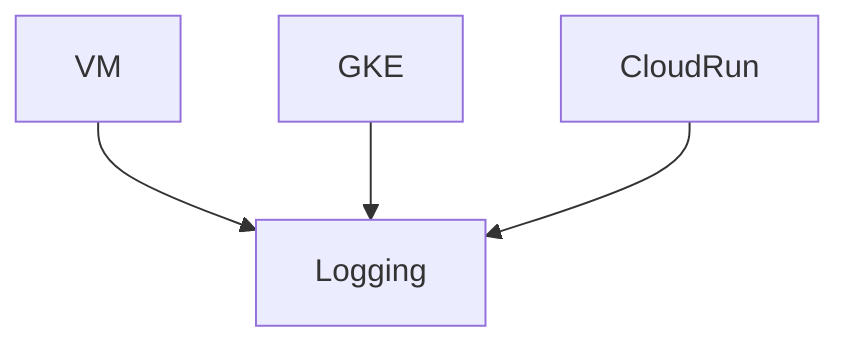
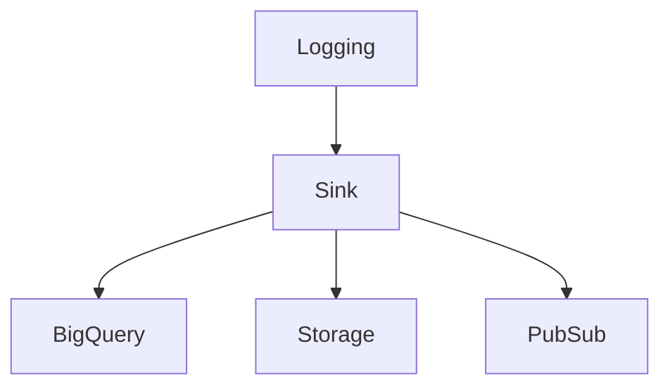
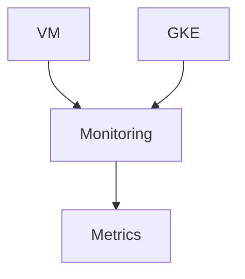
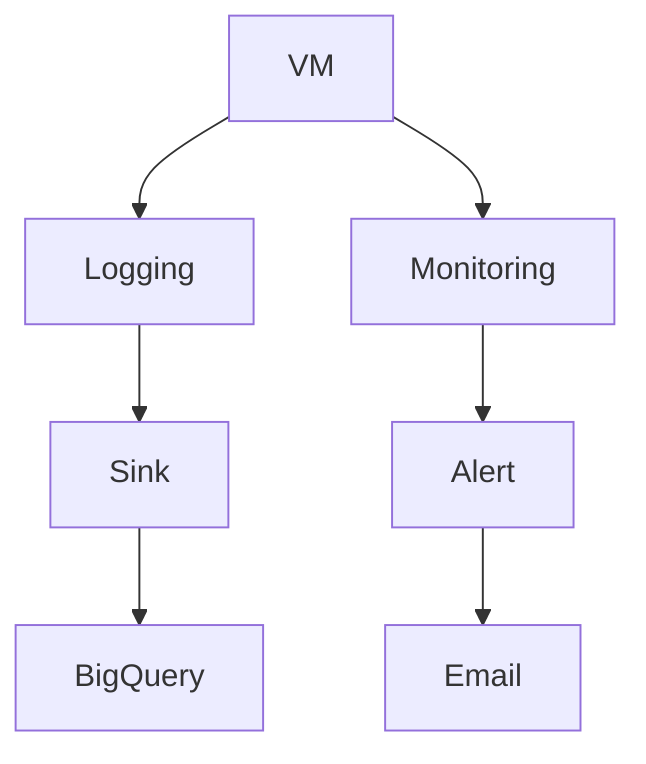
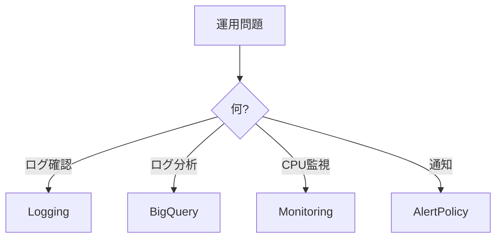

# 07_logging-monitoring.md

````markdown
# GCP Logging / Monitoring（ACE）

GCP運用は **Cloud Operations Suite** を使う。

主なサービス

- Cloud Logging
- Cloud Monitoring
- Alerting

---

# Cloud Operations

```mermaid
graph TD
Operations --> Logging
Operations --> Monitoring
Operations --> Alerting
````

---

# Cloud Logging

ログ収集サービス。

| 用途    | 例              |
| ----- | -------------- |
| VMログ  | syslog         |
| GKEログ | container logs |
| 監査ログ  | audit logs     |

ACE問題

```
ログ確認
→ Cloud Logging
```

---

# Logging構造



ログは自動収集される。

---

# Log Sink

ログを別サービスへ送る。



| 用途   | 転送先           |
| ---- | ------------- |
| ログ分析 | BigQuery      |
| 長期保存 | Cloud Storage |
| SIEM | Pub/Sub       |

ACE問題

```
ログ分析
→ BigQuery Sink
```

---

# Cloud Monitoring

メトリクス監視。

| 用途  | 例   |
| --- | --- |
| CPU | VM  |
| メモリ | VM  |
| Pod | GKE |

ACE問題

```
CPU監視
→ Cloud Monitoring
```

---

# Monitoring構造



---

# Alert Policy

監視アラート。

| 条件   | 例     |
| ---- | ----- |
| CPU  | 90%以上 |
| Disk | 80%以上 |

通知

* Email
* Slack
* PagerDuty

ACE問題

```
CPU > 90%
→ Alert Policy
```

---

# Logging / Monitoring 全体



---

# ACE重要ポイント

```
ログ確認 → Cloud Logging
ログ分析 → BigQuery Sink
CPU監視 → Cloud Monitoring
通知 → Alert Policy
```

---

# ACE判断フロー



```

---


---

# Notes

