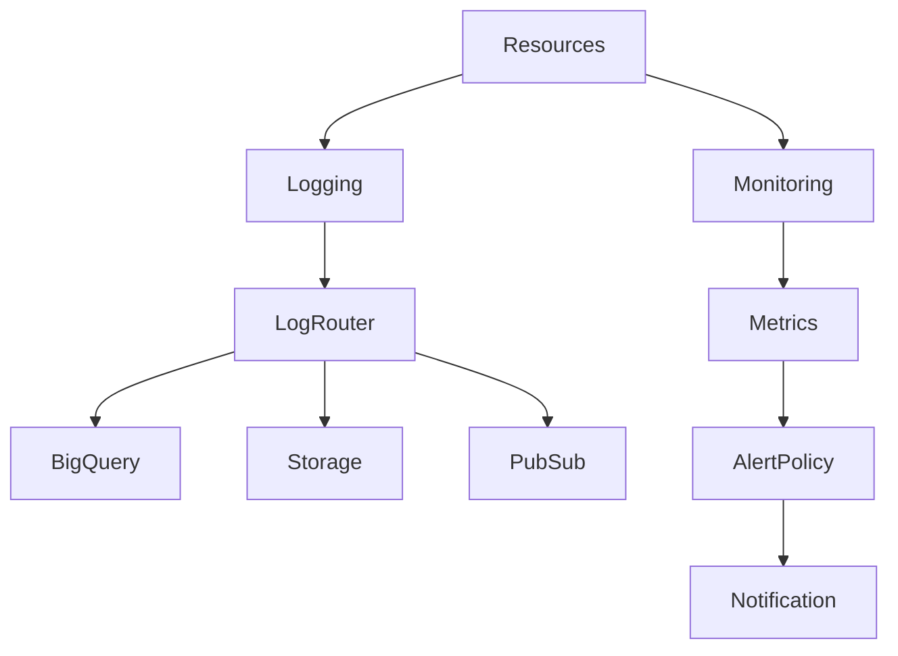
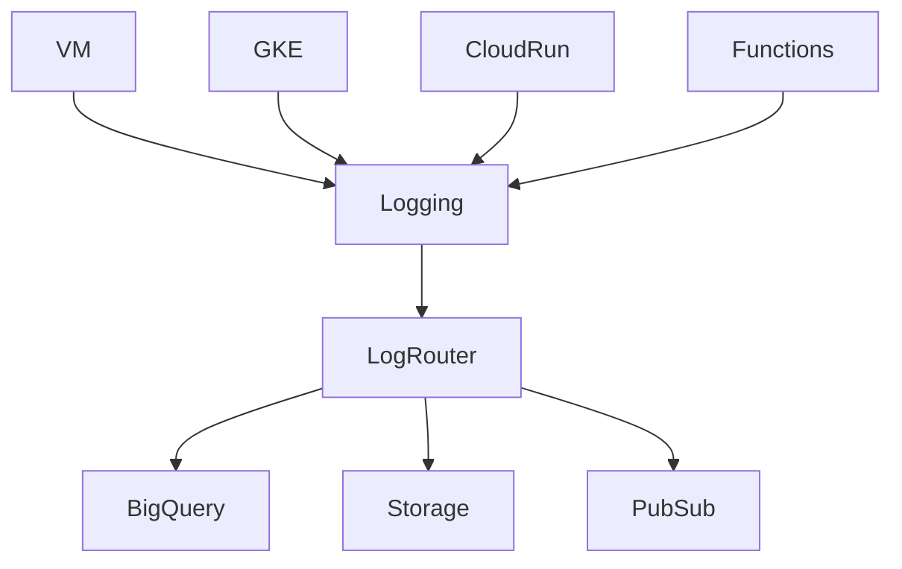
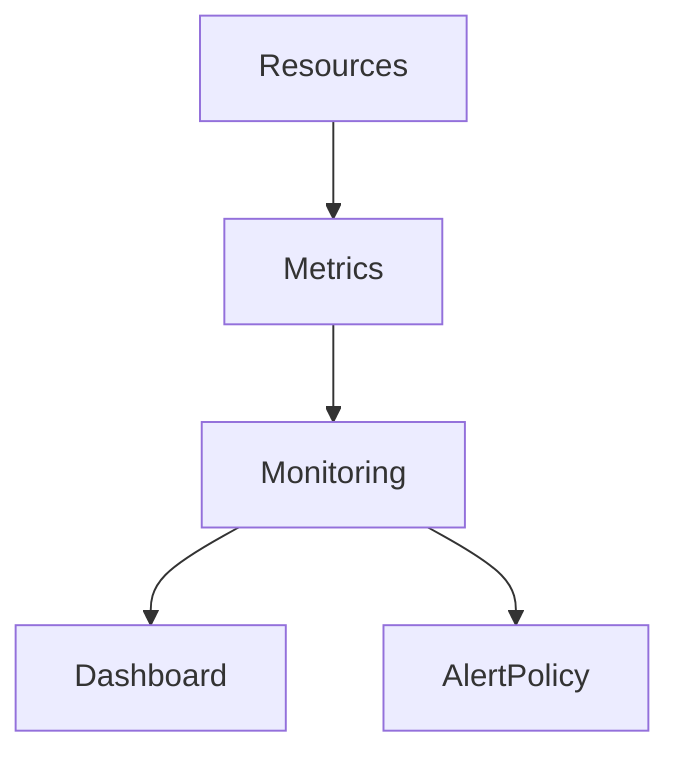
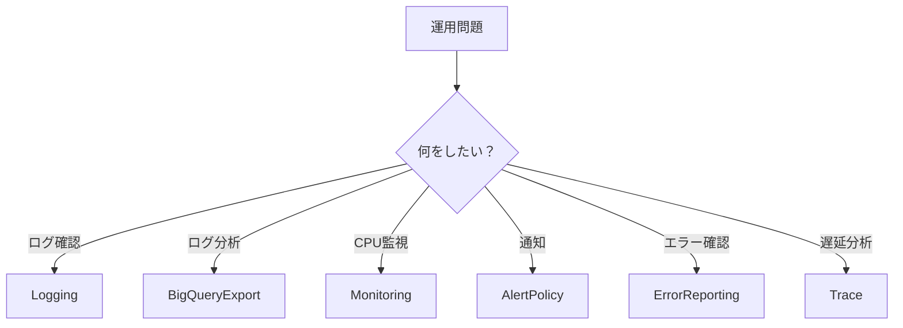

# GCP Logging / Monitoring（ACE 2026）

---

# 1. Cloud Operations Suite 概要

## 1.1 GCP Observabilityの中心サービス

GCPの運用監視は **Cloud Operations Suite** を使用する。

旧名称

```
Stackdriver
```

現在

```
Cloud Operations Suite
```

---

## 1.2 主なObservabilityサービス

Cloud Operations Suiteには以下のサービスが含まれる。

* Cloud Logging
* Cloud Monitoring
* Alerting
* Error Reporting
* Cloud Trace
* Cloud Profiler

ACE試験では主に以下の3つが重要。

```
Cloud Logging
Cloud Monitoring
Alert Policy
```

---

# 2. Cloud Operations 全体構造

## 2.1 Observabilityアーキテクチャ



---

# 3. Cloud Logging

## 3.1 Cloud Logging 概要

Cloud Loggingは **GCPのログ収集・検索サービス**。

GCPリソースのログを自動収集する。

---

## 3.2 自動収集ログ

| リソース            | ログ             |
| --------------- | -------------- |
| Compute Engine  | syslog         |
| GKE             | container logs |
| Cloud Run       | request logs   |
| Cloud Functions | execution logs |
| IAM             | audit logs     |

---

## 3.3 ACE試験ポイント

```
ログ確認
→ Cloud Logging
```

---

# 4. Log Router（旧 Sink）

## 4.1 Log Router 概要

Log Routerは **Cloud Logging内部のログ転送機構**。

ログを他のサービスへ送信できる。

---

## 4.2 主な転送先

| 転送先           | 用途             |
| ------------- | -------------- |
| BigQuery      | ログ分析           |
| Cloud Storage | 長期保存           |
| Pub/Sub       | SIEM / Event処理 |

---

## 4.3 ACE試験ポイント

```
ログ分析
→ BigQuery Export
```

---

# 5. Logging アーキテクチャ

## 5.1 Logging構造



---

# 6. Cloud Monitoring

## 6.1 Cloud Monitoring 概要

Cloud Monitoringは **メトリクス監視サービス**。

システムの状態を数値データで監視する。

---

## 6.2 監視対象

| 対象            | メトリクス               |
| ------------- | ------------------- |
| VM            | CPU / Memory / Disk |
| GKE           | Pod / Node          |
| Cloud Run     | Request / Latency   |
| Load Balancer | QPS / Errors        |

---

## 6.3 ACE試験ポイント

```
CPU監視
→ Cloud Monitoring
```

---

# 7. Metrics構造

## 7.1 Monitoringアーキテクチャ



---

# 8. Alert Policy

## 8.1 Alert Policy 概要

Alert Policyは **監視条件に基づくアラート通知設定**。

---

## 8.2 代表的なアラート条件

| 条件         | 例      |
| ---------- | ------ |
| CPU        | >80%   |
| Memory     | >85%   |
| Error Rate | >5%    |
| Latency    | >500ms |

---

## 8.3 通知先

* Email
* Slack
* PagerDuty
* Webhook

---

## 8.4 ACE試験ポイント

```
CPU > threshold
→ Alert Policy
```

---

# 9. Notification Channel

## 9.1 Notification Channel 概要

Notification Channelは **アラート通知先設定**。

---

## 9.2 代表例

| Channel   | 用途     |
| --------- | ------ |
| Email     | 管理者通知  |
| Slack     | 運用通知   |
| PagerDuty | OnCall |
| Webhook   | 自動処理   |

---

# 10. Error Reporting

## 10.1 Error Reporting 概要

Error Reportingは **アプリケーション例外の集約サービス**。

---

## 10.2 対象サービス

* Cloud Run
* Cloud Functions
* App Engine

---

## 10.3 ACE試験ポイント

```
アプリエラー確認
→ Error Reporting
```

---

# 11. Cloud Trace

## 11.1 Cloud Trace 概要

Cloud Traceは **リクエスト遅延分析ツール**。

---

## 11.2 主な用途

* API latency分析
* microservice tracing

---

## 11.3 ACE試験ポイント

```
遅延分析
→ Cloud Trace
```

---

# 12. Metrics Scope

## 12.1 Metrics Scope 概要

Metrics Scopeは **複数プロジェクトの監視を統合する機能**。

---

## 12.2 主な用途

```
1つのMonitoring環境で
複数Projectを監視
```

---

## 12.3 ACE試験ポイント

```
複数プロジェクト監視
→ Metrics Scope
```

---

# 13. Logging / Monitoring 全体構造


---

# 14. ACE重要ポイント

```
ログ確認
→ Cloud Logging

ログ分析
→ BigQuery Export

メトリクス監視
→ Cloud Monitoring

アラート
→ Alert Policy

エラー確認
→ Error Reporting

遅延分析
→ Cloud Trace
```

---

# 15. ACE判断フロー



---

# 16. 実務ベストプラクティス（2026）

## 16.1 Logging運用

| 用途   | サービス          |
| ---- | ------------- |
| 短期ログ | Cloud Logging |
| 長期保存 | Cloud Storage |
| ログ分析 | BigQuery      |

---

## 16.2 Monitoring運用

一般的な運用フロー

```
Monitoring
↓
Dashboard
↓
Alert
↓
PagerDuty
```

---

## 16.3 SRE運用

```
SLI
↓
SLO
↓
Alert
```

例

```
99.9% availability
```

---

# 17. Observability（2026）

GCP Observabilityは以下の4要素で構成される。

```
Logs
Metrics
Traces
Errors
```

---

# 18. 試験対策まとめ

```
ログ確認
→ Cloud Logging

ログ分析
→ BigQuery Export

CPU監視
→ Cloud Monitoring

通知
→ Alert Policy

アプリ例外
→ Error Reporting

遅延
→ Cloud Trace
```

---

# 19. 実務まとめ

```
Logs → Logging
Metrics → Monitoring
Alert → Alert Policy
Analysis → BigQuery
Long Term → Storage
Incident → PagerDuty
```

---

# 20. 2026変更点

| 旧                    | 2026             |
| -------------------- | ---------------- |
| Log Sink             | Log Router       |
| Stackdriver          | Cloud Operations |
| Monitoring Workspace | Metrics Scope    |
| Logging Agent        | Ops Agent        |

---

# GCP Observability 用語集（ACE 2026）

| 用語                     | 定義                            | 用途                          |
| ---------------------- | ----------------------------- | --------------------------- |
| Cloud Operations Suite | GCPのObservability統合プラットフォーム   | ログ・監視・トレース                  |
| Cloud Logging          | GCPのログ収集・検索サービス               | VM / GKE / アプリログ            |
| Log Router             | Logging内部のログ転送機構              | BigQuery / Storage / PubSub |
| Cloud Monitoring       | メトリクス監視サービス                   | CPU / Memory / Network監視    |
| Alert Policy           | 監視条件に基づくアラート設定                | Email / Slack通知             |
| Notification Channel   | アラート通知先                       | Email / PagerDuty           |
| Error Reporting        | アプリケーション例外の集約                 | エラー分析                       |
| Cloud Trace            | 分散トレーシングツール                   | レイテンシ分析                     |
| Metrics Scope          | 複数プロジェクト監視機能                  | マルチプロジェクト監視                 |
| Ops Agent              | Logging / Monitoring用統合エージェント | VM監視データ収集                   |

---
