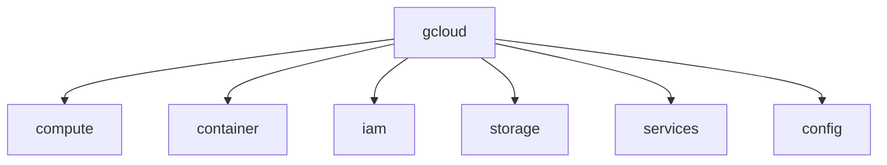
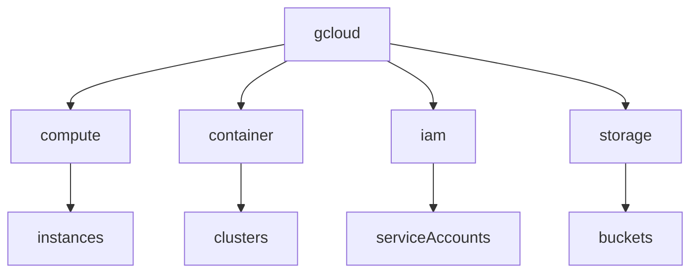

# GCP CLI Cheatsheet（ACE 2026）

---

# 1. gcloud CLI 概要

## 1.1 gcloud CLIとは

**gcloud CLI** は Google Cloud をコマンドラインから操作するための公式ツール。

インフラ管理、デプロイ、監視、IAM設定などを実行できる。

---

## 1.2 CLIコマンド構造

gcloud CLIは以下のような階層構造で構成される。

```
gcloud
 ├ compute
 ├ container
 ├ iam
 ├ storage
 ├ services
 └ config
```

---

## 1.3 CLI構造図



---

# 2. 認証（Authentication）

## 2.1 ユーザーログイン

Googleアカウントを使った認証。

```
gcloud auth login
```

---

## 2.2 サービスアカウント認証

CI/CDや自動化ではサービスアカウントを使用する。

```
gcloud auth activate-service-account \
--key-file=key.json
```

---

## 2.3 現在の認証確認

```
gcloud auth list
```

---

# 3. プロジェクト設定

## 3.1 現在の設定確認

```
gcloud config list
```

---

## 3.2 プロジェクト変更

```
gcloud config set project PROJECT_ID
```

ACE問題

```
プロジェクト変更
→ gcloud config set project
```

---

## 3.3 リージョン設定

```
gcloud config set compute/region REGION
```

---

## 3.4 ゾーン設定

```
gcloud config set compute/zone ZONE
```

---

# 4. Configuration管理

## 4.1 Configurationsとは

複数のプロジェクト設定を切り替えるための仕組み。

---

## 4.2 設定一覧

```
gcloud config configurations list
```

---

## 4.3 設定作成

```
gcloud config configurations create dev
```

---

## 4.4 設定切替

```
gcloud config configurations activate dev
```

---

# 5. API有効化

## 5.1 API一覧確認

```
gcloud services list
```

---

## 5.2 API有効化

```
gcloud services enable compute.googleapis.com
```

ACE問題

```
VM作れない
→ API enable
```

---

# 6. Compute Engine

## 6.1 VM一覧

```
gcloud compute instances list
```

---

## 6.2 VM作成

```
gcloud compute instances create vm-1
```

---

## 6.3 VM停止

```
gcloud compute instances stop vm-1
```

---

## 6.4 VM起動

```
gcloud compute instances start vm-1
```

---

## 6.5 VM削除

```
gcloud compute instances delete vm-1
```

---

## 6.6 SSH接続

```
gcloud compute ssh vm-1
```

ACE問題

```
VM操作
→ gcloud compute
```

---

# 7. Google Kubernetes Engine（GKE）

## 7.1 クラスタ一覧

```
gcloud container clusters list
```

---

## 7.2 クラスタ作成

```
gcloud container clusters create cluster-1
```

---

## 7.3 kubectl接続

```
gcloud container clusters get-credentials cluster-1
```

ACE頻出

```
kubectl接続
→ get-credentials
```

---

# 8. kubectl 基本操作

## 8.1 Pod一覧

```
kubectl get pods
```

---

## 8.2 Node確認

```
kubectl get nodes
```

---

## 8.3 Service確認

```
kubectl get services
```

---

## 8.4 Pod詳細

```
kubectl describe pod POD_NAME
```

---

# 9. IAM操作

## 9.1 IAMロール追加

```
gcloud projects add-iam-policy-binding PROJECT_ID \
--member=user:test@example.com \
--role=roles/viewer
```

---

## 9.2 Service Account作成

```
gcloud iam service-accounts create SA_NAME
```

---

## 9.3 Service Account一覧

```
gcloud iam service-accounts list
```

---

# 10. Cloud Storage

## 10.1 2026 CLI仕様

現在は **gcloud storage CLI** が主流。

旧ツール

```
gsutil
```

新CLI

```
gcloud storage
```

---

## 10.2 バケット作成

```
gcloud storage buckets create gs://bucket-name
```

---

## 10.3 ファイルアップロード

```
gcloud storage cp file.txt gs://bucket-name
```

---

## 10.4 ファイルダウンロード

```
gcloud storage cp gs://bucket/file.txt .
```

---

## 10.5 バケット一覧

```
gcloud storage buckets list
```

---

# 11. Logging操作

## 11.1 ログ検索

```
gcloud logging read
```

---

## 11.2 フィルタ例

```
gcloud logging read "resource.type=gce_instance"
```

---

# 12. Monitoring操作

## 12.1 アラート作成

```
gcloud alpha monitoring policies create
```

---

## 12.2 ダッシュボード一覧

```
gcloud monitoring dashboards list
```

---

# 13. CLI構造図



---

# 14. ACE最重要CLI

ACE試験で頻出のコマンド。

```
gcloud config set project
gcloud services enable
gcloud compute instances create
gcloud container clusters get-credentials
kubectl get pods
```

---

# 15. ACE判断パターン

```
cluster接続
→ get-credentials

VM操作
→ gcloud compute

IAM設定
→ add-iam-policy-binding

API未有効
→ services enable
```

---

# 16. CLI自動化（実務）

CI/CDではサービスアカウントを利用する。

```
Service Account
↓
gcloud auth activate-service-account
↓
gcloud CLI
```

例

```
gcloud auth activate-service-account \
--key-file=sa.json

gcloud config set project prod
```

---

# 17. CLIベストプラクティス

実務では最初に以下を設定する。

```
config set project
config set region
config set zone
```

---

# 18. CLI実務フロー

```
auth login
↓
config set project
↓
services enable
↓
resource create
↓
monitoring
```

---

# 19. ACEまとめ

```
プロジェクト変更
→ gcloud config set project

VM作成
→ gcloud compute instances create

GKE接続
→ get-credentials

API未有効
→ services enable

Storage操作
→ gcloud storage
```

---

# 20. 2026変更点

| 旧                    | 2026             |
| -------------------- | ---------------- |
| gsutil               | gcloud storage   |
| Stackdriver          | Cloud Operations |
| Monitoring Workspace | Metrics Scope    |
| Logging Agent        | Ops Agent        |

---

# GCP CLI 用語集（ACE 2026）

| 用語               | 定義                       | 用途                 |
| ---------------- | ------------------------ | ------------------ |
| gcloud CLI       | Google Cloud公式コマンドラインツール | GCPリソース管理          |
| Authentication   | CLI利用時の認証機構              | ユーザーまたはサービスアカウント認証 |
| Configuration    | CLI設定プロファイル              | 複数プロジェクト管理         |
| Service Account  | GCPリソース用の機械アカウント         | CI/CD認証            |
| API Enable       | GCPサービスの有効化              | Compute / GKE利用    |
| Compute Engine   | GCPの仮想マシンサービス            | VM作成・管理            |
| GKE              | Google Kubernetes Engine | Kubernetesクラスタ     |
| kubectl          | Kubernetes管理CLI          | Pod / Service操作    |
| Cloud Storage    | GCPオブジェクトストレージ           | ファイル保存             |
| gcloud storage   | Cloud Storage操作CLI       | bucket / object管理  |
| Cloud Logging    | GCPログ管理サービス              | ログ検索               |
| Cloud Monitoring | メトリクス監視サービス              | CPU / Latency監視    |

---
