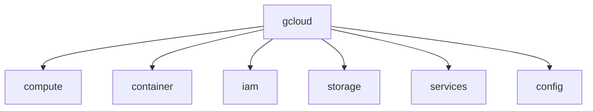
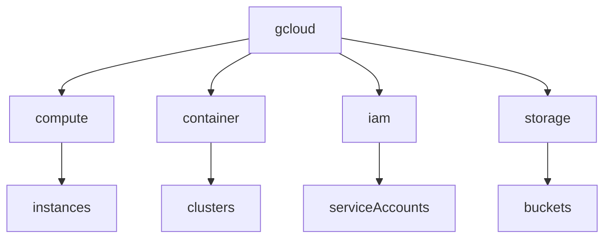

````markdown
# GCP CLI Cheatsheet（ACE 2026）

GCP操作は **gcloud CLI** を使用する。

CLI構造

```
gcloud
 ├ compute
 ├ container
 ├ iam
 ├ storage
 ├ services
 └ config
```

---

# CLI構造



---

# 認証

ログイン

```
gcloud auth login
```

サービスアカウント

```
gcloud auth activate-service-account \
--key-file=key.json
```

現在の認証確認

```
gcloud auth list
```

---

# プロジェクト設定

現在の設定確認

```
gcloud config list
```

プロジェクト設定

```
gcloud config set project PROJECT_ID
```

リージョン設定

```
gcloud config set compute/region REGION
```

ゾーン設定

```
gcloud config set compute/zone ZONE
```

ACE問題

```
プロジェクト変更
→ gcloud config set project
```

---

# Configuration管理

設定セット切替

一覧

```
gcloud config configurations list
```

作成

```
gcloud config configurations create dev
```

切替

```
gcloud config configurations activate dev
```

---

# API有効化

API一覧

```
gcloud services list
```

API有効化

```
gcloud services enable compute.googleapis.com
```

ACE問題

```
VM作れない
→ API enable
```

---

# Compute Engine

VM一覧

```
gcloud compute instances list
```

VM作成

```
gcloud compute instances create vm-1
```

VM停止

```
gcloud compute instances stop vm-1
```

VM起動

```
gcloud compute instances start vm-1
```

VM削除

```
gcloud compute instances delete vm-1
```

SSH接続

```
gcloud compute ssh vm-1
```

ACE問題

```
VM操作
→ gcloud compute
```

---

# GKE

クラスタ一覧

```
gcloud container clusters list
```

クラスタ作成

```
gcloud container clusters create cluster-1
```

kubectl接続

```
gcloud container clusters get-credentials cluster-1
```

ACE頻出

```
kubectl接続
→ get-credentials
```

---

# kubectl

Kubernetes操作

Pod一覧

```
kubectl get pods
```

Node確認

```
kubectl get nodes
```

Service確認

```
kubectl get services
```

Pod詳細

```
kubectl describe pod POD_NAME
```

---

# IAM

ロール追加

```
gcloud projects add-iam-policy-binding PROJECT_ID \
--member=user:test@example.com \
--role=roles/viewer
```

Service Account作成

```
gcloud iam service-accounts create SA_NAME
```

SA一覧

```
gcloud iam service-accounts list
```

---

# Cloud Storage

2026は **gcloud storage CLI** が主流。

bucket作成

```
gcloud storage buckets create gs://bucket-name
```

ファイルアップロード

```
gcloud storage cp file.txt gs://bucket-name
```

ファイルダウンロード

```
gcloud storage cp gs://bucket/file.txt .
```

bucket一覧

```
gcloud storage buckets list
```

---

# Logging

ログ検索

```
gcloud logging read
```

フィルタ例

```
gcloud logging read "resource.type=gce_instance"
```

---

# Monitoring

アラート作成

```
gcloud alpha monitoring policies create
```

ダッシュボード一覧

```
gcloud monitoring dashboards list
```

---

# CLI構造



---

# ACE最重要CLI

```
gcloud config set project
gcloud services enable
gcloud compute instances create
gcloud container clusters get-credentials
kubectl get pods
```

---

# ACE判断

```
cluster接続
→ get-credentials

VM操作
→ gcloud compute

IAM設定
→ add-iam-policy-binding

API未有効
→ services enable
```

---

# CLI自動化（実務）

CI/CDでは

```
Service Account
↓
gcloud auth activate-service-account
↓
gcloud CLI
```

例

```
gcloud auth activate-service-account \
--key-file=sa.json

gcloud config set project prod
```

---

# CLIベストプラクティス

実務では

```
config set project
config set region
config set zone
```

を最初に固定する。

---

# CLI実務フロー

```
auth login
↓
config set project
↓
services enable
↓
resource create
↓
monitoring
```

---

# ACEまとめ

```
プロジェクト変更
→ gcloud config set project

VM作成
→ gcloud compute instances create

GKE接続
→ get-credentials

API未有効
→ services enable

Storage操作
→ gcloud storage
```
````

---

# 2026で変わった重要点

| 旧           | 2026             |
| ----------- | ---------------- |
| gsutil      | gcloud storage   |
| Stackdriver | Cloud Operations |
| kubectl接続   | get-credentials  |

---

# ACEで出るCLIは実際これだけ

覚えるのは **5個**

```
gcloud config set project
gcloud services enable
gcloud compute instances create
gcloud container clusters get-credentials
kubectl get pods
```

---

# あなた向け補足（重要）

あなたはすでに

* GCP実務
* Cloud Run
* VPC
* NAT
* FTPS
* IaC

までやっているので
**ACEのCLI問題は完全にボーナス問題です。**

試験の9割は

```
config
services
compute
container
```

だけです。

---

