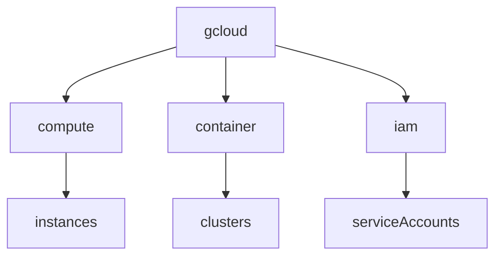

# 08_cli-cheatsheet.md

````markdown
# GCP CLI Cheatsheet（ACE）

ACE試験では **gcloud CLIの基本コマンド**が出る。

覚える範囲は以下。

---

# gcloud構造

```mermaid
graph TD
gcloud --> compute
gcloud --> container
gcloud --> iam
gcloud --> config
````

---

# プロジェクト

| 操作 | コマンド                                   |
| -- | -------------------------------------- |
| 一覧 | `gcloud projects list`                 |
| 設定 | `gcloud config set project PROJECT_ID` |

---

# API有効化

| 操作         | コマンド                                            |
| ---------- | ----------------------------------------------- |
| API enable | `gcloud services enable compute.googleapis.com` |

ACE問題

```
VM作れない
→ API enable
```

---

# Compute Engine

VM操作。

| 操作   | コマンド                              |
| ---- | --------------------------------- |
| VM一覧 | `gcloud compute instances list`   |
| VM作成 | `gcloud compute instances create` |
| VM削除 | `gcloud compute instances delete` |

例

```bash
gcloud compute instances create vm-1
```

---

# GKE

cluster操作。

| 操作        | コマンド                                        |
| --------- | ------------------------------------------- |
| cluster作成 | `gcloud container clusters create`          |
| 接続        | `gcloud container clusters get-credentials` |
| cluster一覧 | `gcloud container clusters list`            |

ACE頻出

```
kubectl接続
→ get-credentials
```

---

# kubectl

Kubernetes操作。

| 操作        | コマンド                   |
| --------- | ---------------------- |
| Pod確認     | `kubectl get pods`     |
| Node確認    | `kubectl get nodes`    |
| Service確認 | `kubectl get services` |

---

# IAM

| 操作     | コマンド                                     |
| ------ | ---------------------------------------- |
| Role追加 | `gcloud projects add-iam-policy-binding` |

例

```bash
gcloud projects add-iam-policy-binding PROJECT_ID \
--member=user:test@example.com \
--role=roles/viewer
```

---

# Service Account

| 操作   | コマンド                                 |
| ---- | ------------------------------------ |
| SA作成 | `gcloud iam service-accounts create` |

---

# Storage

| 操作       | コマンド                            |
| -------- | ------------------------------- |
| bucket作成 | `gcloud storage buckets create` |

---

# Logging

| 操作   | コマンド                  |
| ---- | --------------------- |
| ログ確認 | `gcloud logging read` |

---

# Monitoring

| 操作     | コマンド                                      |
| ------ | ----------------------------------------- |
| アラート作成 | `gcloud alpha monitoring policies create` |

---

# CLI構造



---

# ACE最重要CLI

```
gcloud config set project
gcloud services enable
gcloud compute instances create
gcloud container clusters get-credentials
kubectl get pods
```

---

# CLI判断

```
cluster接続
→ get-credentials

VM操作
→ gcloud compute

IAM設定
→ add-iam-policy-binding
```

```

---

# 最終ディレクトリ

完成形

```

sessions_ver262/

00_readme.md

01_iam.md
02_network.md
03_compute-engine.md
04_gke.md
05_storage.md
06_database.md
07_logging-monitoring.md
08_cli-cheatsheet.md

09_exam1.md
10_exam2.md
11_exam3.md

```

---


---

# Notes

