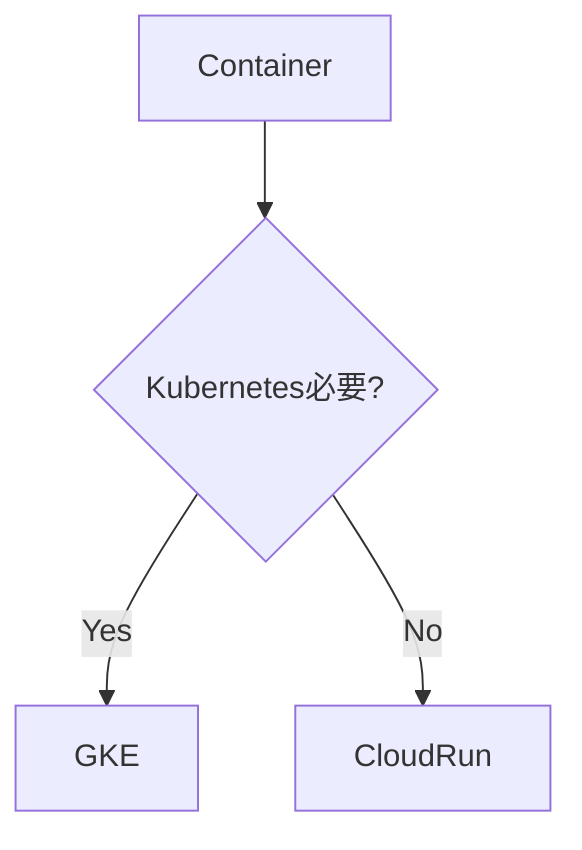
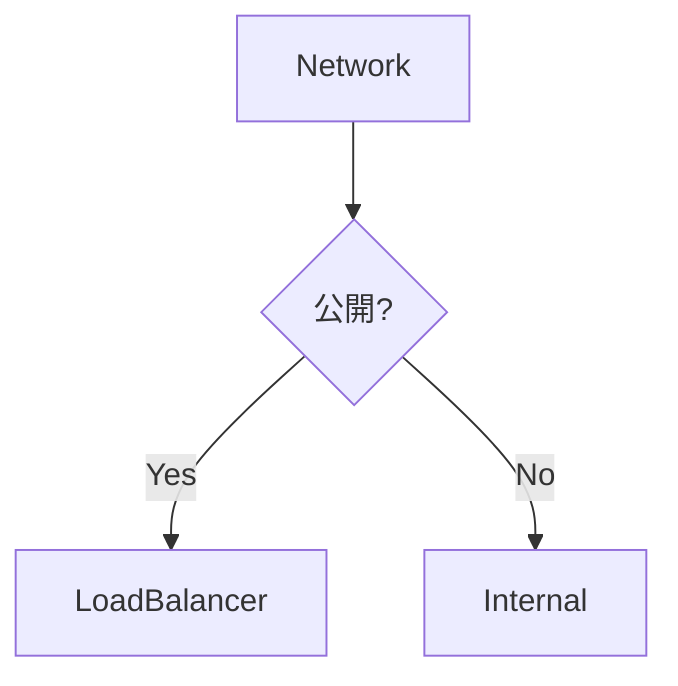
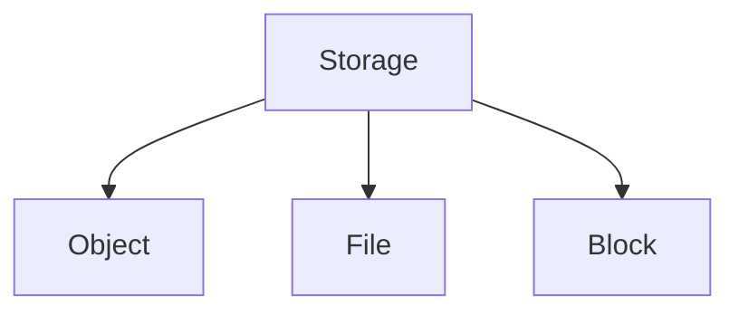
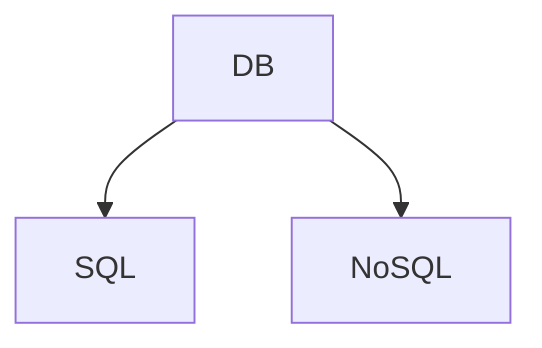
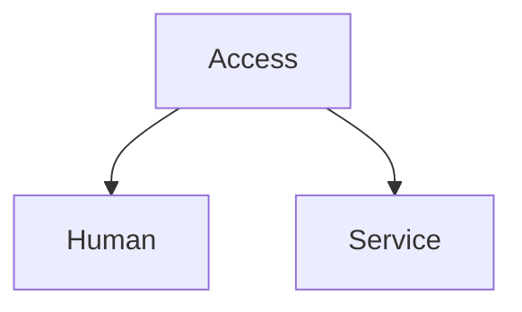
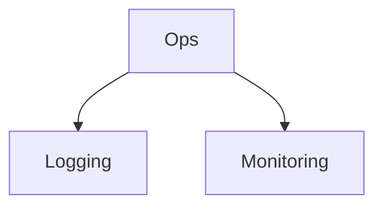
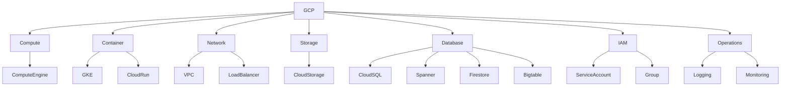

# 09_ace-decision-tree.md

````markdown
# GCP ACE Decision Tree

ACE試験は **サービス選択問題**が中心。

まずこのフローで判断する。

---

# Step 1

問題は何の領域か？

```mermaid
flowchart TD
Q[Question] --> A{カテゴリ}

A --> Compute
A --> Container
A --> Network
A --> Storage
A --> Database
A --> IAM
A --> Operations
````

---

# Step 2 Compute

VMか？

```mermaid
flowchart TD
A[Compute問題] --> B{VM必要?}

B -->|Yes| ComputeEngine
B -->|No| Container
```

判断

```
OS管理
SSH必要
既存アプリ
→ Compute Engine
```

---

# Step 3 Container

コンテナ？



判断

```
HTTP container
→ Cloud Run

Kubernetes
→ GKE
```

---

# Step 4 Networking



判断

```
Web公開
→ HTTP(S) LB

内部サービス
→ Internal LB
```

---

# Step 5 Storage



| 用途     | 答え              |
| ------ | --------------- |
| Object | Cloud Storage   |
| File   | Filestore       |
| Block  | Persistent Disk |

ACE頻出

```
オブジェクト
→ Cloud Storage
```

---

# Step 6 Database



| 状況       | 答え        |
| -------- | --------- |
| Postgres | Cloud SQL |
| 巨大RDB    | Spanner   |
| 分析       | Bigtable  |
| アプリ      | Firestore |

---

# Step 7 IAM



| 状況      | 答え                |
| ------- | ----------------- |
| 人       | Group             |
| VM→API  | Service Account   |
| Pod→API | Workload Identity |

---

# Step 8 Operations



| 問題    | 答え               |
| ----- | ---------------- |
| ログ確認  | Cloud Logging    |
| CPU監視 | Cloud Monitoring |
| ログ分析  | BigQuery Sink    |

---

# ACE Instant Answers

```
VM → Compute Engine
HTTP container → Cloud Run
Kubernetes → GKE
Object storage → Cloud Storage
PostgreSQL → Cloud SQL
巨大DB → Spanner
VM→API → Service Account
Pod→API → Workload Identity
ログ確認 → Cloud Logging
CPU監視 → Cloud Monitoring
```

---

# ACE Final Map



```

---


---

# Notes

