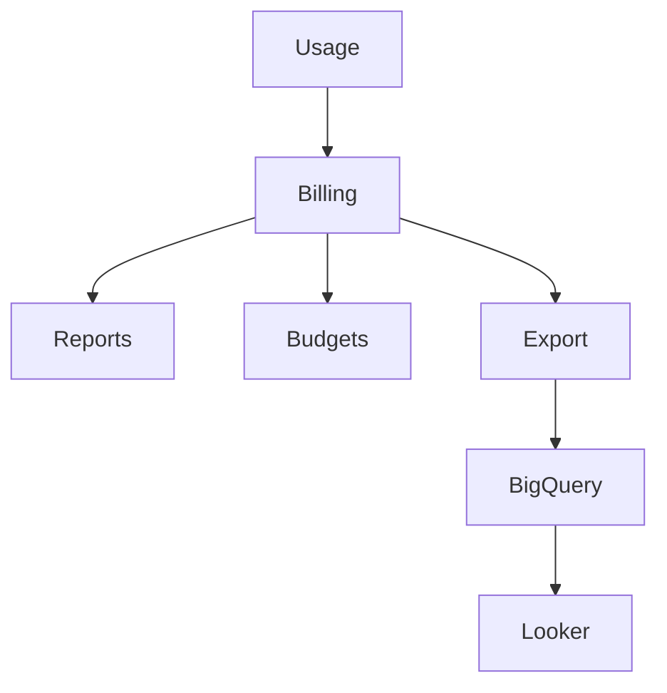
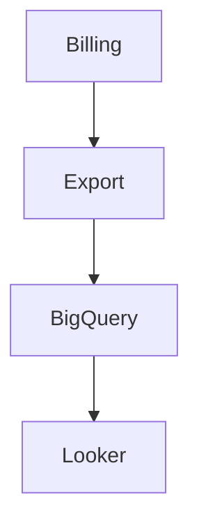
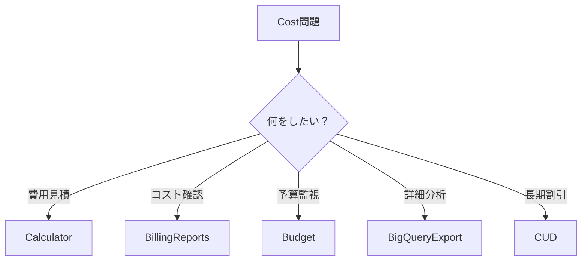

# GCP Cost Management（ACE 2026）

---

# 1. Cloud Billing 概要

## 1.1 GCPのコスト管理

GCPのコスト管理は **Cloud Billing** を中心に行う。

Cloud Billingは以下の機能を提供する。

```
Pricing Calculator
Budgets & Alerts
Billing Reports
Billing Export
Committed Use Discounts
Sustained Use Discounts
```

---

## 1.2 Cost管理の基本構造



---

# 2. Pricing Calculator

## 2.1 Pricing Calculator 概要

Pricing Calculatorは **GCPサービスの費用見積ツール**。

新規システムのコスト試算に使用する。

---

## 2.2 主な用途

| 用途     | 例      |
| ------ | ------ |
| 設計見積   | 新規システム |
| 提案資料   | 顧客見積   |
| PoCコスト | 概算     |

---

## 2.3 ACE試験ポイント

```
費用見積
→ Pricing Calculator
```

---

# 3. Billing Reports

## 3.1 Billing Reports 概要

Billing Reportsは **現在のクラウド利用コストを確認する機能**。

---

## 3.2 確認できる項目

| 項目      | 内容                |
| ------- | ----------------- |
| サービス別   | Compute / Storage |
| プロジェクト別 | Project           |
| 期間      | 日 / 月             |

---

## 3.3 ACE試験ポイント

```
現在のコスト確認
→ Billing Reports
```

---

# 4. Budgets & Alerts

## 4.1 Budget 概要

Budgetsは **予算設定と通知機能**。

---

## 4.2 例

```
予算 $1000
↓
80% 通知
↓
100% 通知
```

---

## 4.3 通知方法

* Email
* Pub/Sub

---

## 4.4 ACE試験ポイント

```
予算超過通知
→ Budget Alert
```

---

## 4.5 重要注意点

```
Budgetはリソース停止しない
```

Budgetsは通知のみを行う。

---

# 5. Billing Export

## 5.1 Billing Export 概要

Billing Exportは **詳細なコストデータを外部分析する機能**。

---

## 5.2 Export先

```
BigQuery
```

---

## 5.3 主な用途

| 用途     | 例      |
| ------ | ------ |
| 詳細分析   | サービス別  |
| コスト可視化 | Looker |
| 社内レポート | BI     |

---

## 5.4 ACE試験ポイント

```
詳細分析
→ Billing Export
```

---

## 5.5 Billing Export構造



---

# 6. Sustained Use Discount（SUD）

## 6.1 SUD概要

Sustained Use Discountは **長時間利用による自動割引**。

---

## 6.2 特徴

| 特徴   | 内容             |
| ---- | -------------- |
| 自動適用 | Yes            |
| 対象   | Compute Engine |
| 条件   | 長時間利用          |

---

## 6.3 例

```
1ヶ月VM稼働
→ 自動割引
```

---

## 6.4 ACE試験ポイント

```
自動割引
→ SUD
```

---

# 7. Committed Use Discount（CUD）

## 7.1 CUD概要

Committed Use Discountは **長期契約による割引**。

---

## 7.2 契約期間

```
1年
3年
```

---

## 7.3 特徴

| 特徴   | 内容            |
| ---- | ------------- |
| 事前契約 | Yes           |
| 対象   | Compute / GKE |
| 割引   | 最大70%         |

---

## 7.4 ACE試験ポイント

```
長期利用確定
→ CUD
```

---

# 8. Spot VM（旧 Preemptible VM）

## 8.1 Spot VM 概要

Spot VMは **低価格の短時間利用VM**。

---

## 8.2 特徴

| 特徴 | 内容         |
| -- | ---------- |
| 価格 | 最大90%安い    |
| 停止 | 24時間以内     |
| 用途 | Batch / CI |

---

## 8.3 ACE試験ポイント

```
安いVM
→ Spot VM
```

---

# 9. Storageコスト管理

## 9.1 Storageクラス

| Class    | 用途     |
| -------- | ------ |
| Standard | 頻繁アクセス |
| Nearline | 月1回程度  |
| Coldline | 年数回    |
| Archive  | 長期保存   |

---

## 9.2 ACE試験ポイント

```
長期保存
→ Archive
```

---

# 10. Networkコスト

## 10.1 ネットワーク課金

| 種類      | 課金 |
| ------- | -- |
| Ingress | 無料 |
| Egress  | 有料 |

---

## 10.2 ACE試験ポイント

```
通信コスト
→ Egress
```

---

# 11. Cost最適化

## 11.1 代表的な最適化手法

```
停止VM
Spot VM
Archive Storage
Autoscaling
```

---

# 12. ACE重要ポイント

```
費用見積
→ Pricing Calculator

現在のコスト
→ Billing Reports

予算通知
→ Budgets

詳細分析
→ Billing Export

長期割引
→ CUD

自動割引
→ SUD
```

---

# 13. ACE判断フロー



---

# 14. ACEトラップ

## Trap1

```
費用見積
```

Spreadsheet → ❌
Pricing Calculator → ✅

---

## Trap2

```
コスト分析
```

Billing console → ❌
Billing Export → ✅

---

## Trap3

```
長期利用
```

SUD → ❌
CUD → ✅

---

## Trap4

```
VM安くしたい
```

Standard VM → ❌
Spot VM → ✅

---

# 15. 実務TIP

実務では以下の構成が一般的。

```
Billing Export → BigQuery
```

そこから

```
Looker
Grafana
BIツール
```

へ接続する。

---

# 16. まとめ

```
見積 → Pricing Calculator
確認 → Billing Reports
予算 → Budget
分析 → Billing Export
割引 → CUD / SUD
```

---

# GCP Cost Management 用語集（ACE 2026）

| 用語                           | 定義                    | 用途             |
| ---------------------------- | --------------------- | -------------- |
| Cloud Billing                | GCPの課金管理サービス          | コスト管理          |
| Pricing Calculator           | GCPサービスの費用見積ツール       | 新規システム見積       |
| Billing Reports              | 現在の利用料金を確認する機能        | コスト可視化         |
| Budgets                      | 予算設定と通知機能             | 予算監視           |
| Budget Alert                 | 予算超過時の通知機能            | コスト管理          |
| Billing Export               | 課金データをBigQueryへ出力する機能 | 詳細分析           |
| Sustained Use Discount (SUD) | 長時間利用による自動割引          | Compute Engine |
| Committed Use Discount (CUD) | 長期契約による割引             | Compute / GKE  |
| Spot VM                      | 低価格で利用できる短時間VM        | Batch処理        |
| Storage Class                | Cloud Storageの保存クラス   | コスト最適化         |
| Network Egress               | 外部通信のデータ転送            | ネットワーク課金       |

---
