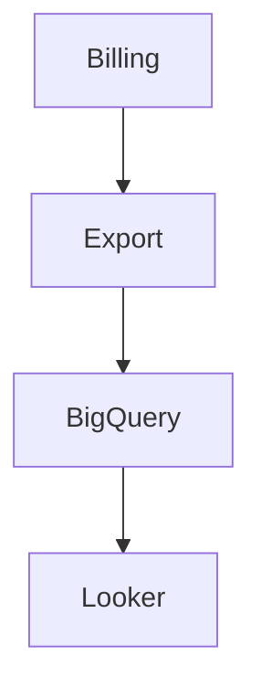
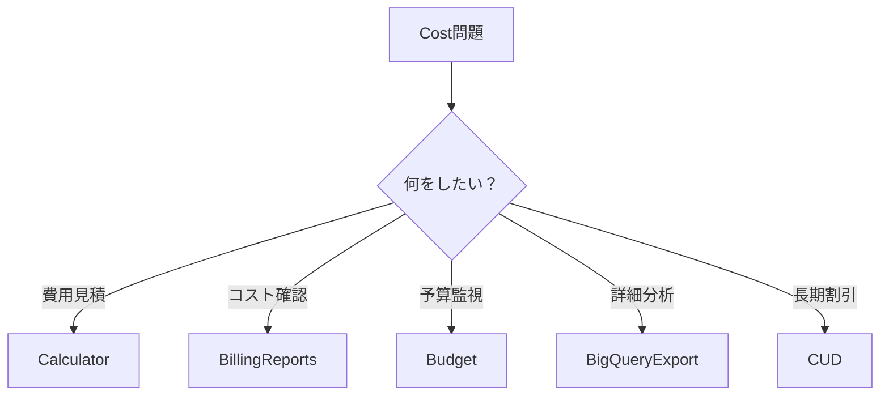

# 09_cost.md（2026完全版）

```markdown
# GCP Cost Management（ACE 2026）

GCPのコスト管理は  
**Cloud Billing** を中心に行う。

主な機能

```

Pricing Calculator
Budgets & Alerts
Billing Reports
Billing Export
Committed Use Discounts
Sustained Use Discounts

````

---

# Cost管理構造

```mermaid
graph TD

Usage --> Billing
Billing --> Reports
Billing --> Budgets
Billing --> Export

Export --> BigQuery
BigQuery --> Looker
````

---

# Pricing Calculator

新規システムの費用見積。

用途

| 用途     | 例      |
| ------ | ------ |
| 設計見積   | 新規システム |
| 提案資料   | 顧客見積   |
| PoCコスト | 概算     |

ACE問題

```
費用見積
→ Pricing Calculator
```

---

# Billing Reports

現在のコスト確認。

確認できる内容

| 項目      | 内容                |
| ------- | ----------------- |
| サービス別   | Compute / Storage |
| プロジェクト別 | Project           |
| 期間      | 日 / 月             |

ACE問題

```
現在のコスト確認
→ Billing Reports
```

---

# Budgets & Alerts

予算監視。

例

```
予算 $1000
↓
80% 通知
↓
100% 通知
```

通知方法

* Email
* Pub/Sub

ACE問題

```
予算超過通知
→ Budget Alert
```

重要

```
Budgetはリソース停止しない
```

---

# Billing Export

詳細コスト分析。

Billingデータを

```
BigQuery
```

へ出力する。

用途

| 用途     | 例      |
| ------ | ------ |
| 詳細分析   | サービス別  |
| コスト可視化 | Looker |
| 社内レポート | BI     |

ACE問題

```
詳細分析
→ Billing Export
```

---

# Billing Export構造



---

# Sustained Use Discount（SUD）

長時間利用割引。

特徴

| 特徴   | 内容             |
| ---- | -------------- |
| 自動適用 | Yes            |
| 対象   | Compute Engine |
| 条件   | 長時間利用          |

例

```
1ヶ月VM稼働
→ 自動割引
```

ACE問題

```
自動割引
→ SUD
```

---

# Committed Use Discount（CUD）

長期契約割引。

契約

```
1年
3年
```

特徴

| 特徴   | 内容            |
| ---- | ------------- |
| 事前購入 | Yes           |
| 対象   | Compute / GKE |
| 割引   | 最大70%         |

ACE問題

```
長期利用確定
→ CUD
```

---

# Preemptible / Spot VM

低価格VM。

特徴

| 特徴 | 内容         |
| -- | ---------- |
| 価格 | 最大90%安い    |
| 停止 | 24時間以内     |
| 用途 | Batch / CI |

ACE問題

```
安いVM
→ Spot VM
```

---

# Storageコスト

ストレージクラス

| Class    | 用途     |
| -------- | ------ |
| Standard | 頻繁アクセス |
| Nearline | 月1回    |
| Coldline | 年数回    |
| Archive  | 長期保存   |

ACE問題

```
長期保存
→ Archive
```

---

# Networkコスト

通信費

| 種類      | 課金 |
| ------- | -- |
| Ingress | 無料 |
| Egress  | 有料 |

ACE問題

```
通信コスト
→ Egress
```

---

# Cost最適化

代表例

```
停止VM
Spot VM
Archive Storage
Autoscaling
```

---

# ACE重要ポイント

```
費用見積
→ Pricing Calculator

現在のコスト
→ Billing Reports

予算通知
→ Budgets

詳細分析
→ Billing Export

長期割引
→ CUD

自動割引
→ SUD
```

---

# ACE判断フロー



---

# ACEトラップ

## Trap1

```
費用見積
```

Spreadsheet → ❌
Pricing Calculator → ✅

---

## Trap2

```
コスト分析
```

Billing console → ❌
Billing Export → ✅

---

## Trap3

```
長期利用
```

SUD → ❌
CUD → ✅

---

## Trap4

```
VM安くしたい
```

Standard VM → ❌
Spot VM → ✅

---

# 実務TIP

実務では

```
Billing Export → BigQuery
```

が基本。

そこから

```
Looker
Grafana
BI
```

へ接続する。

---

# まとめ

```
見積 → Pricing Calculator
確認 → Billing Reports
予算 → Budget
分析 → Billing Export
割引 → CUD / SUD
```

```

---